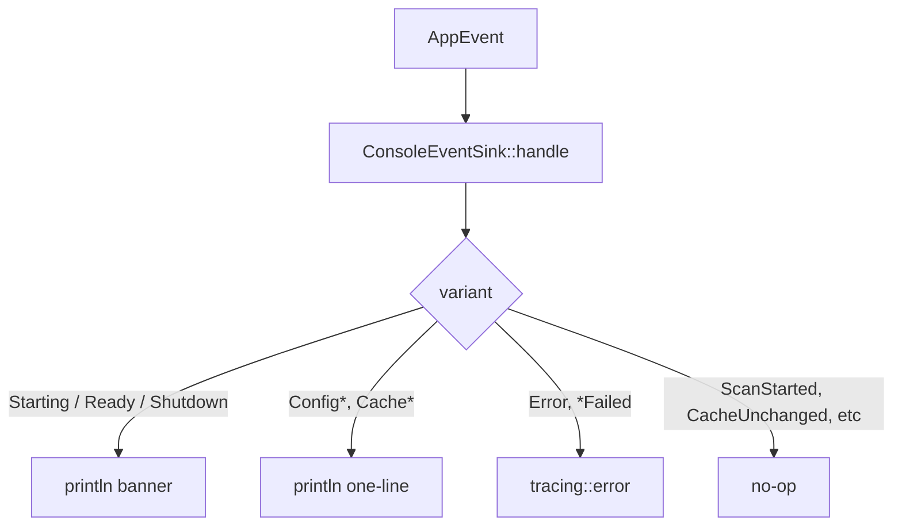

# Overview

The adapter layer that connects pure domain crates to concrete I/O.
Today: config TOML loader (with migration) and the colored console
event sink.

Anything that touches `std::fs`, `toml`, the terminal, or a logger
lives here — never in `lighty-config` or `lighty-events`.

## What's inside

| Module | Purpose |
|---|---|
| `config_io_loader` | `load_config(path, &events).await` → `Config`. Reads, migrates, validates, emits along the way. |
| `config_io_migration` | Adds missing fields with defaults, drops deprecated sections, returns the added-fields list. |
| `console_event_sink` | `ConsoleEventSink` impl of `EventSink`. Stateless. |
| `config_io_errors` | `AdaptersError` — wraps `io`, `toml`, validation. |

## Console output style

"Silent" arms fire often in steady state and would drown the
operator. They're still observable through any other sink mounted on
the bus.

## See also

- [how-to-use.md](./how-to-use.md)
- [exports.md](./exports.md)
- [../../events/docs/overview.md](../../events/docs/overview.md)
- [../../config/docs/overview.md](../../config/docs/overview.md)
