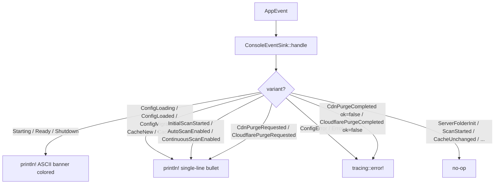

# Overview

`lighty-adapters` collects the small adapter pieces that connect pure
domain crates to concrete I/O. Right now two of them:

1. **Config I/O** — reads `config.toml` from disk, runs the migration
   pipeline if the schema lags, validates, and emits the appropriate
   `AppEvent` along the way.
2. **`ConsoleEventSink`** — turns `AppEvent` into colored stdout for
   the operator (with `tracing::*` for the bits that belong in logs
   rather than the foreground).

Anything that touches `std::fs`, `toml`, `toml_edit`, the terminal,
or a logger lives here — never in the domain crates (`lighty-config`,
`lighty-events`).

## What's inside

| Module | Purpose |
|---|---|
| `config_io_loader` | `load_config(path, &events).await` → `Config`. Reads the file, creates the default if missing, calls `migrate_config_if_needed`, validates, emits `ConfigLoading` / `ConfigLoaded` / `ConfigCreated` / `ConfigMigrated`. |
| `config_io_migration` | Schema migration logic. Adds missing fields with defaults, removes deprecated sections, returns the list of `added_fields` so the loader can emit it on the bus. |
| `config_io_validation` | Sanity checks (positive numbers, paths exist, host:port parseable). Private. |
| `config_io_errors` | `AdaptersError` — wraps `io`, `toml::de::Error`, validation errors. |
| `console_event_sink` | `ConsoleEventSink` implementing `EventSink`. One arm per `AppEvent` variant, mixes `println!` and `tracing::{info,warn,error}!` depending on operator vs ops audience. |

## Console output style

The "silent" group is intentional: those events fire dozens of times
per minute in normal operation and would otherwise drown the
operator. They're still observable through any other sink mounted on
the bus.

## Cargo features

None.

## See also

- [`how-to-use.md`](./how-to-use.md) — `ConsoleEventSink::new`,
  `load_config` snippets
- [`exports.md`](./exports.md) — full public surface
- [`../../events/docs/exports.md`](../../events/docs/exports.md) —
  every `AppEvent` variant
- [`../../config/docs/overview.md`](../../config/docs/overview.md) —
  the pure schema this crate hydrates
