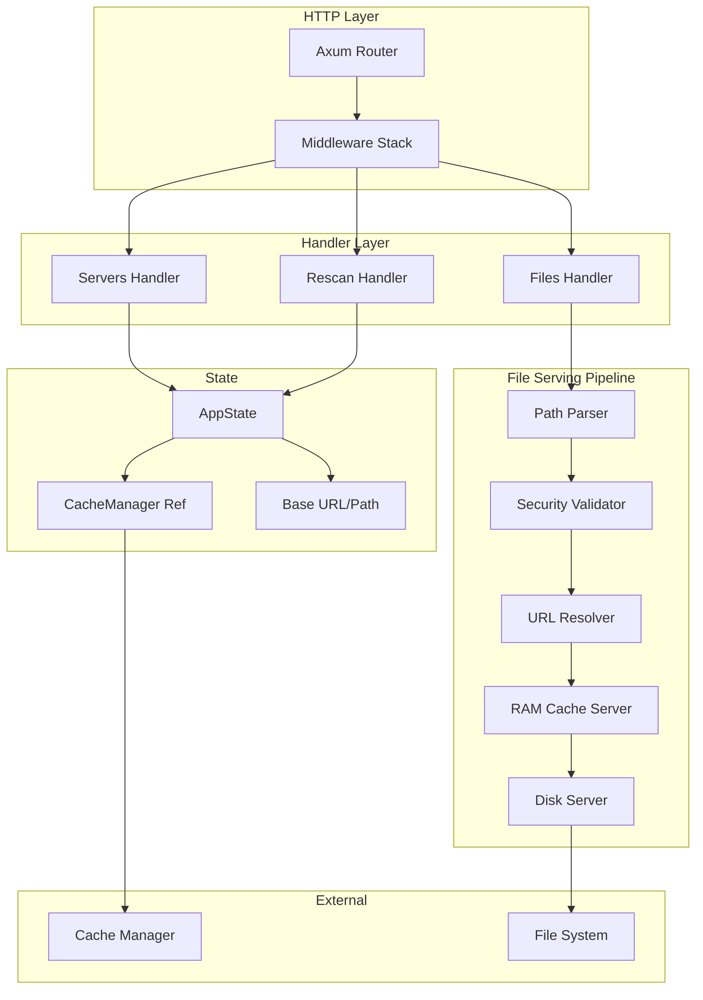
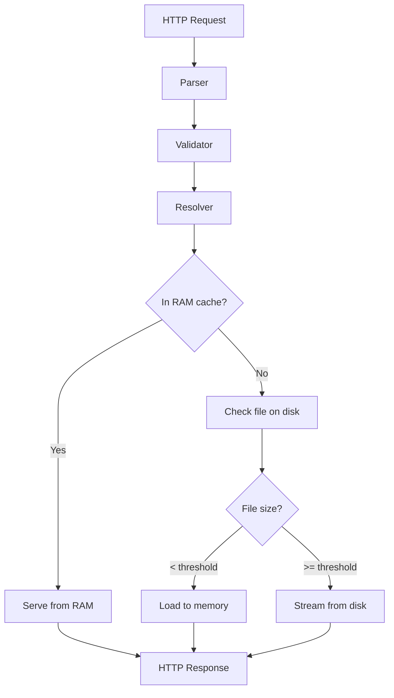
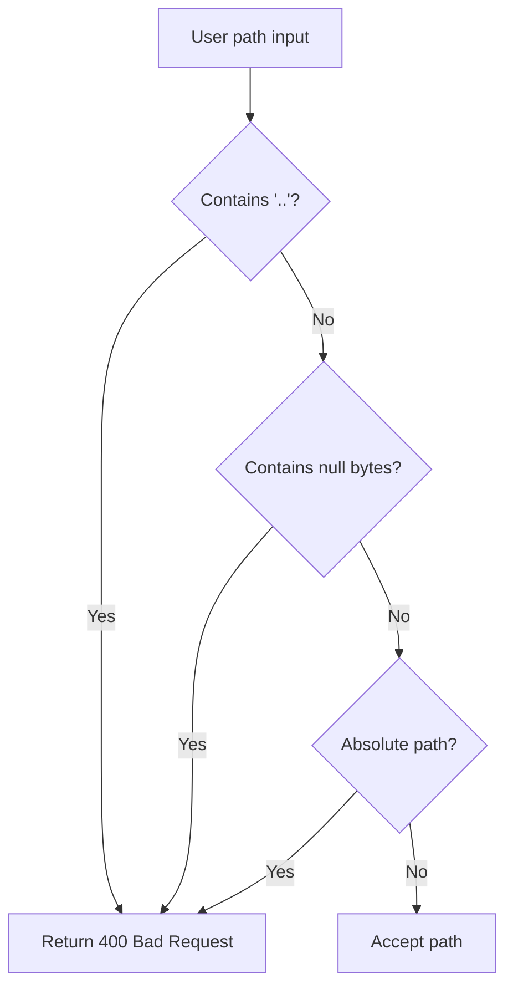

# HTTP API Architecture

## Overview

The API is built with Axum and follows a layered architecture with clear separation of concerns.

## Architecture Diagram



## Main Components

### AppState

Shared state structure across all handlers.

**Data:**
- `cache`: Arc<CacheManager> - Reference to cache manager
- `base_url`: Arc<String> - Base URL for generating URLs
- `base_path`: Arc<String> - Root path for files
- `streaming_threshold_bytes`: u64 - Threshold for streaming vs memory loading

### Handlers

**list_servers:**
- Route: GET /servers
- Returns list of all servers with metadata
- Builds ServerInfo for each server

**get_server_metadata:**
- Route: GET /{server}.json
- Returns complete VersionBuilder
- Checks if server is active

**serve_file:**
- Route: GET /{server}/{path}
- Complete file serving pipeline
- RAM cache then disk fallback

**force_rescan:**
- Route: POST /rescan/{server}
- Triggers manual rescan
- Returns JSON status

### File Serving Pipeline



## Data Models

### ServerListResponse

```rust
{
  "servers": [
    {
      "name": "server1",
      "loader": "forge",
      "minecraft_version": "1.20.1",
      "url": "http://localhost:8080/server1.json",
      "last_update": "2024-01-15T10:30:00Z"
    }
  ]
}
```

### ErrorResponse

```rust
{
  "error": {
    "code": "SERVER_NOT_FOUND",
    "message": "Server 'invalid' not found",
    "available_servers": ["server1", "server2"]
  }
}
```

## Security

### Path Validation



### Path Traversal Protection

The validator checks:
- No `..` sequences (directory traversal)
- No absolute paths
- No null bytes
- Special characters blocked

## Performance

### RAM Cache

**Advantages:**
- Latency < 1ms for cached files
- Zero disk I/O
- Zero-copy with Bytes

**Limits:**
- Configured memory size
- Automatic LRU eviction
- Only small files (<= threshold)

### Streaming

**When:**
- Files > streaming_threshold_bytes
- Default: 10MB

**Advantages:**
- Constant memory O(buffer_size)
- Large file support
- Automatic backpressure

### Recommended Thresholds

| Use case | Threshold | Rationale |
|----------|-----------|-----------|
| Local dev | 5MB | Abundant memory |
| Production | 10MB | Balance perf/memory |
| Memory constrained | 1MB | Minimize RAM usage |
| High perf | 50MB | Maximize cache hits |
