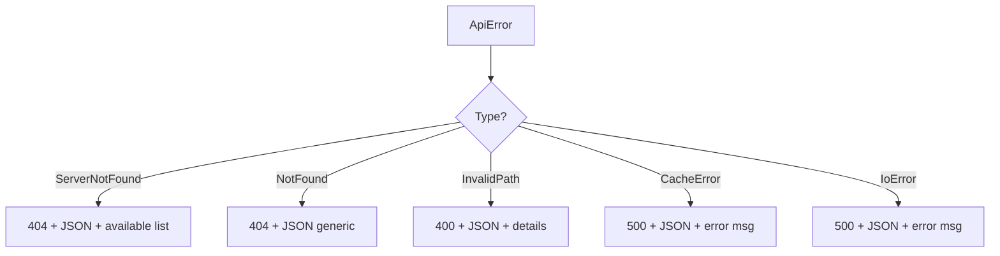

# Error Documentation

## Main Type: ApiError

```rust
pub enum ApiError {
    ServerNotFound { server: String, available: Vec<String> },
    NotFound,
    InternalError(String),
    InvalidPath(String),
    CacheError(#[from] lighty_cache::CacheError),
    IoError(#[from] std::io::Error),
}
```

## Error Types

### ServerNotFound

**Description**: Requested server does not exist or is disabled.

**HTTP Response**: 404 Not Found

**JSON Body:**
```json
{
  "error": {
    "code": "SERVER_NOT_FOUND",
    "message": "Server 'invalid' not found",
    "available_servers": ["server1", "server2"]
  }
}
```

**Causes**: Incorrect server name, disabled server.

---

### NotFound

**Description**: General resource not found.

**HTTP Response**: 404 Not Found

**Causes**: Non-existent file, invalid URL, failed resolution.

---

### InvalidPath

**Description**: Path containing invalid characters or patterns.

**HTTP Response**: 400 Bad Request

**Causes**: Path traversal (`..`), absolute paths, null bytes.

---

### CacheError

**Description**: Cache manager error.

**HTTP Response**: 500 Internal Server Error

**Causes**: Cache read failure, corruption, timeout.

---

### IoError

**Description**: I/O error during file reading.

**HTTP Response**: 500 Internal Server Error

**Causes**: Permission denied, disk error, file locked.

## Response Strategy



All errors return structured JSON, never HTML.
