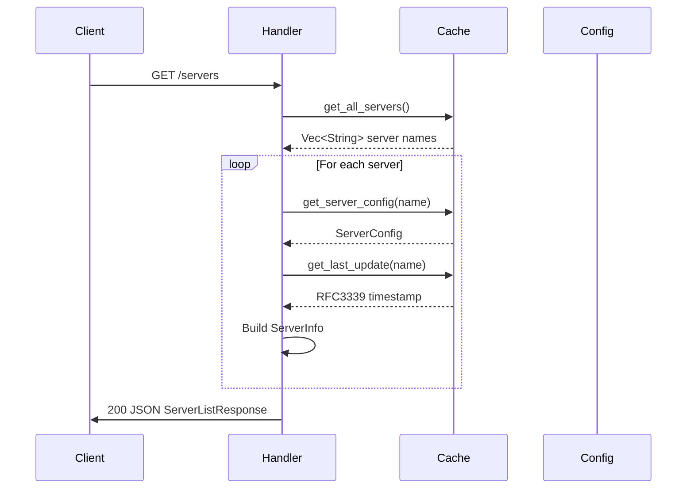
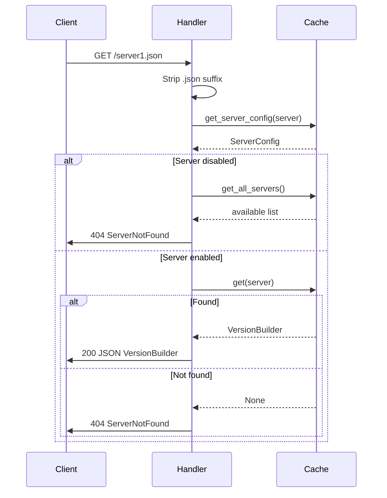
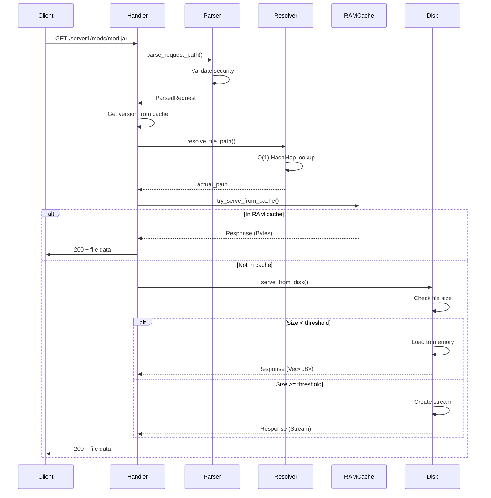

# API Processing Flow

## GET /servers - Server List

```mermaid
sequenceDiagram
    participant C as Client
    participant H as Handler
    participant Ca as Cache
    participant Cf as Config

    C->>H: GET /servers
    H->>Ca: get_all_servers()
    Ca-->>H: Vec<String> server names

    loop For each server
        H->>Ca: get_server_config(name)
        Ca-->>H: ServerConfig
        H->>Ca: get_last_update(name)
        Ca-->>H: RFC3339 timestamp
        H->>H: Build ServerInfo
    end

    H->>C: 200 JSON ServerListResponse
```

## GET /{server}.json - Server Metadata

```mermaid
sequenceDiagram
    participant C as Client
    participant H as Handler
    participant Ca as Cache

    C->>H: GET /server1.json
    H->>H: Strip .json suffix

    H->>Ca: get_server_config(server)
    Ca-->>H: ServerConfig

    alt Server disabled
        H->>Ca: get_all_servers()
        Ca-->>H: available list
        H->>C: 404 ServerNotFound
    else Server enabled
        H->>Ca: get(server)

        alt Found
            Ca-->>H: VersionBuilder
            H->>C: 200 JSON VersionBuilder
        else Not found
            Ca-->>H: None
            H->>C: 404 ServerNotFound
        end
    end
```

## GET /{server}/{path} - File Serving

```mermaid
sequenceDiagram
    participant C as Client
    participant H as Handler
    participant P as Parser
    participant R as Resolver
    participant RC as RAMCache
    participant D as Disk

    C->>H: GET /server1/mods/mod.jar

    H->>P: parse_request_path()
    P->>P: Validate security
    P-->>H: ParsedRequest

    H->>H: Get version from cache

    H->>R: resolve_file_path()
    R->>R: O(1) HashMap lookup
    R-->>H: actual_path

    H->>RC: try_serve_from_cache()

    alt In RAM cache
        RC-->>H: Response (Bytes)
        H->>C: 200 + file data
    else Not in cache
        H->>D: serve_from_disk()

        D->>D: Check file size

        alt Size < threshold
            D->>D: Load to memory
            D-->>H: Response (Vec<u8>)
        else Size >= threshold
            D->>D: Create stream
            D-->>H: Response (Stream)
        end

        H->>C: 200 + file data
    end
```
