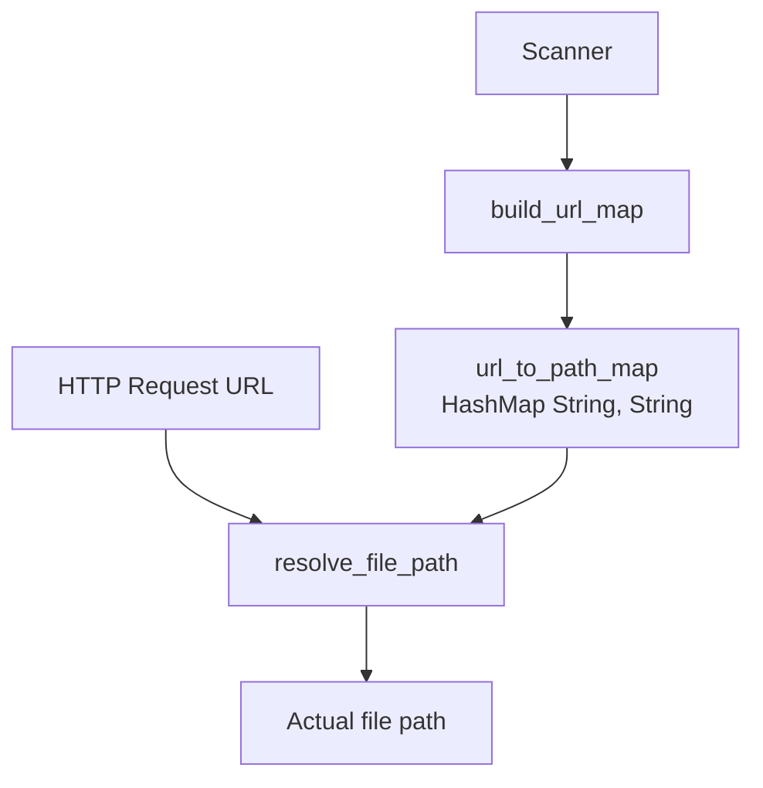
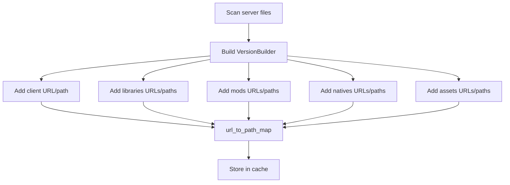
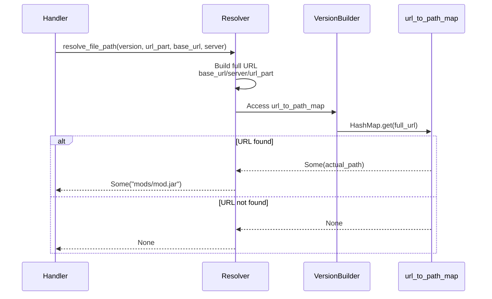
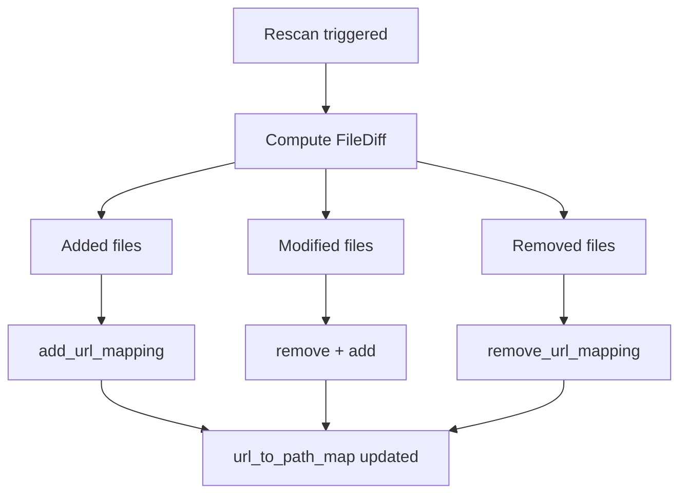

# URL to File Path Resolution

## Overview

The resolution system converts HTTP URLs to physical file paths via a pre-built HashMap for fast lookups.

## Architecture



## Mapping Construction

The mapping is built during initial scan and rescans:



## Mapping Format

### Client JAR

```rust
URL:  "http://localhost:8080/server1/client/client.jar"
Path: "client/client.jar"
```

### Library

```rust
URL:  "http://localhost:8080/server1/libraries/com/google/guava/31.0/guava-31.0.jar"
Path: "libraries/com/google/guava/31.0/guava-31.0.jar"
```

### Mod

```rust
URL:  "http://localhost:8080/server1/mods/JEI-forge-1.20.1.jar"
Path: "mods/JEI-forge-1.20.1.jar"
```

### Native

```rust
URL:  "http://localhost:8080/server1/natives/windows/lwjgl-3.3.1-natives-windows.jar"
Path: "natives/windows/lwjgl-3.3.1-natives-windows.jar"
```

### Asset

```rust
URL:  "http://localhost:8080/server1/assets/ab/cd/abcdef123456"
Path: "assets/ab/cd/abcdef123456"
```

## Resolution Process



## Performance

- Map construction: One-time build during server scan
- Lookup: Fast HashMap-based resolution
- Memory: Stores URL to path mappings for all files

## Incremental Updates

The mapping can be updated incrementally during rescans:



**Advantages**:
- Avoids complete reconstruction
- Updates only changed files
- Consistency maintained during rescan

## Special Cases

### Files Without URL

Some files don't have a public URL (optional files, legacy assets):

```rust
Library {
    name: "optional-lib",
    url: None,  // No URL
    path: Some("libraries/optional/lib.jar"),
    // ...
}
// Pas ajoute au mapping
```

### URLs dupliquees

Si deux fichiers ont la meme URL (ne devrait pas arriver):

```rust
// Last insertion overwrites
map.insert(url1, path1);
map.insert(url1, path2);  // path1 is lost
```

Prevention: The scanner guarantees URL uniqueness.

### Relative vs Absolute Paths

Paths in the mapping are always relative to the server folder:

```rust
// Good
"mods/mod.jar"
"libraries/com/google/guava.jar"

// Bad (rejected by scanner)
"/var/minecraft/server1/mods/mod.jar"
"C:\minecraft\mods\mod.jar"
```
