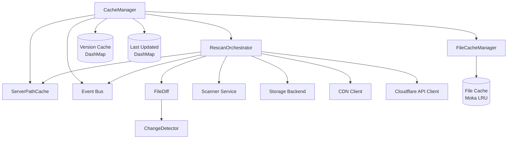
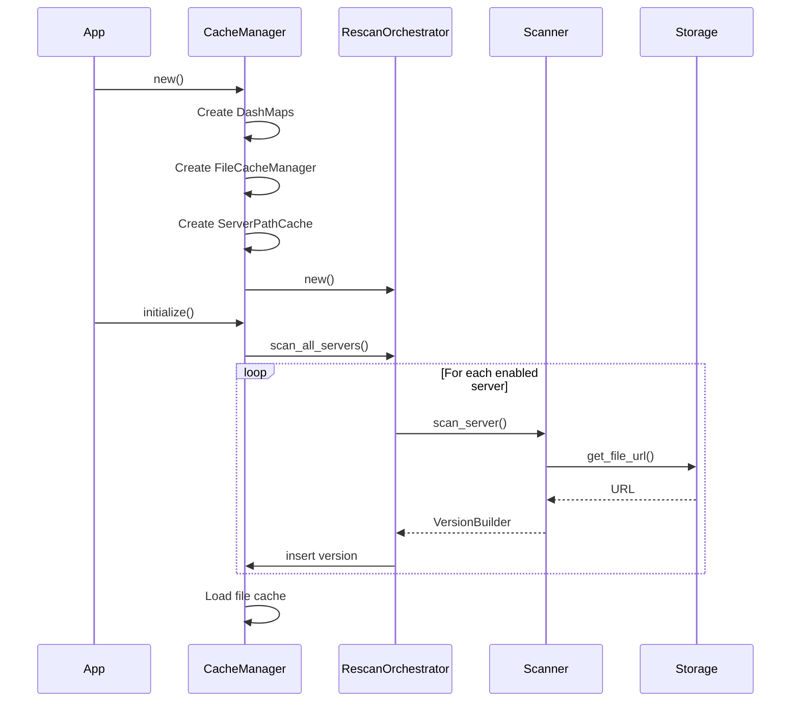
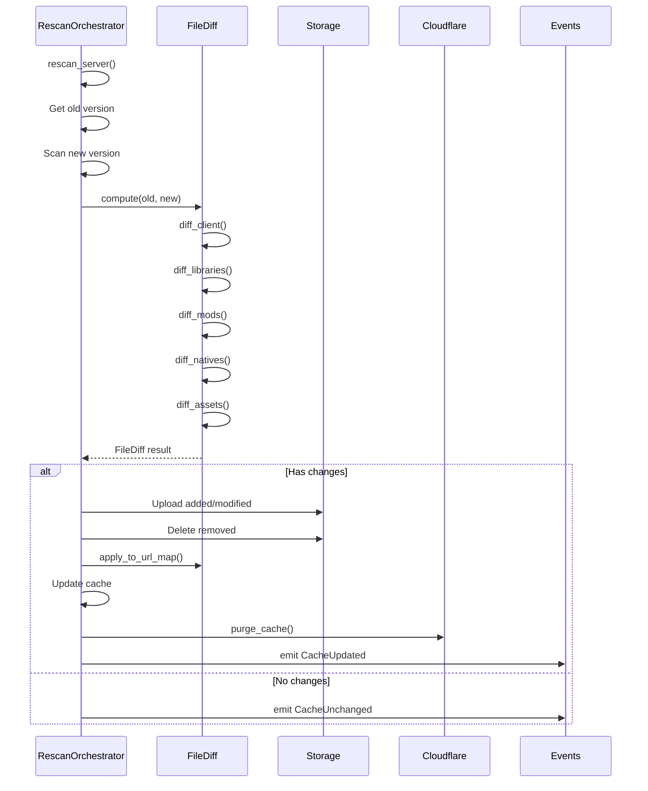

# Cache System Architecture

## Overview

The cache system is designed as a multi-layer architecture with clear separation of responsibilities. Each component has a specific role and communicates via well-defined interfaces.

## Architecture Diagram

## Main Components

### CacheManager

The main manager that coordinates all aspects of the cache system.

**Responsibilities:**
- Component initialization and configuration
- Task lifecycle coordination
- Server version cache management
- Public interface for other crates

**Managed Data:**
- `cache`: DashMap containing `VersionBuilder` for each server
- `last_updated`: DashMap of last update timestamps
- `file_cache_manager`: LRU file cache
- `rescan_orchestrator`: Rescan orchestrator
- `server_path_cache`: path→server mapping cache

### RescanOrchestrator

Orchestrates automatic and manual server rescanning with two operating modes.

**Operating Modes:**

1. **Polling Mode** (rescan_interval > 0)
   - Periodic rescan based on time interval
   - Uses tokio::time::interval for timing
   - Checks all active servers at each iteration

2. **File Watcher Mode** (rescan_interval = 0)
   - Real-time monitoring with notify
   - Configurable debouncing to avoid excessive rescans
   - O(1) lookup via ServerPathCache to identify the affected server

**Responsibilities:**
- Change detection via FileDiff
- Cloud storage synchronization
- CDN cache purging for storage files
- Cloudflare API cache purging for JSON responses
- Event emission on changes

### FileDiff

Computes granular differences between two server versions.

**Algorithm:**
- Uses HashMaps for O(1) lookups
- Compares each file type separately (client, libraries, mods, natives, assets)
- Identifies three categories: added, modified, removed
- Optimized for incremental URL map updates

**Managed File Types:**
- Client JAR
- Libraries
- Mods
- Natives
- Assets

### ServerPathCache

Fast mapping cache between file paths and owner servers.

**Structure:**
- Uses a sorted Vec of (PathBuf, String) tuples
- Paths sorted by length in descending order (longest first)
- RwLock for concurrent access

**Lookup Strategy:**
- Paths are sorted to ensure most specific paths match first
- Iteration stops at first matching prefix
- O(k) complexity where k = number of servers

**Usage:**
- File watcher: Determines which server to rescan for a modified file
- Configuration reload: Cache rebuilt with new server list

**CDN & Cloudflare Integration:**
When CDN/Cloudflare is enabled, cache purging includes:
- **CDN purging**: Purges storage files (S3/R2) from CDN cache
- **Cloudflare API purging**: Purges JSON responses from Cloudflare cache
- Automatic retry with exponential backoff (3 attempts)
- 10-second timeout per request
- Graceful degradation on persistent failures

### FileCacheManager

Manages in-memory file cache with Moka LRU.

**Features:**
- LRU cache with configurable memory limit
- Complete file storage in memory (data, SHA1, size, MIME type)
- Automatic eviction according to LRU policy
- Asynchronous file loading

## Data Flow

### Initialization

### Change Detection and Synchronization

## Concurrency and Synchronization

### Locking Strategies

1. **DashMap for main cache**
   - Lock-free for most operations
   - Allows concurrent reads
   - Horizontal scalability

2. **RwLock for ServerPathCache**
   - Multiple simultaneous reads
   - Exclusive writes
   - Rare rebuilds, frequent reads

3. **Arc for sharing**
   - Immutable structure sharing
   - No unnecessary copies
   - Thread-safe reference counting

### Task Management

The CacheManager maintains a registry of background tasks:
- Atomic counter for IDs
- DashMap to store JoinHandles
- Graceful shutdown with broadcast channel

## Optimizations

### Memory

1. **LRU Cache with Moka**
   - Automatic eviction based on size
   - Weight based on file sizes
   - Dynamic memory limit configuration

2. **Arc<str> for strings**
   - Reduced memory overhead
   - Efficient thread sharing
   - No copying on clone

3. **Incremental URL map updates**
   - Avoids full reconstruction
   - Applies only deltas
   - O(1) performance per change

### Performance

1. **Parallel file scanning**
   - Uses tokio::spawn for parallelization
   - Configurable batch processing
   - Concurrency limits

2. **O(1) lookups**
   - HashMap for FileDiff
   - ServerPathCache for file watcher
   - DashMap for version cache

3. **Debouncing**
   - File watcher: Avoids multiple rescans
   - Config watcher: Groups changes
   - Adjustable configuration

## Error Handling

The system propagates errors via the `CacheError` type:
- Automatic conversion from underlying errors
- Appropriate logging at each level
- Event emission for critical errors
- Graceful recovery when possible
