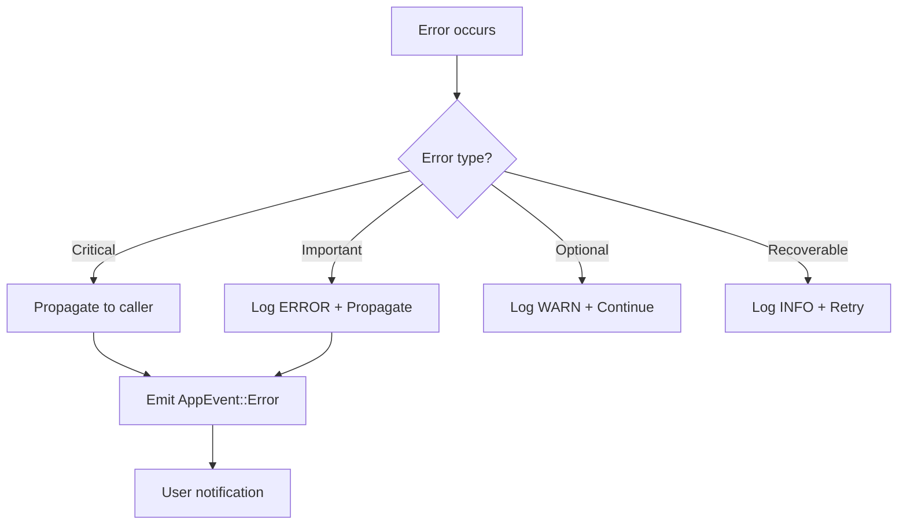

# Error Documentation

This document describes the different types of errors handled by the `cache` crate.

## Main Type: CacheError

The `CacheError` type is an enumeration that groups all possible errors of the cache system. It uses `thiserror` for idiomatic error handling in Rust.

## Error Types

### IoError

```rust
#[error("I/O error: {0}")]
IoError(#[from] std::io::Error)
```

**Description**: Input/output error when reading or writing files.

**Possible causes**:
- Insufficient permissions on files/folders
- File or folder not found
- Insufficient disk space
- Network error when accessing remote files

**Context of occurrence**:
- Reading server files
- Writing cache to disk
- Accessing configuration files

**Handling**: The error is propagated automatically thanks to `#[from]`. The system logs the error and emits an `AppEvent::Error` event.

---

### ScanError

```rust
#[error("Scanner error: {0}")]
ScanError(#[from] lighty_scanner::ScanError)
```

**Description**: Error from the `lighty_scanner` crate when scanning servers.

**Possible causes**:
- Invalid server folder structure
- Corrupted JAR files
- Invalid file metadata
- Error during hash calculation

**Context of occurrence**:
- Initial server scan (`scan_all_servers`)
- Automatic or manual rescan
- Change detection

**Handling**: The error is propagated and logged. The affected server is marked as having failed the scan, but other servers continue to be scanned.

---

### StorageError

```rust
#[error("Storage error: {0}")]
StorageError(#[from] lighty_storage::StorageError)
```

**Description**: Error from the storage backend (local or S3).

**Possible causes**:
- Failed connection to S3 backend
- Invalid S3 credentials
- S3 bucket not found or insufficient permissions
- Network timeout during upload/download
- Insufficient disk space (local storage)

**Context of occurrence**:
- Cloud synchronization (`sync_cloud_storage`)
- Upload of added/modified files
- Deletion of files on the cloud
- File URL generation

**Handling**: The error is logged and the synchronization operation is cancelled. The local cache remains functional even if the cloud is unavailable.

---

### JoinError

```rust
#[error("Join error: {0}")]
JoinError(#[from] tokio::task::JoinError)
```

**Description**: Error when waiting for the completion of a Tokio asynchronous task.

**Possible causes**:
- Task that panicked
- Cancelled task
- Tokio runtime shutdown

**Context of occurrence**:
- Parallelized cloud synchronization
- CacheManager shutdown
- Parallel scan operations

**Handling**: The error indicates a serious problem (task panic). It is propagated and logged at ERROR level.

---

### ServerNotFound

```rust
#[error("Server not found: {0}")]
ServerNotFound(String)
```

**Description**: The requested server does not exist in the configuration.

**Possible causes**:
- Incorrect server name in the request
- Server removed from configuration
- Typo in the server name

**Context of occurrence**:
- `force_rescan_server` with an invalid name
- Access to a server that does not exist
- Update of a deleted server

**Handling**: Returns a 404 error to the API. The system continues to function normally for other servers.

---

### CacheOperationFailed

```rust
#[error("Cache operation failed: {0}")]
CacheOperationFailed(String)
```

**Description**: Generic error during a cache operation.

**Possible causes**:
- Uninitialized storage backend
- Corrupted cache
- Invalid cache operation
- Inconsistent cache state

**Context of occurrence**:
- Failed cache operations
- Incomplete system initialization
- Data corruption

**Handling**: The error contains a descriptive message. It is logged and can trigger a cache reinitialization if necessary.

---

### HttpError

```rust
#[error("HTTP request failed: {0}")]
HttpError(String)
```

**Description**: Error during an HTTP request.

**Possible causes**:
- Connection timeout
- Network error
- Remote server unavailable
- Invalid HTTP response

**Context of occurrence**:
- Calls to the Cloudflare API
- Requests to external services
- URL availability verification

**Handling**: The error is logged with a warning. Failed Cloudflare purge operations do not impact the local cache.

**Conversion**: Implemented via `impl From<reqwest::Error>` for automatic conversion of reqwest errors.

---

### CloudflareError

```rust
#[error("Cloudflare API error: {0}")]
CloudflareError(String)
```

**Description**: Specific error from the Cloudflare API.

**Possible causes**:
- Invalid API token
- Incorrect Zone ID
- Cloudflare API rate limiting
- Error in the purge request

**Context of occurrence**:
- Cloudflare cache purge after an update
- Invalid Cloudflare configuration

**Handling**: The error is logged with a warning. Cloudflare purge is optional and its failure does not prevent the cache from functioning.

---

## Error Handling Strategy

### Resilience Principle

The cache system is designed to be resilient:
- Errors from one server do not affect the others
- Cloud errors do not prevent local operation
- Cloudflare purge errors do not impact the cache

### Severity Levels

**CRITICAL**: Errors preventing cache operation
- Uninitialized storage backend
- Severe cache corruption

**ERROR**: Errors on important operations
- Server scan failure
- Task panic
- Cloud synchronization failure

**WARN**: Errors on optional operations
- Cloudflare purge failure
- Non-critical HTTP timeout

**INFO**: Recoverable errors
- Temporarily unavailable server
- Missing file during rescan

### Error Propagation



### Recovery Strategies

**Automatic retry**:
- Temporary network failures
- Timeouts with exponential backoff

**Graceful degradation**:
- Local cache functions without cloud
- Individual servers can fail without impacting others

**Manual intervention**:
- Configuration errors require manual correction
- Cache corruption may require a forced rescan
