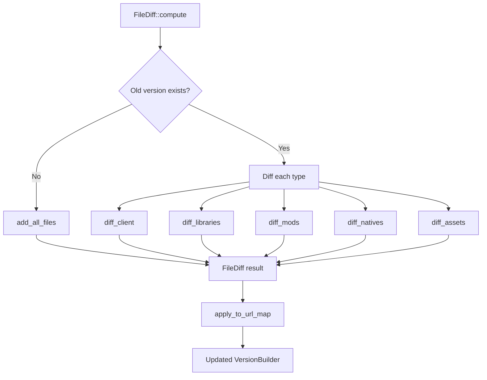
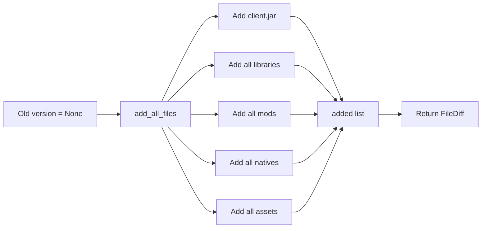
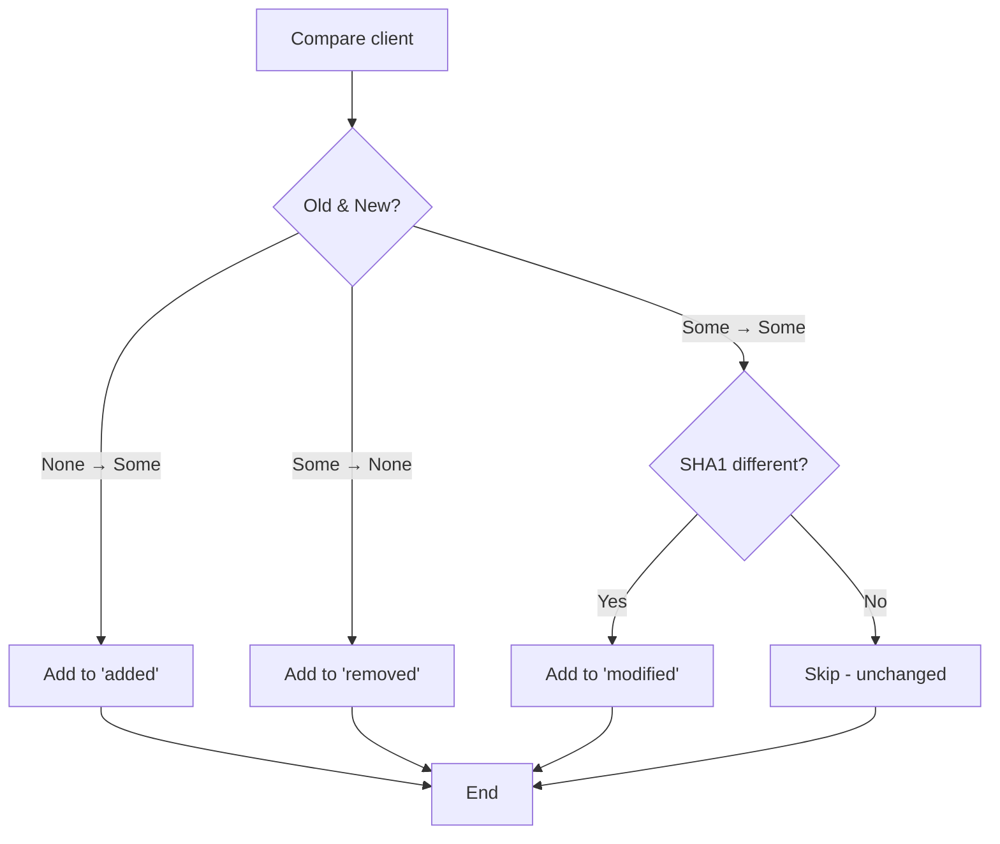
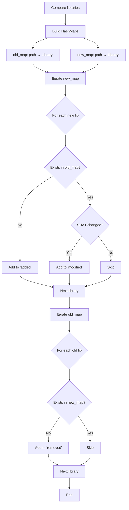
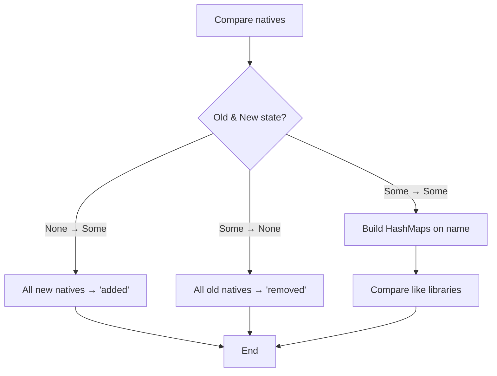
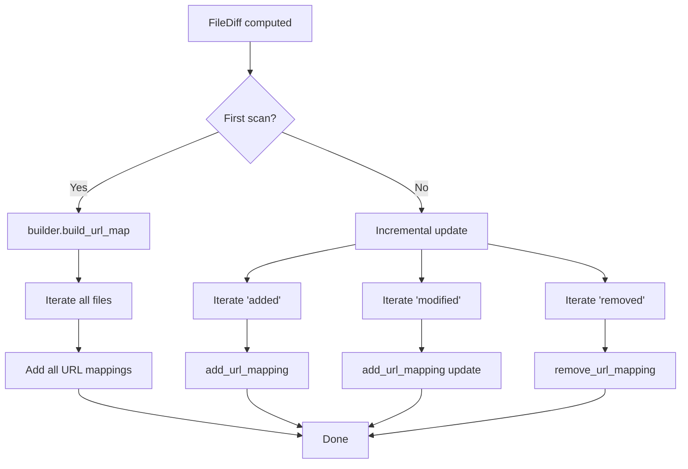
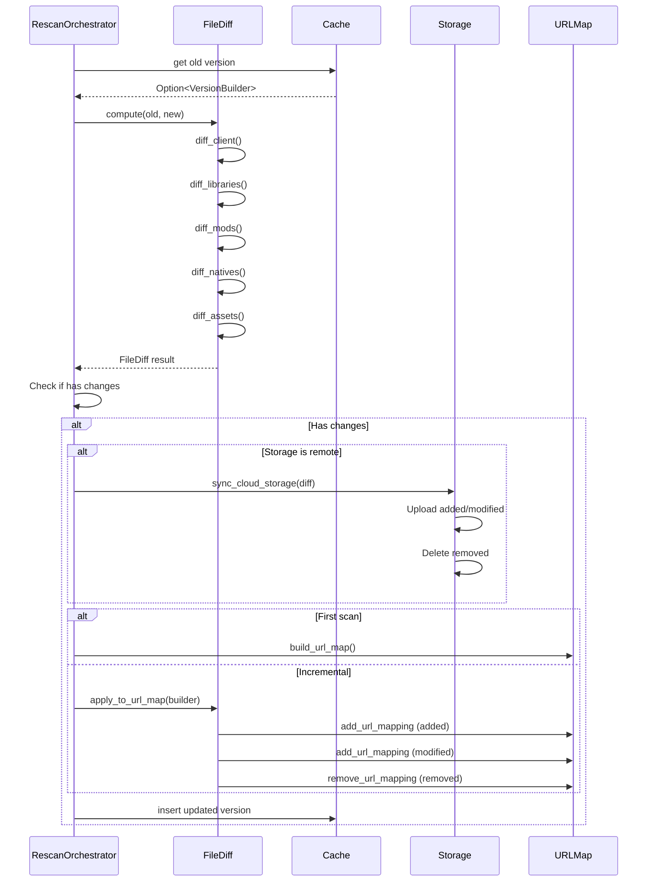

# FileDiff - Granular Change Detection

Detailed documentation of the change detection system between versions.

## Overview

`FileDiff` is the component responsible for precise detection of changes between two versions of a server. It identifies exactly which files have been added, modified, or deleted.

## Data Structure

```rust
pub struct FileDiff {
    pub added: Vec<FileChange>,
    pub modified: Vec<FileChange>,
    pub removed: Vec<FileChange>,
}

pub struct FileChange {
    pub file_type: FileType,
    pub remote_key: String,
    pub local_path: String,
    pub url: String,
}

pub enum FileType {
    Client,
    Library,
    Mod,
    Native,
    Asset,
}
```

## Architecture



## Detection Algorithm

### Case 1: First Scan (old = None)

When there is no previous version, all files are marked as "added":



**Optimization**: No comparison necessary, simple iteration over files.

### Case 2: Rescan with Previous Version

Compares each file type separately with an optimized algorithm.

## Algorithms by File Type

### diff_client

The client JAR is unique, three possible cases:



Simple comparison of optional client JAR.

### diff_libraries

Libraries are compared via HashMap for fast lookups:



**Optimization**: HashMap enables fast lookups during comparison.

### diff_mods

Same algorithm as `diff_libraries`, but on the `name` field instead of `path`:

```rust
let old_map: HashMap<_, _> = old.mods.iter().map(|m| (&m.name, m)).collect();
let new_map: HashMap<_, _> = new.mods.iter().map(|m| (&m.name, m)).collect();
```


### diff_natives

Special case: can be `None`, `Some(Vec)`, or transition from one to the other:



**Cases**:
- None → Some or Some → None: Entire list marked as added/removed
- Some → Some: Compared using HashMap

### diff_assets

Same algorithm as `diff_libraries`, on the `path` field:

```rust
let old_map: HashMap<_, _> = old.assets.iter().map(|a| (&a.path, a)).collect();
let new_map: HashMap<_, _> = new.assets.iter().map(|a| (&a.path, a)).collect();
```


**Note**: Assets can be very numerous (thousands of files), hence the importance of HashMap optimization.

## Incremental URL Map Update

### Principle

Instead of completely rebuilding the URL map, we only apply changes to the files that were added, modified, or removed.



### apply_to_url_map Method

```rust
pub fn apply_to_url_map(&self, builder: &mut VersionBuilder) {
    // Add/update: added and modified files
    for change in self.added.iter().chain(self.modified.iter()) {
        if !change.url.is_empty() {
            let path = Self::extract_relative_path(&change.local_path);
            builder.add_url_mapping(change.url.clone(), path);
        }
    }

    // Remove: deleted files
    for change in &self.removed {
        if !change.url.is_empty() {
            builder.remove_url_mapping(&change.url);
        }
    }
}
```

**Advantages**:
- Performance: Updates only changed files
- Memory: No temporary reconstruction
- Precision: Only necessary changes

### Relative Path Extraction

```rust
fn extract_relative_path(local_path: &str) -> String {
    // Input:  "survival/mods/optifine.jar"
    // Output: "mods/optifine.jar"
    if let Some(idx) = local_path.find('/') {
        local_path[idx + 1..].to_string()
    } else {
        local_path.to_string()
    }
}
```

## Usage in RescanOrchestrator

### Integration in update_cache_if_changed



## Example Scenarios

### Scenario 1: Adding a Mod

```
Old version:
  mods: [mod1.jar, mod2.jar]

New version:
  mods: [mod1.jar, mod2.jar, mod3.jar]

FileDiff result:
  added: [mod3.jar]
  modified: []
  removed: []
```

**Actions**:
1. Upload `mod3.jar` to cloud storage
2. Add URL mapping for `mod3.jar`
3. Update cache
4. Purge Cloudflare
5. Emit `CacheUpdated` event

### Scenario 2: Updating a Library

```
Old version:
  libraries: [lwjgl-3.3.0.jar (SHA1: abc123)]

New version:
  libraries: [lwjgl-3.3.1.jar (SHA1: def456)]

FileDiff result:
  added: [lwjgl-3.3.1.jar]
  modified: []
  removed: [lwjgl-3.3.0.jar]
```

**Actions**:
1. Upload `lwjgl-3.3.1.jar` to cloud
2. Delete `lwjgl-3.3.0.jar` from cloud
3. Add URL mapping for `lwjgl-3.3.1.jar`
4. Remove URL mapping for `lwjgl-3.3.0.jar`
5. Update cache

### Scenario 3: Modifying the Client JAR

```
Old version:
  client: Some(ClientFile { sha1: "abc123", ... })

New version:
  client: Some(ClientFile { sha1: "def456", ... })

FileDiff result:
  added: []
  modified: [client.jar]
  removed: []
```

**Actions**:
1. Upload new `client.jar` to cloud (overwrites old)
2. Update URL mapping (same URL, new hash)
3. Update cache
4. Purge Cloudflare

### Scenario 4: Complete Removal of Natives

```
Old version:
  natives: Some([native1.jar, native2.jar])

New version:
  natives: None

FileDiff result:
  added: []
  modified: []
  removed: [native1.jar, native2.jar]
```

**Actions**:
1. Delete `native1.jar` and `native2.jar` from cloud
2. Remove URL mappings
3. Update cache

## Performance Optimizations

### Using HashMap

**Before (nested loops)**:
```rust
for new_lib in &new.libraries {
    let mut found = false;
    for old_lib in &old.libraries {  // Linear search for each new_lib
        if new_lib.path == old_lib.path {
            found = true;
            if new_lib.sha1 != old_lib.sha1 {
                modified.push(new_lib);
            }
            break;
        }
    }
    if !found {
        added.push(new_lib);
    }
}
```

**After (HashMap)**:
```rust
let old_map: HashMap<_, _> = old.libraries.iter().map(|lib| (&lib.path, lib)).collect();
for new_lib in &new.libraries {
    if let Some(old_lib) = old_map.get(&new_lib.path) {  // Fast lookup
        if new_lib.sha1 != old_lib.sha1 {
            modified.push(new_lib);
        }
    } else {
        added.push(new_lib);
    }
}
```

**Gain**: Significant performance improvement when handling thousands of assets.

### Chaining for Added and Modified

Instead of two separate loops:
```rust
for change in self.added.iter().chain(self.modified.iter()) {
    // Unified processing
}
```

**Advantages**:
- Less duplicated code
- Equivalent performance
- More maintainable

## Resource Usage

**Memory**:
- Temporary HashMaps for comparisons
- FileDiff result containing only changed files
- Memory freed after computation completes
