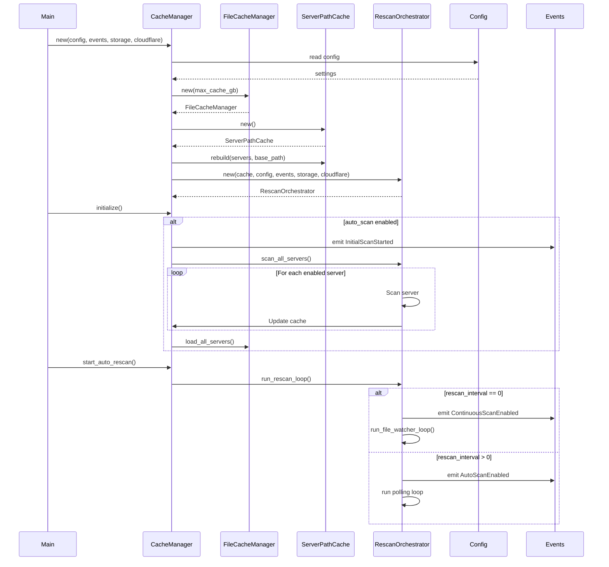
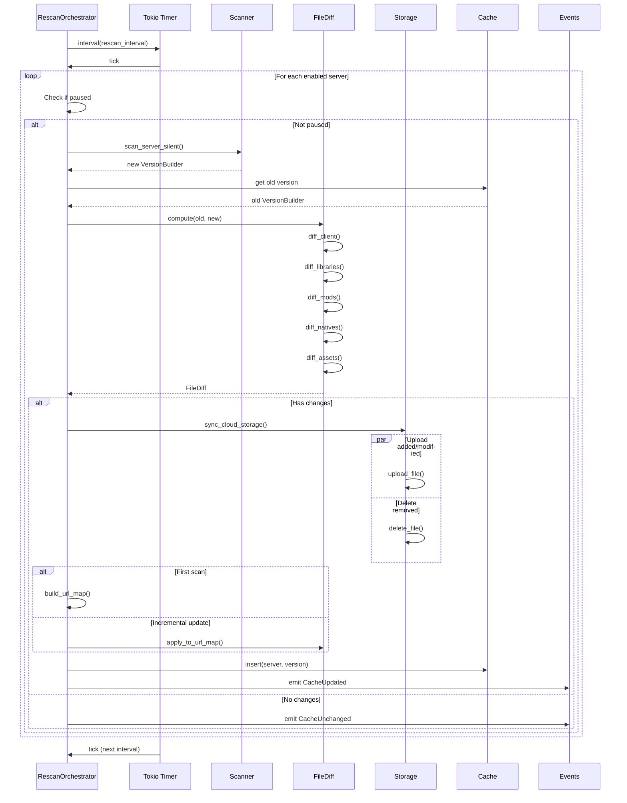
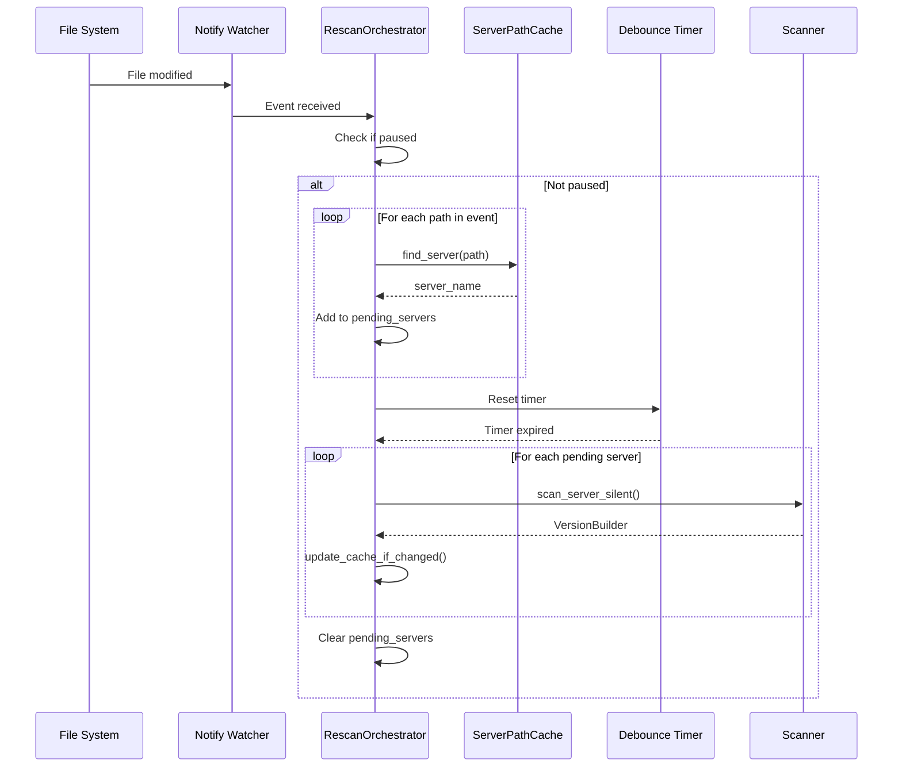
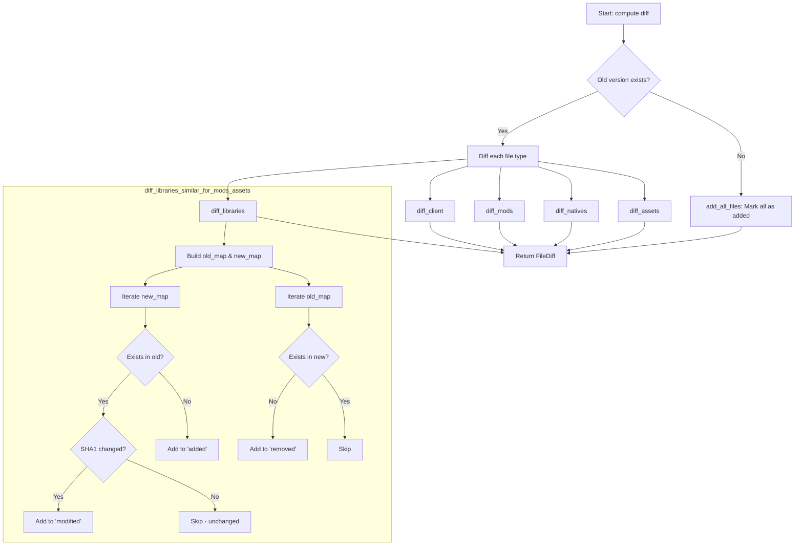
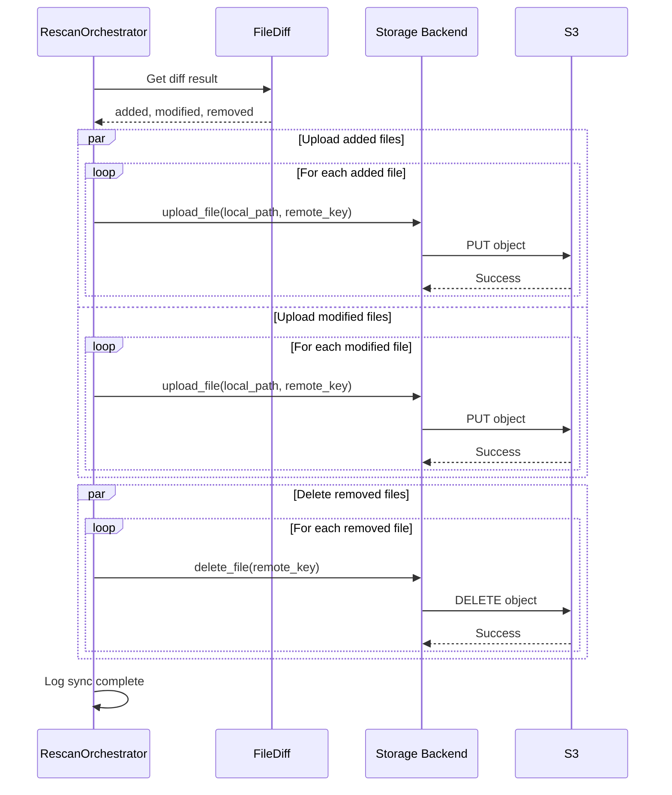
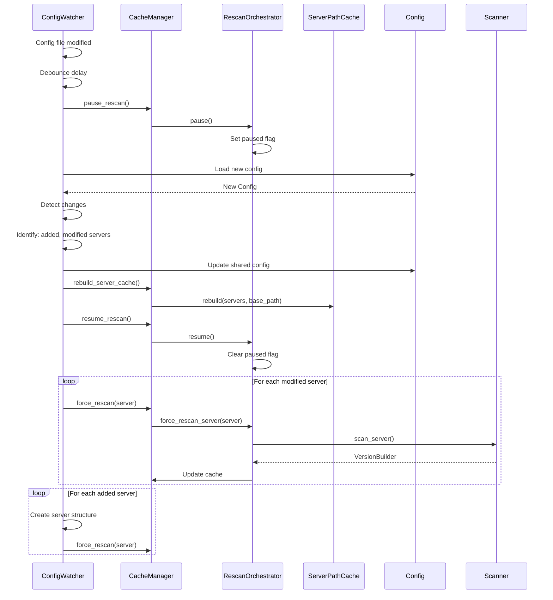
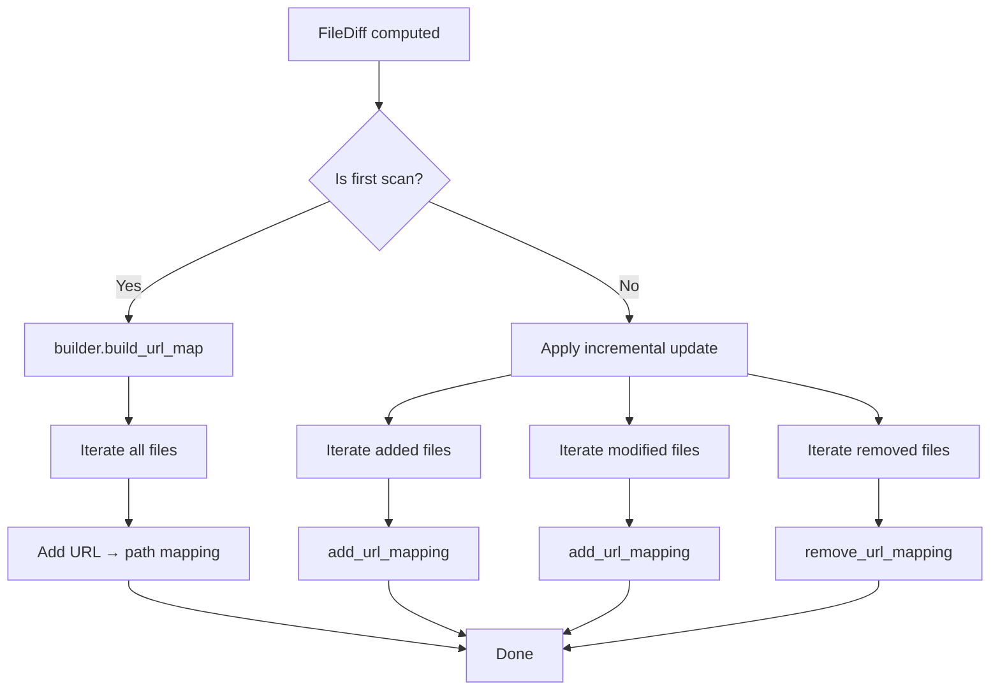
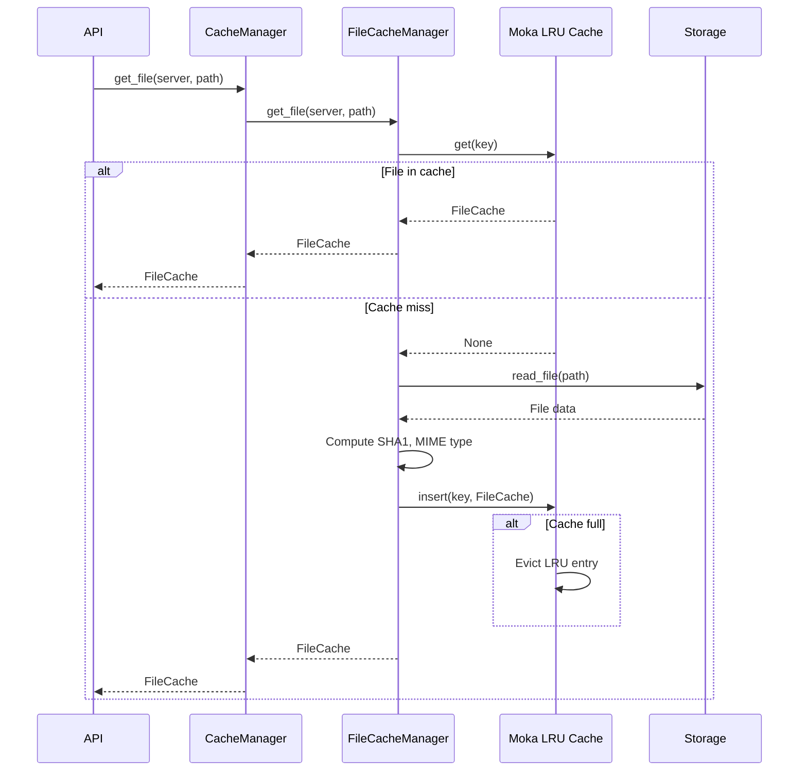
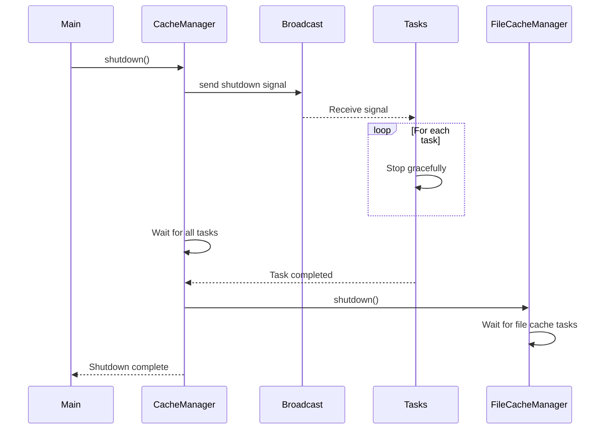

# Processing Flow

This document describes the main processing flows of the cache system with detailed sequence diagrams.

## Flow 1: Startup and Initialization

## Flow 2: Automatic Rescan (Polling Mode)

## Flow 3: Automatic Rescan (File Watcher Mode)

## Flow 4: Granular Change Detection (FileDiff)

## Flow 5: Cloud Synchronization

## Flow 6: Configuration Hot-reload

## Flow 7: Incremental URL Map Update

## Flow 8: File LRU Cache

## Flow 9: Graceful Shutdown

## Performance Metrics

### Time Complexity

- **FileDiff computation**: O(n) where n = total number of files
- **ServerPathCache lookup**: O(1) amortized
- **Version cache get/insert**: O(1) with DashMap
- **File cache get/insert**: O(1) with Moka
- **URL map update**: O(k) where k = number of changes

### Implemented Optimizations

1. **HashMap for FileDiff**: Avoids O(n²) comparisons
2. **Incremental URL map**: Avoids O(n) reconstruction
3. **Parallel file upload**: Reduces total synchronization time
4. **Debouncing**: Avoids unnecessary rescans
5. **Lock-free DashMap**: Maximizes concurrency
