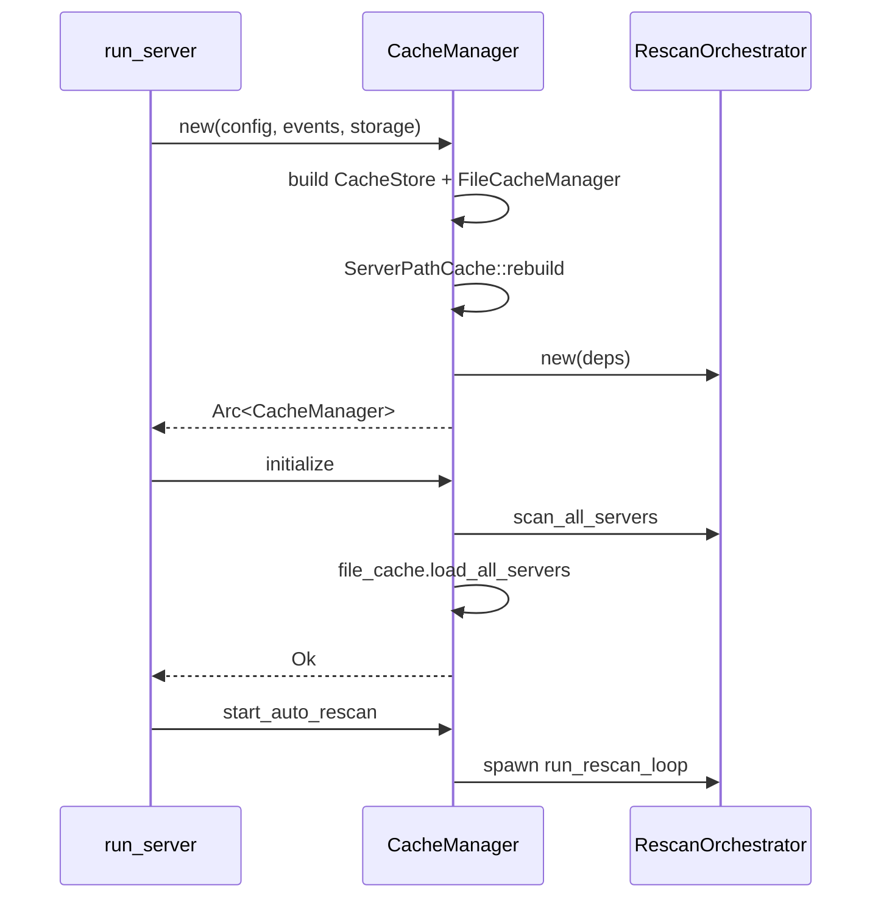
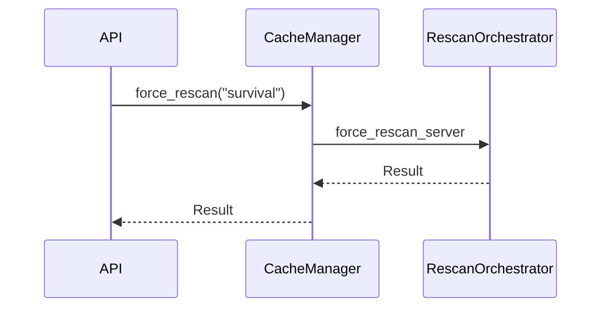
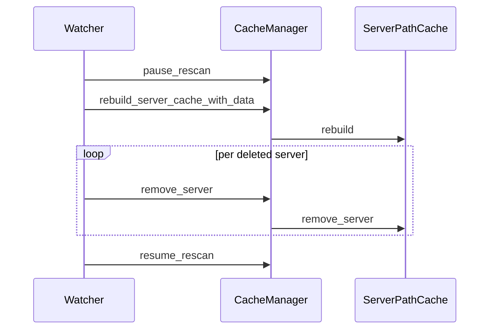

# Flows

## Boot



`new` does no I/O beyond reading `config.read().await`. The first
disk touch is `initialize`.

## Force rescan



Loud variant — errors propagate.

## Config hot-reload



## Shutdown

```mermaid
sequenceDiagram
    participant Sig as ctrl-c
    participant Run as run_server
    participant CM as CacheManager
    participant Loop as rescan task

    Sig->>Run: SIGINT
    Run->>CM: shutdown
    CM->>CM: shutdown_tx.send (broadcast)
    Loop-->>Loop: select recv exits
    CM->>CM: await every spawned handle
    CM-->>Run: ()
```

Single broadcast fans out to every receiver.

## See also

- [overview.md](./overview.md)
- [../../rescan/docs/flows.md](../../rescan/docs/flows.md) — the interesting diff-driven pipeline
