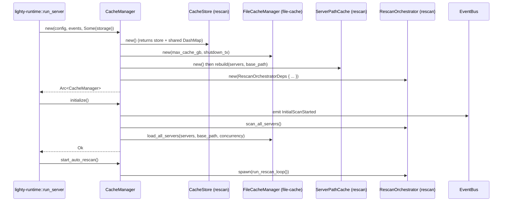
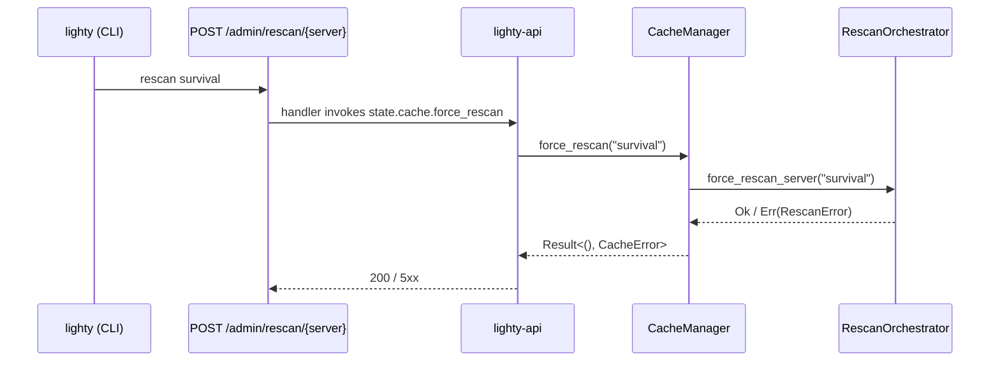
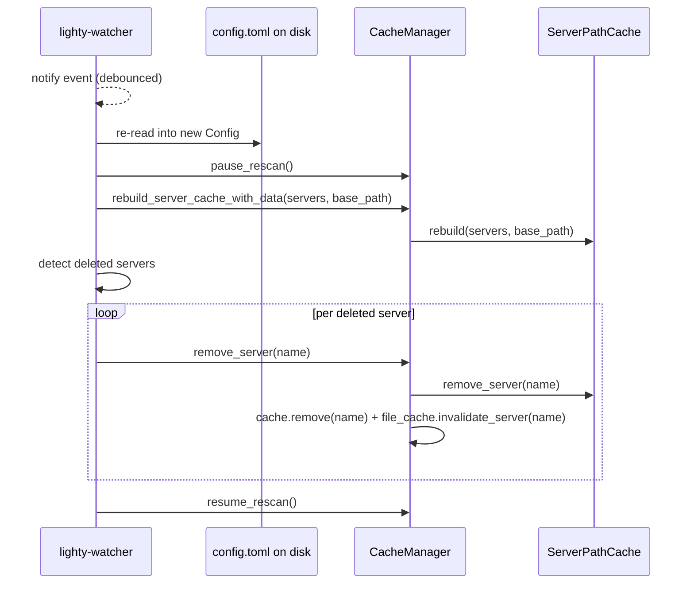

# Flows

Lifecycle sequences for the facade itself. The interesting work
happens in the sub-crates; these diagrams show how `CacheManager`
glues them.

## Boot



`new` does no I/O: it reads from `config.read()` (a tokio RwLock), but
none of the constructed pieces touch the disk until `initialize`. This
keeps `new` fast and predictable for tests.

## Force rescan from the CLI



Note that `force_rescan` propagates errors — unlike the continuous
loop, which swallows them. The CLI / admin endpoint wants to surface
failures.

## Config hot-reload



`pause` -> `rebuild` -> `resume` is the canonical sequence. Doing it
in the other order risks an in-flight rescan reading the old server
path cache and missing the rename.

## Shutdown

```mermaid
sequenceDiagram
    participant Sig as ctrl-c
    participant Run as lighty-runtime
    participant CM as CacheManager
    participant Loop as rescan loop task
    participant FC as FileCacheManager

    Sig->>Run: SIGINT
    Run->>CM: shutdown()
    CM->>CM: shutdown_tx.send(()) (broadcast)
    Loop-->>Loop: select! recv triggers, loop exits
    CM->>CM: drain tasks DashMap, await each handle
    CM->>FC: shutdown() (drains its own tasks)
    CM-->>Run: ()
    Run->>Bus: emit Shutdown
```

All spawned tasks subscribe to the broadcast channel; the shutdown
signal is a single `send(())` that fans out to every receiver.

## See also

- [`overview.md`](./overview.md)
- [`how-to-use.md`](./how-to-use.md)
- [`exports.md`](./exports.md)
- [`../../rescan/docs/flows.md`](../../rescan/docs/flows.md) — the
  interesting diff-driven side-effect pipeline (delegated to that
  crate)
