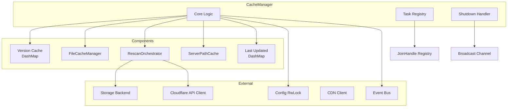
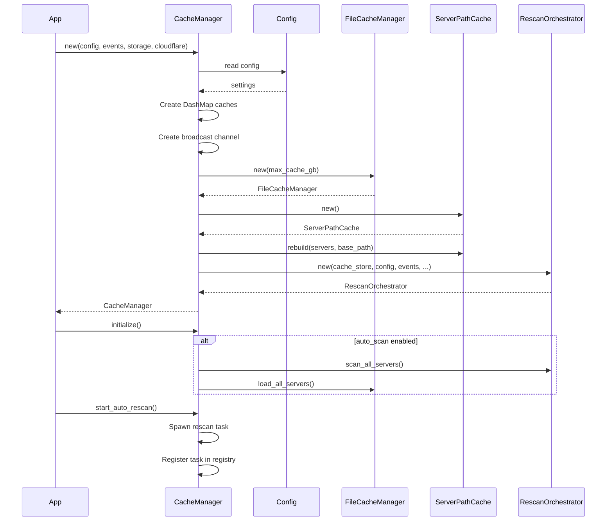
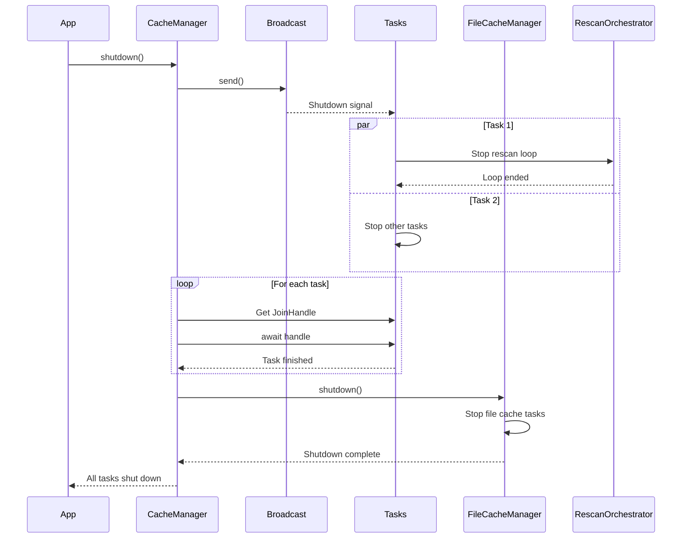
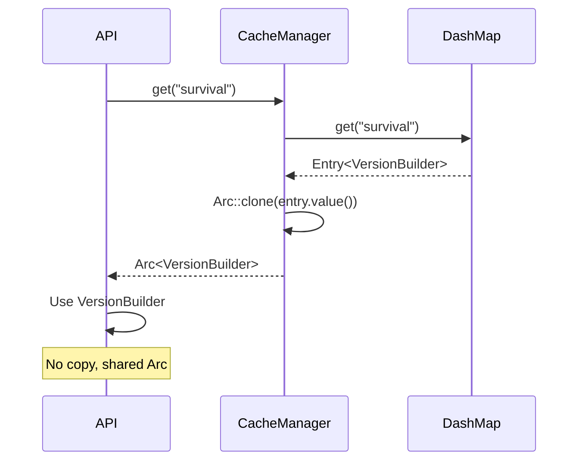
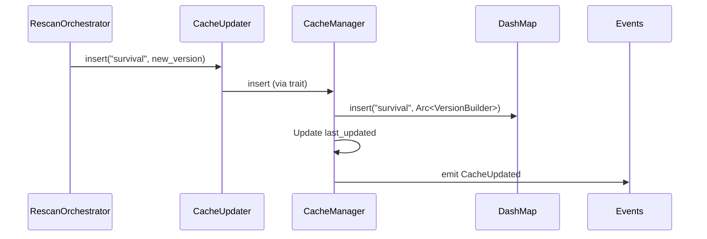

# CacheManager - Main Manager

Detailed documentation of the cache system's main manager.

## Overview

The `CacheManager` is the main entry point of the cache crate. It coordinates all components and provides the public interface for other crates.

## Architecture



## Internal Components

### Version Cache

```rust
cache: Arc<DashMap<String, Arc<VersionBuilder>>>
```

**Characteristics**:
- DashMap for lock-free concurrency
- Key: server name
- Value: Arc<VersionBuilder> for sharing without copying
- Thread-safe by design

**Operations**:
- `get`: Read server's VersionBuilder - O(1)
- `insert`: Update cache - O(1)
- `contains_key`: Check existence - O(1)

### FileCacheManager

```rust
file_cache_manager: Arc<FileCacheManager>
```

Manages the in-memory LRU cache of files:
- Moka cache with automatic eviction
- Configurable memory limit
- Stores complete files (data, SHA1, size, MIME)

### Last Updated

```rust
last_updated: Arc<DashMap<String, String>>
```

RFC3339 timestamp of each server's last update:
- Used for API display
- Updated on each successful rescan
- Format: "2024-12-25T15:30:45Z"

### Task Registry

```rust
tasks: Arc<DashMap<usize, JoinHandle<()>>>
task_counter: Arc<AtomicUsize>
```

Background task registry:
- Atomic counter for unique IDs
- DashMap of JoinHandles
- Allows graceful shutdown

## Lifecycle

### Creation and Initialization



### Starting Automatic Rescan

```rust
pub async fn start_auto_rescan(&self) {
    let enabled = {
        let config = self.config.read().await;
        config.cache.enabled
    };

    if !enabled {
        return;
    }

    let orchestrator = Arc::clone(&self.rescan_orchestrator);
    let mut shutdown_rx = self.shutdown_tx.subscribe();

    let handle = tokio::spawn(async move {
        tokio::select! {
            _ = orchestrator.run_rescan_loop() => {
                tracing::info!("Rescan loop ended");
            }
            _ = shutdown_rx.recv() => {
                tracing::info!("Rescan loop shutting down gracefully");
            }
        }
    });

    let task_id = self.task_counter.fetch_add(1, Ordering::SeqCst);
    self.tasks.insert(task_id, handle);
}
```

**Mechanism**:
1. Clone orchestrator for move into task
2. Subscribe to shutdown channel
3. Use `tokio::select!` for graceful shutdown
4. Register JoinHandle in registry

### Graceful Shutdown



**Guarantees**:
- All tasks terminate cleanly
- No data loss
- No panic during shutdown

## Public API

### Initialization

```rust
pub async fn initialize(&self) -> Result<()>
```

Initializes the cache:
- Initial scan if `auto_scan` active
- File cache loading
- Emission of `InitialScanStarted` event

### Manual Rescan

```rust
pub async fn force_rescan(&self, server_name: &str) -> Result<()>
```

Forces rescan of a specific server:
- Used by manual rescan API
- Used during config hot-reload
- Immediate cache update

### Cache Access

```rust
pub async fn get(&self, server_name: &str) -> Option<Arc<VersionBuilder>>
```

Retrieves a server's version:
- Returns None if server doesn't exist
- Arc for sharing without copying
- Thread-safe

```rust
pub async fn get_version(&self, name: &str) -> Option<Arc<VersionBuilder>>
```

Alias of `get` for compatibility.

### File Access

```rust
pub async fn get_file(&self, server: &str, path: &str) -> Option<FileCache>
```

Retrieves a file from LRU cache:
- Cache miss: load from disk
- Returns data, SHA1, size, MIME type
- Automatic LRU eviction

### Server Information

```rust
pub async fn get_all_servers(&self) -> Vec<String>
```

Lists all active servers.

```rust
pub async fn get_server_config(&self, name: &str) -> Option<Arc<ServerConfig>>
```

Retrieves a server's configuration.

```rust
pub fn get_last_update(&self, name: &str) -> Option<String>
```

Timestamp of server's last update.

### Statistics

```rust
pub fn get_cache_stats(&self) -> (u64, u64)
```

LRU cache statistics:
- Number of entries
- Weighted size in KB

### Pause/Resume

```rust
pub fn pause_rescan(&self)
pub fn resume_rescan(&self)
```

Control automatic rescan:
- Used during config hot-reload
- Avoids race conditions

### Rebuild Server Cache

```rust
pub async fn rebuild_server_cache(&self)
```

Rebuilds the ServerPathCache:
- Called after config reload
- Updates path→server mappings

## Integration with CacheUpdater

The CacheManager implements the `CacheUpdater` trait:

```rust
impl CacheUpdater for CacheManager {
    fn insert(&self, server_name: String, version: Arc<VersionBuilder>) {
        self.cache.insert(server_name, version);
    }

    fn get(&self, server_name: &str) -> Option<Arc<VersionBuilder>> {
        self.cache.get(server_name).map(|entry| Arc::clone(entry.value()))
    }

    fn contains(&self, server_name: &str) -> bool {
        self.cache.contains_key(server_name)
    }
}
```

**Purpose**: Allows RescanOrchestrator to update cache without directly depending on CacheManager.

## Internal CacheStore

Internal structure that also implements `CacheUpdater`:

```rust
pub struct CacheStore {
    cache: Arc<DashMap<String, Arc<VersionBuilder>>>,
}
```

**Usage**: Passed to RescanOrchestrator to allow decoupled cache updates.

## Concurrency Management

### Locking Strategies

**DashMap (lock-free)**:
```rust
self.cache.get(server_name)  // No explicit lock
self.cache.insert(server_name, version)
```

**RwLock for Config**:
```rust
let config = self.config.read().await;  // Read
// or
let mut config = self.config.write().await;  // Write
```

**AtomicUsize for task_counter**:
```rust
let id = self.task_counter.fetch_add(1, Ordering::SeqCst);
```

### Synchronization Patterns

**Clone before spawn**:
```rust
let orchestrator = Arc::clone(&self.rescan_orchestrator);
tokio::spawn(async move {
    orchestrator.run_rescan_loop().await
})
```

**Broadcast for shutdown**:
```rust
let mut shutdown_rx = self.shutdown_tx.subscribe();
tokio::select! {
    _ = work() => {}
    _ = shutdown_rx.recv() => {
        // Shutdown gracefully
    }
}
```

## Data Flow

### Read Flow (API → Cache)



### Write Flow (Rescan → Cache)



## Optimizations

### Sharing Without Copying

```rust
// Bad: complete copy
let version = self.cache.get(name).cloned();

// Good: sharing via Arc
let version = self.cache.get(name).map(|e| Arc::clone(e.value()));
```

**Gain**: Zero-copy for potentially large structures (VersionBuilder with thousands of files).

### Lazy Initialization

Cache is only filled if `auto_scan` is active:
- Faster startup if disabled
- Flexibility for tests

### Optimized Task Registry

```rust
tasks: Arc<DashMap<usize, JoinHandle<()>>>
```

- No global lock
- Concurrent add/remove
- Parallel task shutdown

## Error Handling

### Selective Propagation

Some operations don't propagate errors:
```rust
pub async fn start_auto_rescan(&self) {
    // No Result, errors handled internally
}
```

Others propagate:
```rust
pub async fn initialize(&self) -> Result<()> {
    // Critical failure, must be handled by caller
}
```

### Structured Logging

- ERROR: Critical failures
- WARN: Non-blocking problems
- INFO: Important operations
- DEBUG: Operation details

### Error Events

```rust
self.events.emit(AppEvent::Error {
    context: "Failed to scan server survival".to_string(),
    error: e.to_string(),
});
```

Allows consumers to react to errors.
