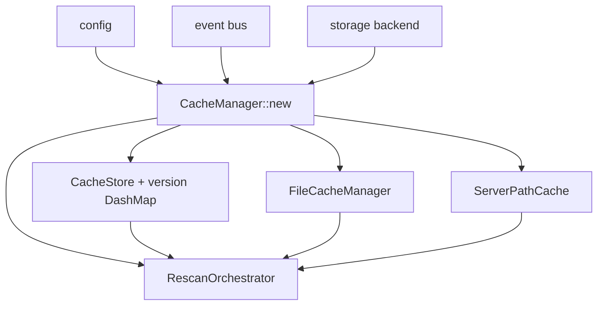

# Overview

The thin facade the rest of the workspace talks to. After the split,
`lighty-cache` is ~270 LOC across 4 files; the substantial work lives
in `lighty-file-diff`, `lighty-file-cache`, `lighty-cdn`,
`lighty-rescan`.

## What's inside

| Module | Purpose |
|---|---|
| `manager` | `CacheManager` impl: ctor, lifecycle, public reads, admin. |
| `models` | `CacheManager` struct (fields crate-private). |
| `errors` | `CacheError` umbrella that wraps `RescanError`, `FileCacheError`, `CdnError`. |

## What it re-exports

```rust
pub use lighty_cdn::{CdnClient, CdnError, CloudflareClient};
pub use lighty_file_cache::{FileCache, FileCacheManager};
pub use lighty_file_diff::{FileChange, FileDiff, FileType};
pub use lighty_rescan::{ChangeDetector, RescanOrchestrator, ServerPathCache};
pub use errors::CacheError;
pub use models::CacheManager;
```

`api`, `runtime` and `watcher` keep their existing imports.

## Wiring at construction



CDN/Cloudflare are no longer wired here — they live in
`lighty-cdn::CdnEventSink` mounted by the runtime.

## See also

- [how-to-use.md](./how-to-use.md)
- [exports.md](./exports.md)
- [flows.md](./flows.md)
- [../../file-diff/docs/](../../file-diff/docs/overview.md), [../../file-cache/docs/](../../file-cache/docs/overview.md), [../../cdn/docs/](../../cdn/docs/overview.md), [../../rescan/docs/](../../rescan/docs/overview.md)
