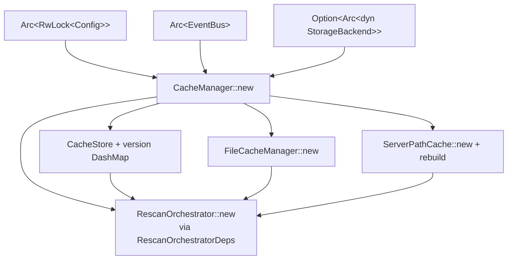

# Overview

`lighty-cache` is the thin facade the rest of the workspace talks to.
After the refactor it owns very little code of its own — about 270
lines across `manager.rs`, `models.rs`, `errors.rs` and `lib.rs`.
Everything substantial lives in dedicated crates:
`lighty-file-diff`, `lighty-file-cache`, `lighty-cdn`,
`lighty-rescan`.

The crate exists for two reasons:

1. **Stable entry point.** `api`, `runtime` and `watcher` all hold an
   `Arc<CacheManager>`. Splitting the implementation crates while
   keeping this one means consumers see no change in their `use`
   statements.
2. **Composition root for the cache layer.** `CacheManager::new`
   constructs every sub-crate's primary type, hands them the right
   inputs (`Arc<EventBus>`, `Arc<RwLock<Config>>`, storage backend),
   and returns a single owned struct.

## What's inside

| Module | Purpose |
|---|---|
| `manager` | `CacheManager` impl: ctor, lifecycle (`initialize`, `start_auto_rescan`, `shutdown`), public reads (`get`, `get_file`, `get_all_servers`, `get_last_update`), admin (`force_rescan`, `remove_server`, `pause_rescan`/`resume_rescan`). Also impls `CacheUpdater`. |
| `models` | `CacheManager` struct definition (fields are crate-private). |
| `errors` | `CacheError` umbrella that wraps `RescanError`, `FileCacheError`, `CdnError`, plus `IoError`. |

## What it re-exports

Everything callers used to import from `lighty-cache` is still exposed:

```rust
pub use lighty_cdn::{CdnClient, CdnError, CloudflareClient};
pub use lighty_file_cache::{FileCache, FileCacheManager};
pub use lighty_file_diff::{FileChange, FileDiff, FileType};
pub use lighty_rescan::{ChangeDetector, RescanOrchestrator, ServerPathCache};
pub use errors::CacheError;
pub use models::CacheManager;
```

This means `api` continues to `use lighty_cache::CacheManager`,
`runtime` continues to `use lighty_cache::CdnClient`, and the diff
between the old and new world is invisible to them.

## Wiring at construction



CDN and Cloudflare clients are **not** wired here anymore. They live
inside `lighty-cdn::CdnEventSink`, which is mounted on the event bus
by `lighty-runtime`.

## Cargo features

None.

## See also

- [`how-to-use.md`](./how-to-use.md) — boot + lifecycle code
- [`exports.md`](./exports.md) — full public surface
- [`flows.md`](./flows.md) — `initialize`, `start_auto_rescan`,
  `force_rescan`, `remove_server`, `shutdown`
- The four extracted crates:
  [`../../file-diff/docs/`](../../file-diff/docs/overview.md),
  [`../../file-cache/docs/`](../../file-cache/docs/overview.md),
  [`../../cdn/docs/`](../../cdn/docs/overview.md),
  [`../../rescan/docs/`](../../rescan/docs/overview.md).
