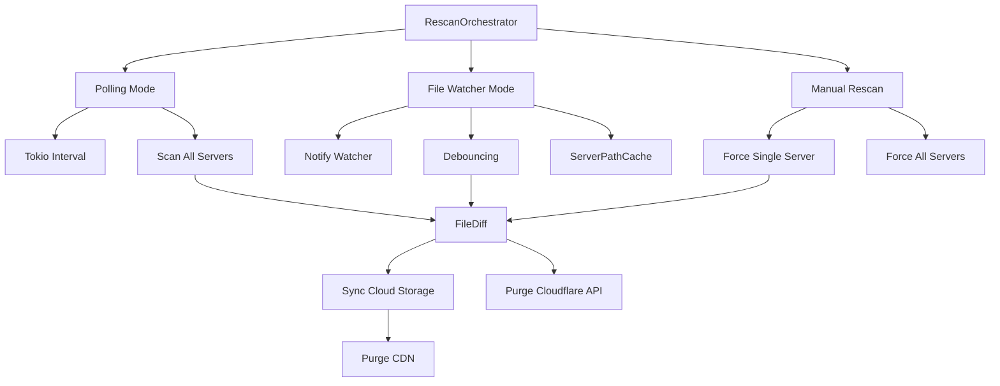
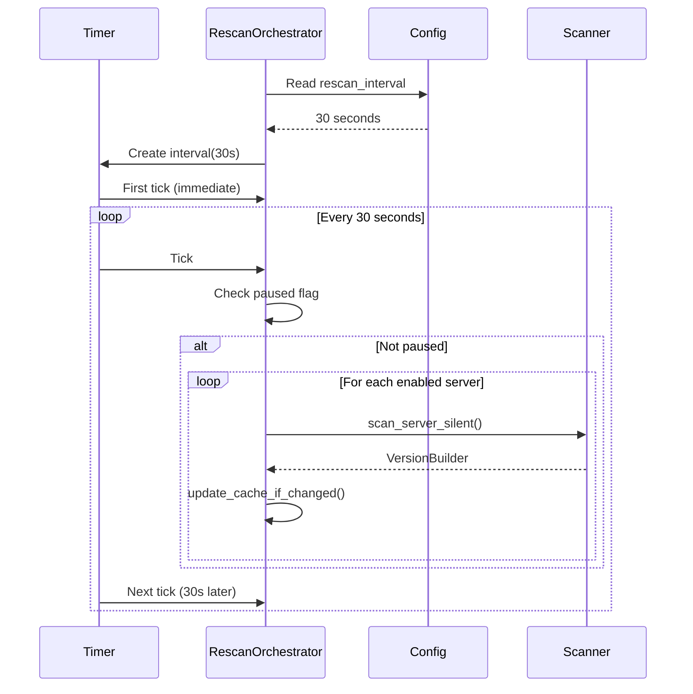
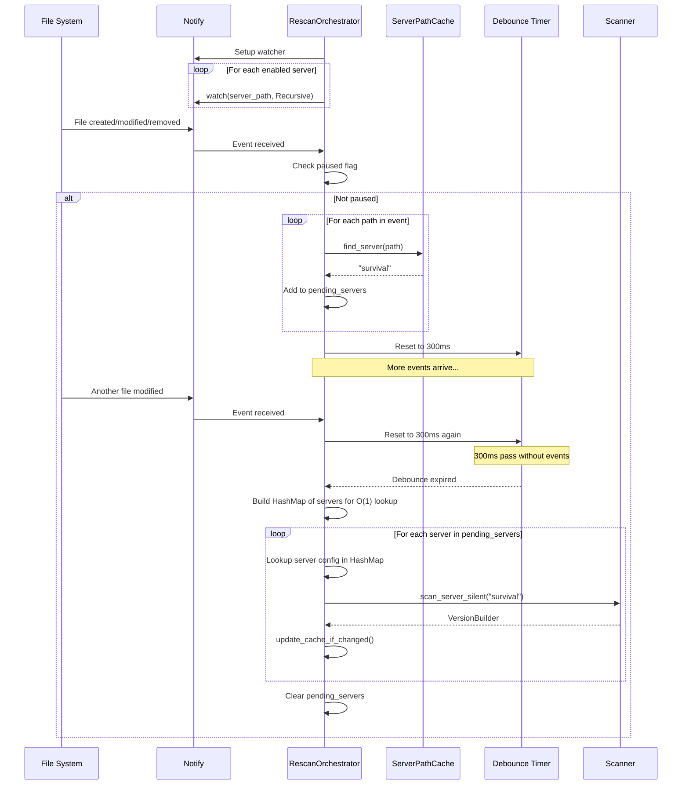
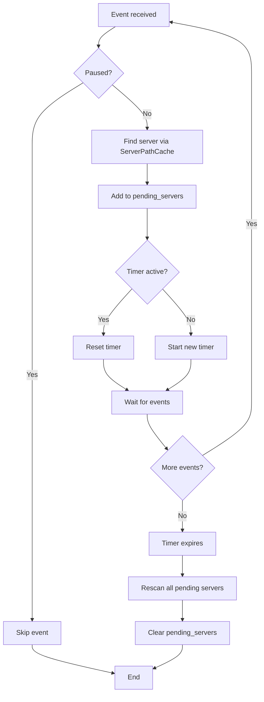
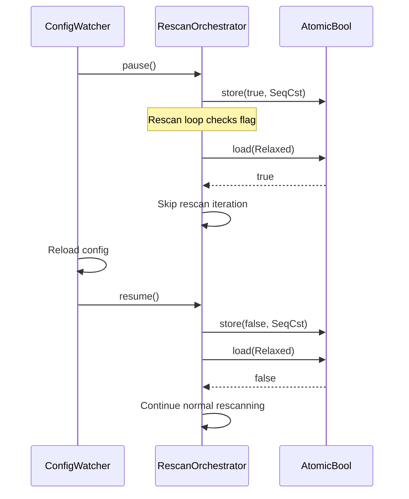
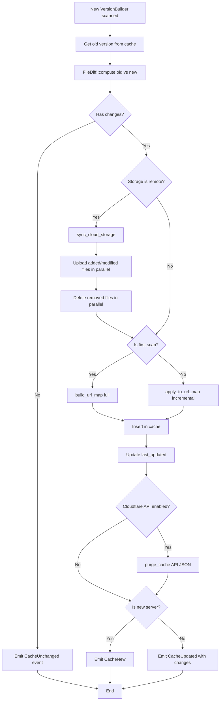
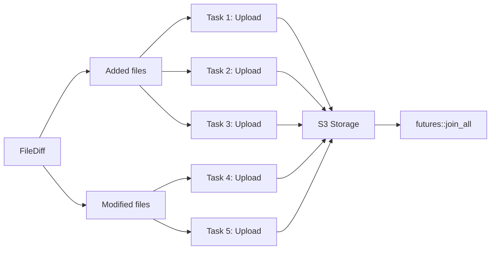
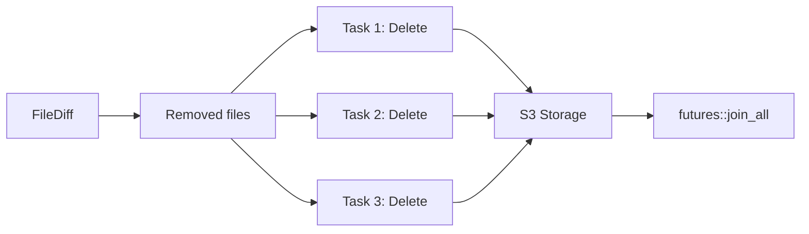
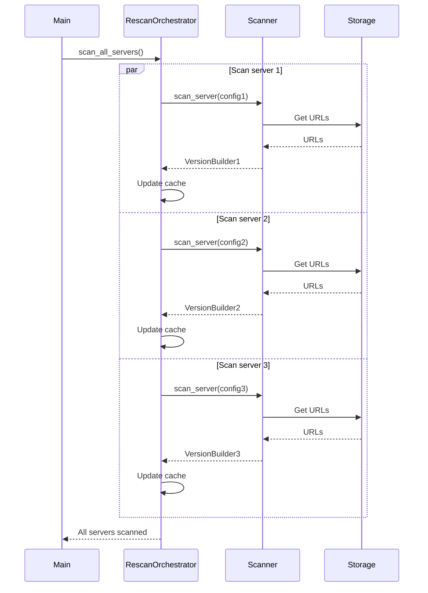

# RescanOrchestrator

Detailed documentation of the automatic and manual rescan system.

## Overview

The `RescanOrchestrator` is the central component that orchestrates monitoring and automatic cache updating. It supports two distinct operating modes and offers manual rescan capabilities.

## Architecture



## Operating Modes

### Polling Mode

Active when `rescan_interval > 0` in the configuration.

**Principle**:
- Periodic rescan based on a fixed time interval
- Checks all active servers at each iteration
- Uses `tokio::time::interval` for precise timing

**Advantages**:
- Simple and predictable
- Works even if the file system doesn't support notify
- Guarantees regular verification

**Disadvantages**:
- Potential delay between the change and detection
- Regular CPU consumption even without changes

**Configuration**:
```toml
[cache]
rescan_interval = 30  # Rescan every 30 seconds
```

**Sequence diagram**:



### File Watcher Mode

Active when `rescan_interval = 0` in the configuration.

**Principle**:
- Real-time file change monitoring
- Uses the `notify` library to receive file system events
- Debouncing to avoid multiple rapid rescans
- O(1) lookup via `ServerPathCache` to identify the affected server

**Advantages**:
- Immediate change detection
- No CPU consumption when there are no changes
- Optimization: rescan only the modified server

**Disadvantages**:
- Requires file system support (inotify on Linux, FSEvents on macOS)
- More complex to debug
- Can generate many events during massive modifications

**Configuration**:
```toml
[cache]
rescan_interval = 0  # Activate file watcher

[hot-reload.files]
enabled = true  # Enable file hot-reload
debounce_ms = 300  # Wait 300ms after the last event
```

**Sequence diagram**:



**Debouncing algorithm**:



## Pause and Resume

The RescanOrchestrator can be temporarily paused, particularly during configuration hot-reload.

**Usage**:

```rust
orchestrator.pause();   // Pause rescan
// ... reload configuration ...
orchestrator.resume();  // Resume rescan
```

**Implementation**:

Uses an `AtomicBool` for a thread-safe flag without locking:



**Memory Ordering:**
- Store operations use `SeqCst` for strong synchronization
- Load operations use `Relaxed` ordering for simple flag checks

**Importance**: Avoids race conditions during configuration reload by guaranteeing that no rescan occurs during shared config update.

## Change Detection and Synchronization

### update_cache_if_changed Algorithm



### Cloud Synchronization

When the storage backend is remote (S3, etc.), the system automatically synchronizes changes:

**Parallelized upload**:



**Parallelized delete**:



**Advantages**:
- Maximum parallelization of uploads/deletes
- No sequential waiting
- Optimization of total synchronization time

## Manual Rescan

### Force Rescan of a Single Server

```rust
orchestrator.force_rescan_server("survival").await?;
```

**Use cases**:
- Manual file correction
- Debugging
- On-demand rescan API
- Configuration hot-reload with server change

**Behavior**:
- Complete server scan
- Complete URL map reconstruction
- Immediate cache update
- No CacheUpdated event emission (manual operation)

### Scan All Servers

```rust
orchestrator.scan_all_servers().await?;
```

**Use cases**:
- System initialization
- Complete cache reconstruction
- Recovery after corruption

**Behavior**:
- Parallel scan of all active servers
- Each server is scanned independently
- Individual failures don't prevent other scans
- Event emission for each scanned server

**Diagram**:



## Optimizations

### ServerPathCache

Cache for efficient lookup of the owner server of a file:

```rust
// Structure: Vec sorted by path length (descending)
// Paths sorted to ensure most specific matches first

// Example:
// [
//   ("/servers/survival-modded", "survival-modded"),  // longest first
//   ("/servers/survival", "survival"),
//   ("/servers/creative", "creative")
// ]

server_path_cache.find_server(&path)
```

**Implementation:**
- Sorted Vec ensures the first matching path is the most specific
- Early termination on first match
- Efficient for typical deployments with few servers

**Impact**: Essential for the file watcher which potentially receives hundreds of events per second. The sorted structure ensures correct matching for nested server paths.

### Silent Scan

`scan_server_silent` vs `scan_server`:
- Silent version: no detailed logging
- Used for frequent automatic rescans
- Reduces noise in logs

### Incremental URL Map

Avoids complete URL map reconstruction:
- First scan: `build_url_map()` - Full map construction
- Rescans: `apply_to_url_map(&diff)` - Updates only changed files

Significant performance gain when few files change.

## Error Handling

### Recoverable Errors

- Temporarily unavailable server: Skip and retry in next cycle
- Missing file: Log warning, continue scan
- Cloud timeout: Log error, local cache remains functional

### Critical Errors

- Uninitialized storage backend: Error propagation
- Complete scan all servers failure: Error event emission

### Error Isolation

Each server is scanned independently:
- Failure of server A doesn't affect server B
- Successful servers are cached even if others fail
