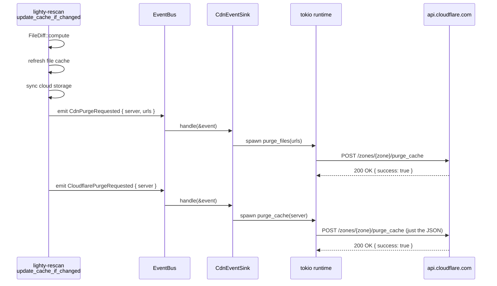
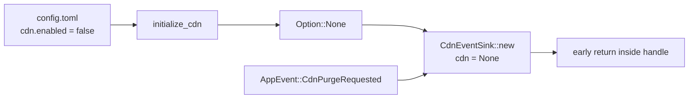

# Flows

End-to-end sequence of a CDN purge starting from a rescan diff.

## Purge after a server diff



The bus is **synchronous**: `Bus::emit` returns as soon as `handle`
returns. Because `handle` only `spawn`s, the rescan loop doesn't wait
for the HTTP call to land. That's deliberate — purges are best-effort
and the launcher will eventually retry the JSON manifest anyway.

## Retry loop on transient failures

```mermaid
flowchart TD
    Start[purge_files / purge_cache] --> POST[POST /zones/{zone}/purge_cache]
    POST --> Resp{Response?}
    Resp -->|2xx + success=true| Ok[Ok]
    Resp -->|2xx + success=false| Err[Err Cdn::Cloudflare]
    Resp -->|5xx or transport| Retry{attempts < 3?}
    Retry -->|yes| Sleep[sleep 100ms * 2^attempt]
    Sleep --> POST
    Retry -->|no| Err
```

Backoff is exponential with base `100 ms`. The final failure is logged
at `error!` and returned to the sink, which logs a `warn!` and drops
it (the bus contract has no error path).

## Disabled-in-config path



When the operator hasn't configured a CDN, `initialize_cdn` in
`lighty-runtime` returns `None`. The sink still receives every event
but matches on `Some(cdn)` first and falls through silently when
absent. Same path for `CloudflarePurgeRequested`.

## See also

- [`overview.md`](./overview.md)
- [`how-to-use.md`](./how-to-use.md)
- [`exports.md`](./exports.md)
- [`../../rescan/docs/flows.md`](../../rescan/docs/flows.md) — the
  upstream half of the flow (scan → diff → emit)
