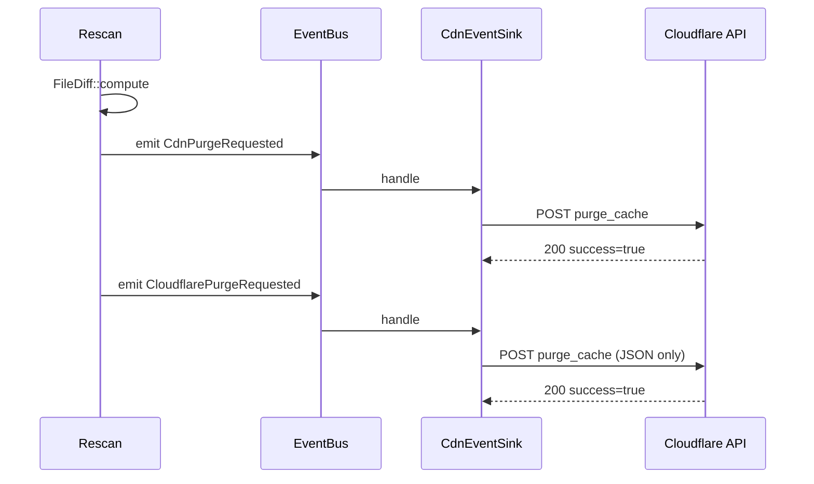
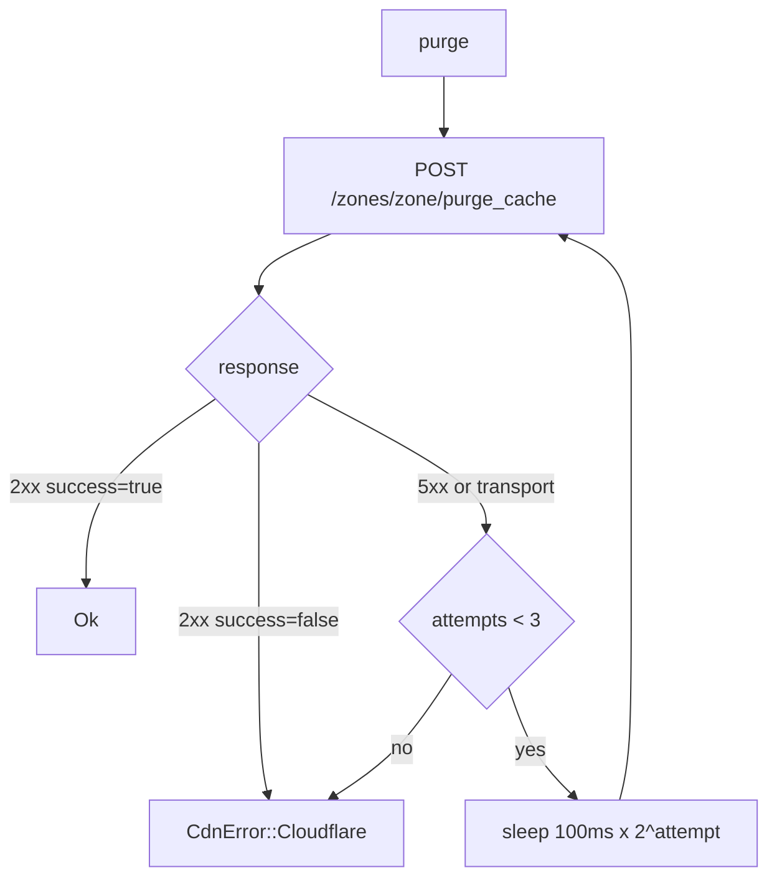
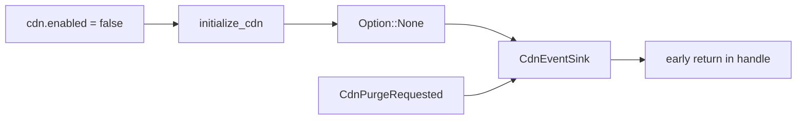

# Flows

## End-to-end purge

The bus is sync: `emit` returns as soon as `handle` returns. The sink
only `spawn`s, so rescan never waits for the network.

## Retry loop

## Disabled in config

## See also

- [overview.md](./overview.md)
- [../../rescan/docs/flows.md](../../rescan/docs/flows.md)
