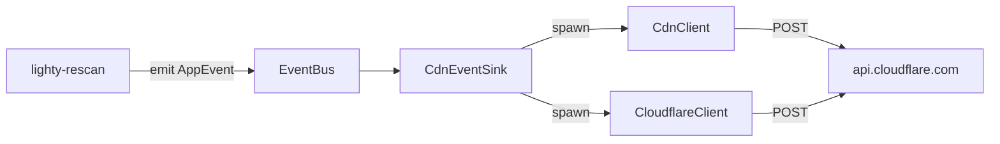

# Overview

HTTP clients for Cloudflare and the event sink that drives them.
Rescan emits purge events; this crate is the only place that opens a
TCP connection.

## What's inside

| Item | Purpose |
|---|---|
| `CdnClient` | Per-URL purge against a CDN provider (Cloudflare today). Exponential-backoff retry built in. |
| `CloudflareClient` | Purges a server's JSON metadata key. |
| `CdnEventSink` | `EventSink` impl: listens for `CdnPurgeRequested` / `CloudflarePurgeRequested`, spawns the HTTP call on the runtime. |
| `CdnError` | `#[from] reqwest::Error` plus a `Cloudflare(reason)` variant. |
| `CdnProvider` | `Cloudflare` / `CloudFront` (stub). |

## Big picture

The bus is synchronous, so the sink saves a `Handle` and spawns each
purge as a background task. Failures get logged, not propagated.

## See also

- [how-to-use.md](./how-to-use.md)
- [exports.md](./exports.md)
- [flows.md](./flows.md)
- [../../events/docs/exports.md](../../events/docs/exports.md) — the events this sink consumes
- [../../rescan/docs/overview.md](../../rescan/docs/overview.md) — who emits them
