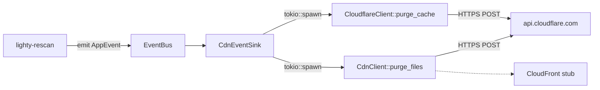

# Overview

`lighty-cdn` ships the HTTP clients that talk to Cloudflare and a thin
event sink so the rest of the workspace can stay HTTP-free. Rescan
emits `CdnPurgeRequested` / `CloudflarePurgeRequested` on the event
bus; the sink in this crate is the only place that actually opens a
TCP connection.

## What's inside

| Item | Purpose |
|---|---|
| `CdnClient` | Per-URL purge against a configured CDN provider (Cloudflare today, CloudFront stubbed). Exponential-backoff retry built in. |
| `CloudflareClient` | Purges a single server's JSON metadata key — used after every `CacheUpdated` so launchers see the new manifest. |
| `CdnEventSink` | `EventSink` impl that listens for `CdnPurgeRequested` / `CloudflarePurgeRequested` and dispatches the call on the surrounding tokio runtime. |
| `CdnError` | One error type for the crate; `#[from] reqwest::Error` plus a `Cloudflare(reason)` variant. |
| `CdnProvider` | `enum { Cloudflare, CloudFront }` resolved from a config string. |

The crate has no Cargo features.

## Big picture

The bus is synchronous (`emit` is fire-and-forget), so the sink saves
a `tokio::runtime::Handle` at construction time and spawns each purge
as a background task. Failures are logged with `tracing::warn!` — the
event-bus contract doesn't propagate `Result`.

## Design notes

- **No shared global state.** The two clients hold their own
  `reqwest::Client` instances; no static singletons.
- **Retries are exponential.** 3 attempts, base 100 ms backoff,
  doubling each retry. A `5xx` or transport error retries; a
  `success: false` JSON body returns immediately as
  `CdnError::Cloudflare`.
- **CloudFront is a stub.** Selecting `provider = "cloudfront"` logs
  and returns `Ok(())` — wire up AWS-SDK calls when the project
  actually targets it.
- **Empty URL list short-circuits.** `CdnClient::purge_files(vec![])`
  returns immediately without opening a connection.

## Cargo features

None. `tokio`, `serde`, `tracing`, `thiserror`, `reqwest` (rustls) are
unconditionally required.

## See also

- [`how-to-use.md`](./how-to-use.md) — runnable examples
- [`exports.md`](./exports.md) — full public surface
- [`flows.md`](./flows.md) — sequence diagram for an end-to-end purge
- [`../../events/docs/exports.md`](../../events/docs/exports.md) — the
  `AppEvent` variants this sink reacts to
- [`../../rescan/docs/overview.md`](../../rescan/docs/overview.md) —
  who emits the events on the bus
