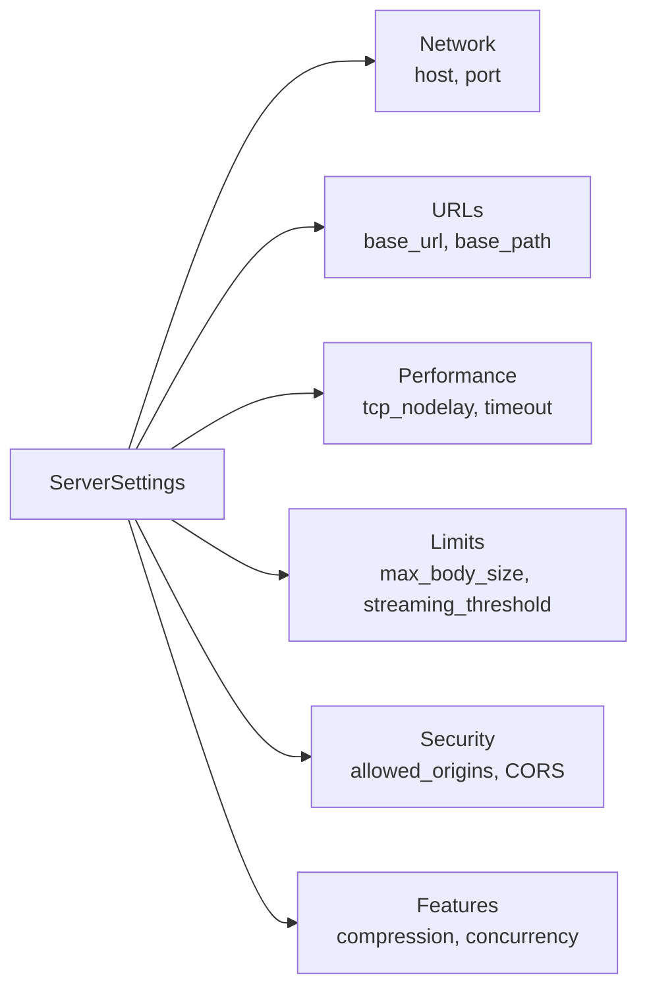
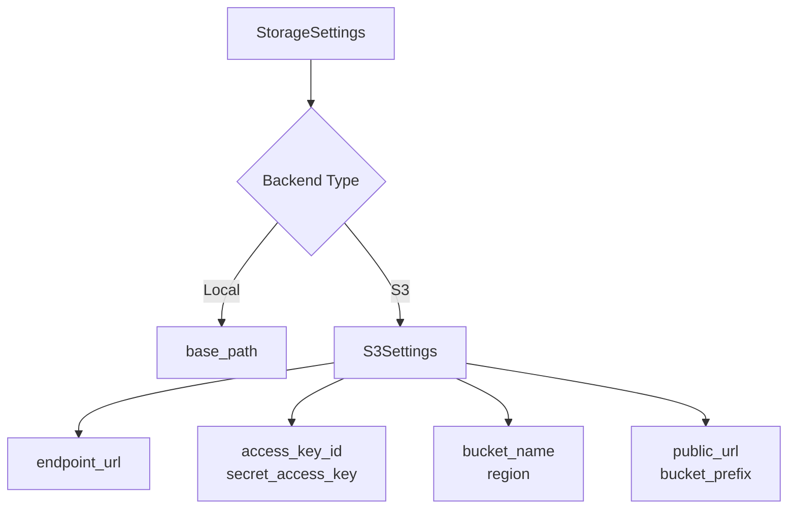
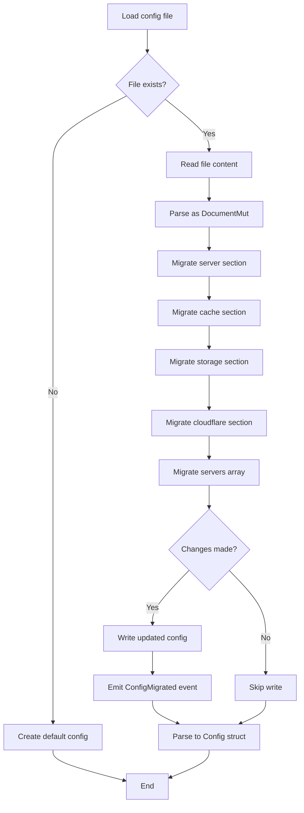
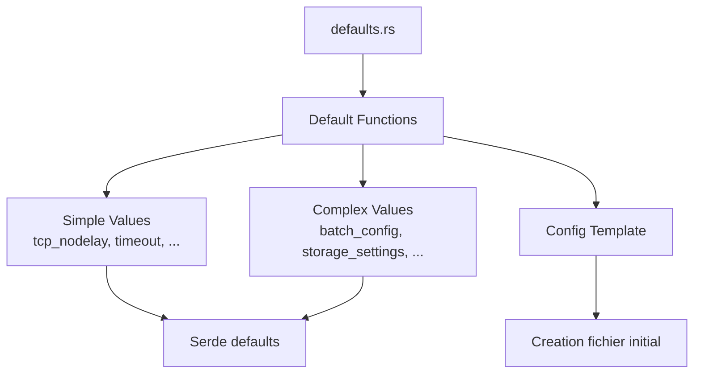
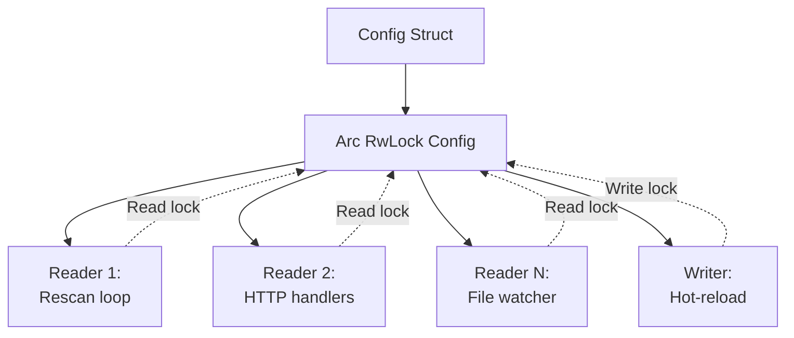
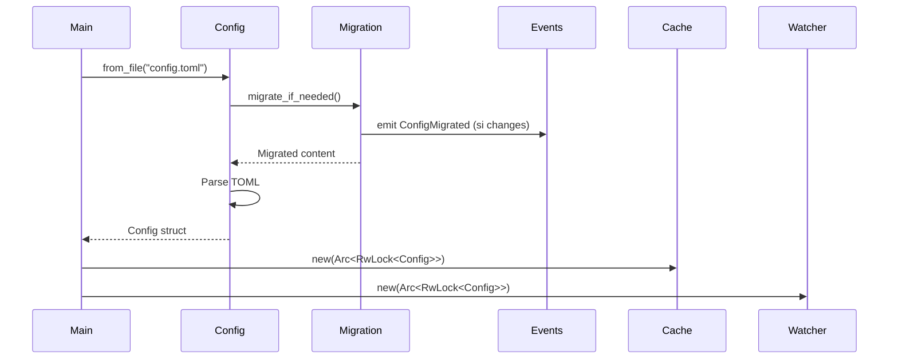

# Configuration System Architecture

## Overview

The configuration system is designed to be robust, flexible and maintainable with automatic migration and hot-reload support.

## Architecture Diagram

```mermaid
graph TB
    subgraph "Loading Layer"
        Loader[Config Loader]
        Migration[Migration System]
        Parser[TOML Parser]
    end

    subgraph "Configuration Structures"
        Config[Config]
        Server[ServerSettings]
        Cache[CacheSettings]
        Storage[StorageSettings]
        CF[CloudflareSettings]
        Servers[Vec ServerConfig ]
    end

    subgraph "Defaults"
        Defaults[Default Values]
        Template[Config Template]
    end

    subgraph "Runtime"
        RwLock[Arc RwLock Config ]
        Watcher[ConfigWatcher]
        Events[Event Bus]
    end

    File[config.toml] --> Loader
    Loader --> Migration
    Migration --> Parser
    Parser --> Config

    Config --> Server
    Config --> Cache
    Config --> Storage
    Config --> CF
    Config --> Servers

    Defaults --> Migration
    Template --> Loader

    Config --> RwLock
    RwLock --> Watcher
    Watcher --> Events
```

## Main Components

### Config

Root structure containing all configuration.

**Fields**:
```rust
pub struct Config {
    pub server: ServerSettings,
    pub cache: CacheSettings,
    pub storage: StorageSettings,
    pub cloudflare: CloudflareSettings,
    pub servers: Vec<Arc<ServerConfig>>,
}
```

**Features**:
- Serialization/Deserialization with serde
- Custom deserializers for Arc<str> and Vec<Arc<ServerConfig>>
- Automatic defaults for optional fields

### ServerSettings

HTTP server configuration.



**Important Fields**:
- `host`: Listen address
- `port`: Server port
- `base_url`: Public URL for clients
- `base_path`: Base path for server files
- `allowed_origins`: Allowed CORS origins
- `max_concurrent_requests`: Concurrency limit

### CacheSettings

Cache system configuration.

**Structure**:
```rust
pub struct CacheSettings {
    pub enabled: bool,
    pub auto_scan: bool,
    pub rescan_interval: u64,
    pub config_watch_debounce_ms: u64,
    pub max_memory_cache_gb: u64,
    pub batch: BatchConfig,
    pub file_watcher_debounce_ms: u64,
    pub checksum_buffer_size: usize,
    pub hash_concurrency: usize,
}
```

**BatchConfig**:
```rust
pub struct BatchConfig {
    pub client: usize,
    pub libraries: usize,
    pub mods: usize,
    pub natives: usize,
    pub assets: usize,
}
```

**Rescan Modes**:
- `rescan_interval = 0`: File watcher mode (real-time)
- `rescan_interval > 0`: Polling mode (periodic)

### StorageSettings

Storage backend configuration.



**Enum Backend**:
```rust
pub enum StorageBackend {
    Local,
    S3,
}
```

### ServerConfig

Individual Minecraft server configuration.

**Structure**:
```rust
pub struct ServerConfig {
    pub name: Arc<str>,
    pub enabled: bool,
    pub loader: String,
    pub loader_version: String,
    pub minecraft_version: String,
    pub main_class: String,
    pub java_version: u8,
    pub enable_client: bool,
    pub enable_libraries: bool,
    pub enable_mods: bool,
    pub enable_natives: bool,
    pub enable_assets: bool,
    pub game_args: Vec<String>,
    pub jvm_args: Vec<String>,
}
```

**Using Arc<str>**:
- Reduces memory overhead
- Efficient sharing between threads
- No copy on clone

## Migration System

### Migration Architecture



### Migration Strategies

**Adding Fields**:
```rust
fn ensure_field(table: &mut Table, key: &str, default_value: Value, added_fields: &mut Vec<String>) {
    if !table.contains_key(key) {
        table[key] = Item::Value(default_value);
        added_fields.push(key.to_string());
    }
}
```

**Migrating Sections**:
```toml
# Before
[security]
allowed_origins = ["*"]

# After
[server]
allowed_origins = ["*"]

# [security] section removed
```

**Restructuring**:
```toml
# Before
[cache]
scan_batch_size = 100

# After
[cache.batch]
client = 100
libraries = 100
mods = 100
natives = 100
assets = 100
```

### Using toml_edit

**Why toml_edit**:
- Preserves user comments
- Preserves formatting
- Allows surgical modifications
- Easy conversion to/from toml

**Example**:
```rust
let mut doc = content.parse::<DocumentMut>()?;
doc["cache"]["enabled"] = Item::Value(Value::from(true));
tokio::fs::write(path, doc.to_string()).await?;
```

## Custom Deserializers

### Arc<str> Deserialization

```rust
fn deserialize_arc_str<'de, D>(deserializer: D) -> Result<Arc<str>, D::Error>
where
    D: serde::Deserializer<'de>,
{
    let s: String = String::deserialize(deserializer)?;
    Ok(Arc::from(s.as_str()))
}
```

**Advantage**: Zero-copy sharing between threads.

### Vec<Arc<ServerConfig>> Deserialization

```rust
fn deserialize_arc_servers<'de, D>(deserializer: D) -> Result<Vec<Arc<ServerConfig>>, D::Error>
{
    let servers: Vec<ServerConfig> = Vec::deserialize(deserializer)?;
    Ok(servers.into_iter().map(Arc::new).collect())
}
```

**Advantage**: ServerConfig shared without copy throughout the system.

## Defaults System

### Architecture



### Default Examples

**Simple**:
```rust
pub fn tcp_nodelay() -> bool { true }
pub fn timeout_secs() -> u64 { 60 }
pub fn max_body_size() -> usize { 100 }
```

**Complex**:
```rust
pub fn batch_config() -> BatchConfig {
    BatchConfig {
        client: 1,
        libraries: 100,
        mods: 100,
        natives: 100,
        assets: 100,
    }
}
```

**Template**:
```rust
pub const DEFAULT_CONFIG_TEMPLATE: &str = r#"
[server]
host = "0.0.0.0"
port = 8080
# ... etc
"#;
```

## Runtime Configuration

### Shared State with RwLock



**Usage Pattern**:
```rust
// Read
{
    let config = self.config.read().await;
    let interval = config.cache.rescan_interval;
    // lock released at end of scope
}

// Write (hot-reload only)
{
    let mut config = self.config.write().await;
    *config = new_config;
    // lock released
}
```

### Performance Considerations

**Fast Reads**:
- RwLock allows multiple simultaneous reads
- No contention if no writes
- Selective cloning of necessary values

**Rare Writes**:
- Only during hot-reload
- Pause rescan during write
- Minimize time under write lock

## System Integration

### At Startup



### During Hot-Reload

See [hot-reload.md](hot-reload.md) for full details.

## Error Handling

See [errors.md](errors.md) for detailed error documentation.
