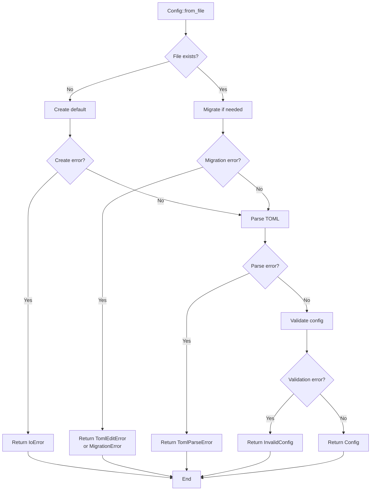
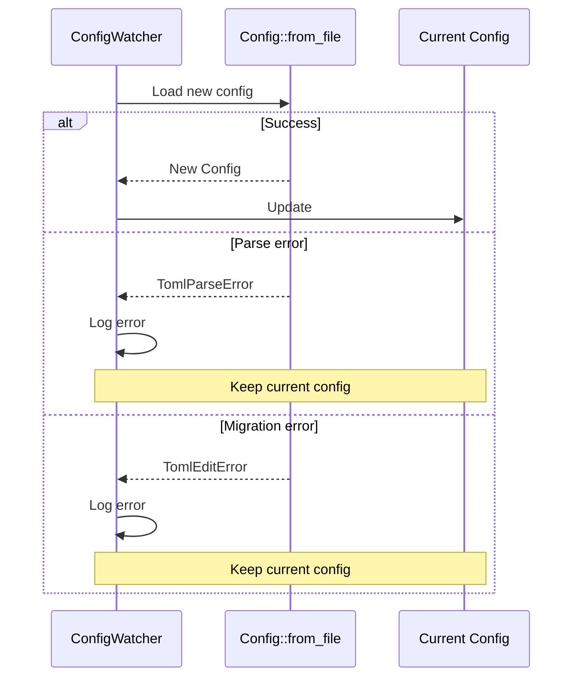

# Error Documentation

## Main Type: ConfigError

Error enumeration for the config crate using `thiserror`.

## Error Types

### IoError
```rust
#[error("I/O error: {0}")]
IoError(#[from] std::io::Error)
```

**Causes**: Configuration file read/write errors.

**Contexts**:
- Reading config.toml
- Writing after migration
- Creating default file

**Handling**: Critical error at startup, propagated.

---

### TomlParseError
```rust
#[error("TOML parsing error: {0}")]
TomlParseError(#[from] toml::de::Error)
```

**Causes**: Invalid TOML syntax in configuration file.

**Examples**:
```toml
# Error: missing comma
[server]
host = "0.0.0.0"
port = 8080
base_url = "http://localhost:8080"
base_path = "updater"  # Missing comma or end of section

# Error: incorrect type
[cache]
rescan_interval = "not a number"  # Should be u64
```

**Handling**: Critical error, file must be manually corrected.

---

### TomlEditError
```rust
#[error("TOML edit error: {0}")]
TomlEditError(#[from] toml_edit::TomlError)
```

**Causes**: Error during migration with toml_edit.

**Contexts**:
- Parsing file for migration
- Manipulating sections/fields
- DocumentMut conversion

**Handling**: Migration cancelled, file unmodified.

---

### ConfigNotFound
```rust
#[error("Config file not found: {0}")]
ConfigNotFound(String)
```

**Note**: Currently unused as file is automatically created if missing.

**Potential Usage**: Explicit existence verification.

---

### InvalidConfig
```rust
#[error("Invalid configuration: {0}")]
InvalidConfig(String)
```

**Causes**: Invalid configuration even after successful parsing.

**Examples**:
- Missing section after migration
- Unexpected data type
- Out of range value

**Contexts**:
- Section migration
- Post-parsing validation

**Handling**: Critical error with descriptive message.

---

### MigrationError
```rust
#[error("Migration failed: {0}")]
MigrationError(String)
```

**Causes**: Automatic migration failure.

**Scenarios**:
- Unable to determine how to migrate
- Structure too old or corrupted
- Value conflicts

**Handling**: Critical error, manual intervention required.

## Error Handling Flow

### During Loading



### During Hot-Reload



**Behavior**: Reload errors don't crash the server, old config preserved.

## Error Messages

### IoError Examples

```
I/O error: Permission denied (os error 13)
I/O error: No such file or directory (os error 2)
I/O error: Disk quota exceeded (os error 122)
```

### TomlParseError Examples

```
TOML parsing error: invalid type: string "not a number", expected u64 at line 5 column 18
TOML parsing error: missing field `host` at line 1 column 1
TOML parsing error: unexpected character found: `:` at line 10
```

### InvalidConfig Examples

```
Invalid configuration: Invalid [server] section in config
Invalid configuration: Invalid [cache.batch] section in config
```

### MigrationError Examples

```
Migration failed: Cannot migrate from version 0.x to current version
Migration failed: Conflicting values in old and new config
```

## Recovery Strategies

### Default File Creation

```rust
if !path.exists() {
    create_default_config(path).await?;
}
```

**Guarantees**: File always present.

### Migration with Preservation

```rust
// Utilise toml_edit pour preserver contenu
let mut doc = content.parse::<DocumentMut>()?;
// Modifications...
tokio::fs::write(path, doc.to_string()).await?;
```

**Guarantees**: Comments and formatting preserved.

### Post-Parsing Validation

```rust
let config: Config = toml::from_str(&content)?;
// Config valide structurellement grace a serde
```

**Guarantees**: Correct types, required fields present.

## Error Logging

### Severity Levels

**ERROR**: Critical errors preventing startup
```rust
tracing::error!("Failed to load config: {}", e);
```

**WARN**: Reload errors (current config preserved)
```rust
tracing::warn!("Failed to reload config: {}", e);
```

### Context in Logs

```rust
tracing::error!(
    "Failed to reload config from {}: {}",
    config_path,
    e
);
```

Always includes file path for easier debugging.
