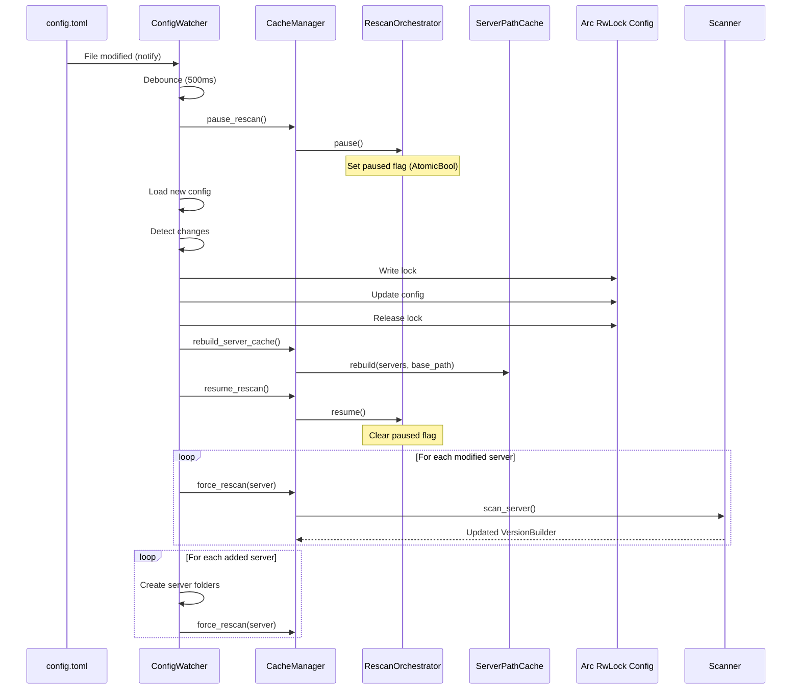

# Configuration Hot-Reload

## Overview

The hot-reload system allows modifying configuration without server restart. It detects changes, reloads configuration and updates affected components.

## Architecture


## Complete Process



## Change Detection

### Configuration Comparison

```rust
fn server_config_changed(old: &ServerConfig, new: &ServerConfig) -> bool {
    old.enabled != new.enabled
        || old.loader != new.loader
        || old.loader_version != new.loader_version
        || old.minecraft_version != new.minecraft_version
        || old.main_class != new.main_class
        || old.java_version != new.java_version
        || old.enable_client != new.enable_client
        || old.enable_libraries != new.enable_libraries
        || old.enable_mods != new.enable_mods
        || old.enable_natives != new.enable_natives
        || old.enable_assets != new.enable_assets
        || old.game_args != new.game_args
        || old.jvm_args != new.jvm_args
}
```

### Change Categories

**Added Servers**:
```rust
let added_servers: Vec<_> = new_servers
    .difference(&old_servers)
    .cloned()
    .collect();
```

**Modified Servers**:
```rust
for new_server in &new_config.servers {
    if let Some(old_server) = old_configs.iter().find(|s| s.name == new_server.name) {
        if server_config_changed(old_server, new_server) {
            modified_servers.push(new_server.name.clone());
        }
    }
}
```

**Removed Servers**: No rescan necessary, handled automatically.

## Debouncing

### Problem

Text editors can generate multiple events:
- Temporary save
- Content write
- Metadata update

### Solution


**Configuration**:
```toml
[cache]
config_watch_debounce_ms = 500  # 500ms grace period
```

**Implementation**:
```rust
while rx.recv().await.is_some() {
    let debounce_ms = {
        let config_read = config.read().await;
        config_read.cache.config_watch_debounce_ms
    };

    tokio::time::sleep(Duration::from_millis(debounce_ms)).await;

    // Reload config
}
```

## Rescan Pause

### Critical Importance

**Problem**: Race condition if rescan active during config update.


**Solution**: Pause before reload, resume after.


## Shared Configuration Update

### Pattern with Write Lock

```rust
// 1. Pause rescan
cache_manager.pause_rescan();

// 2. Acquire write lock
let mut config_write = config.write().await;

// 3. Update config
*config_write = new_config;

// 4. Resume BEFORE dropping lock (important!)
cache_manager.resume_rescan();

// 5. Lock automatically dropped at end of scope
```

**Why resume before drop**:
- Avoids window where rescan paused + config lock released
- Guarantees operation atomicity

## ServerPathCache Rebuild

### Necessity

ServerPathCache maintains a path→server mapping:
- Server addition: new path to track
- Server removal: path to remove
- base_path change: all paths change

### Process

```rust
cache_manager.rebuild_server_cache().await;
```

**Implementation**:
```rust
pub async fn rebuild_server_cache(&self) {
    let (servers, base_path) = {
        let config = self.config.read().await;
        (config.servers.clone(), config.server.base_path.clone())
    };
    self.server_path_cache.rebuild(&servers, base_path.as_ref());
}
```

**Cache Rebuild**:
```rust
pub fn rebuild(&self, servers: &[Arc<ServerConfig>], base_path: &str) {
    let mut paths = self.paths.write();
    paths.clear();

    for server in servers {
        if server.enabled {
            let server_path = PathBuf::from(base_path).join(server.name.as_ref());
            paths.insert(server_path, server.name.to_string());
        }
    }
}
```

## Rescan of Changed Servers

### Modified Servers

```rust
for server_name in &modified_servers {
    tracing::info!("Server config changed, rescanning: {}", server_name);

    // Drop write lock for I/O operation
    drop(config_write);

    if let Err(e) = cache_manager.force_rescan(server_name).await {
        tracing::error!("Failed to rescan modified server {}: {}", server_name, e);
    }

    // Re-acquire lock for next iteration
    config_write = config.write().await;
}
```

**Rescan Reasons**:
- enable_* fields changed: files to scan have changed
- Minecraft/loader version changed: structure may have changed
- JVM/game arguments changed: metadata to update

### Added Servers

```rust
for server_name in &added_servers {
    let server_config = config_write.servers
        .iter()
        .find(|s| &s.name == server_name)?;

    if !server_config.enabled {
        continue;  // Skip disabled servers
    }

    tracing::info!("New server detected: {}", server_name);

    // Create server folder structure
    let base_path = config_write.server.base_path.clone();
    drop(config_write);

    FileSystem::ensure_server_structure(&base_path, &server_name).await?;

    // Scan new server
    cache_manager.force_rescan(server_name).await?;

    config_write = config.write().await;
}
```

**Created Structure**:
```
base_path/
└── server_name/
    ├── client/
    ├── libraries/
    ├── mods/
    ├── natives/
    │   ├── windows/
    │   ├── linux/
    │   └── macos/
    └── assets/
```

## Error Handling

### Loading Error

```rust
match Config::from_file_with_events(config_path, None).await {
    Ok(new_config) => {
        // Process reload
    }
    Err(e) => {
        tracing::error!("Failed to reload config: {}", e);
        // Continue with old config
    }
}
```

**Behavior**: Invalid config does not overwrite current config.

### Rescan Error

```rust
if let Err(e) = cache_manager.force_rescan(server_name).await {
    tracing::error!("Failed to rescan modified server {}: {}", server_name, e);
    // Continue with other servers
}
```

**Behavior**: Failure on one server doesn't prevent reload of others.

### Deleted File

```rust
if !std::path::Path::new(config_path).exists() {
    tracing::warn!("Config file deleted, ignoring event");
    continue;
}
```

**Behavior**: Ignores event, keeps current config.

## Communication Channel

### Configuration

```toml
[cache]
config_reload_channel_size = 100
```

**Channel Size**:
- Too small: Events lost if reload slow
- Too large: Memory unnecessarily consumed
- 100: Good compromise

### Creation

```rust
let channel_size = {
    let config_read = config.read().await;
    config_read.cache.config_reload_channel_size
};

let (tx, mut rx) = tokio::sync::mpsc::channel(channel_size);
```

## Scenario Examples

### Scenario 1: rescan_interval Change

```toml
# Before
[cache]
rescan_interval = 30  # Polling every 30s

# After
[cache]
rescan_interval = 0  # File watcher mode
```

**Impact**:
- Config reloaded
- Rescan loop reads new interval
- Switches from polling to file watcher
- No server rescan necessary

### Scenario 2: Adding a Server

```toml
# New server added
[[servers]]
name = "creative"
enabled = true
loader = "fabric"
# ... etc
```

**Process**:
1. Detection: "creative" server added
2. Creation of `base_path/creative/` with subfolders
3. Initial server scan
4. Added to cache
5. ServerPathCache rebuild

### Scenario 3: enable_mods Modification

```toml
# Before
[[servers]]
name = "survival"
enable_mods = false

# After
[[servers]]
name = "survival"
enable_mods = true
```

**Process**:
1. Detection: "survival" modified
2. Force rescan of "survival"
3. Scanner now scans mods/
4. Cache updated with mods

### Scenario 4: Multiple Changes

```toml
# Multiple changes in one save
[cache]
rescan_interval = 0  # Changed

[[servers]]
name = "survival"
enable_natives = true  # Changed

[[servers]]
name = "creative"  # New server
# ...
```

**Process**:
1. Debouncing: waits 500ms after last event
2. Complete config reload
3. Detection: 1 modified + 1 added
4. Rescan "survival"
5. Create + scan "creative"
6. Rebuild ServerPathCache
