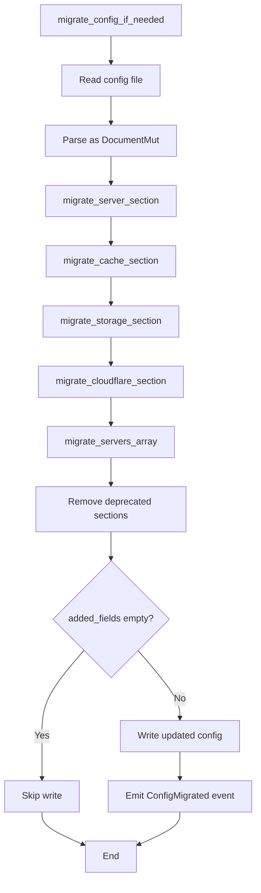
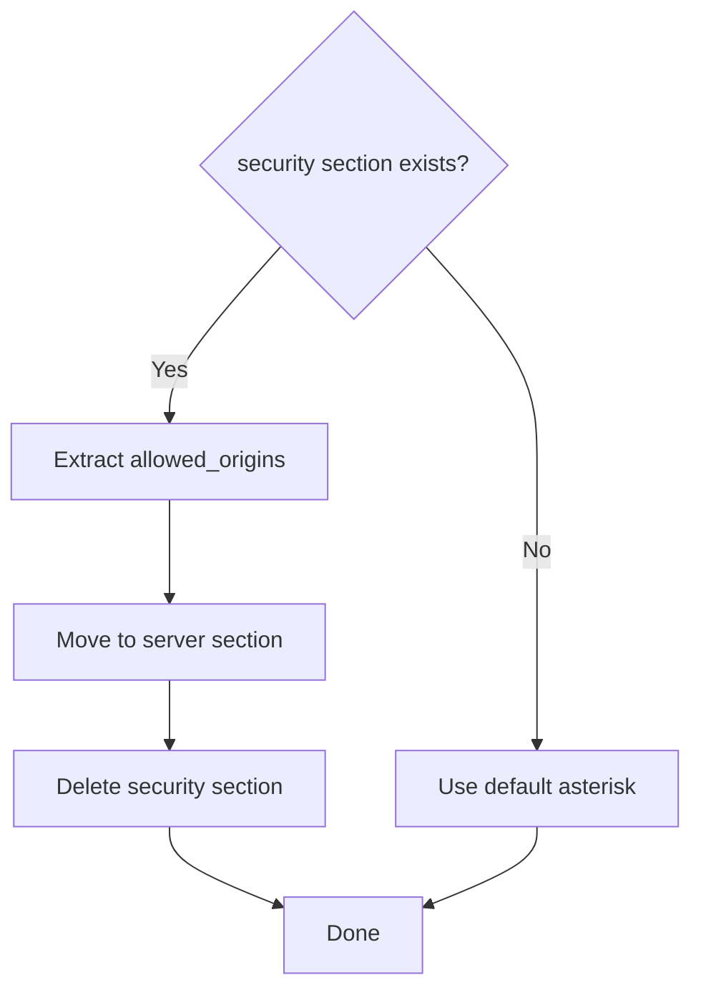
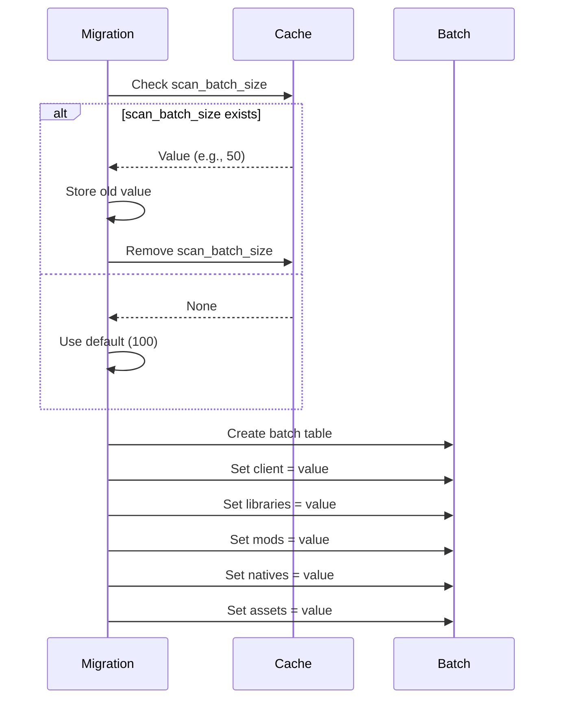
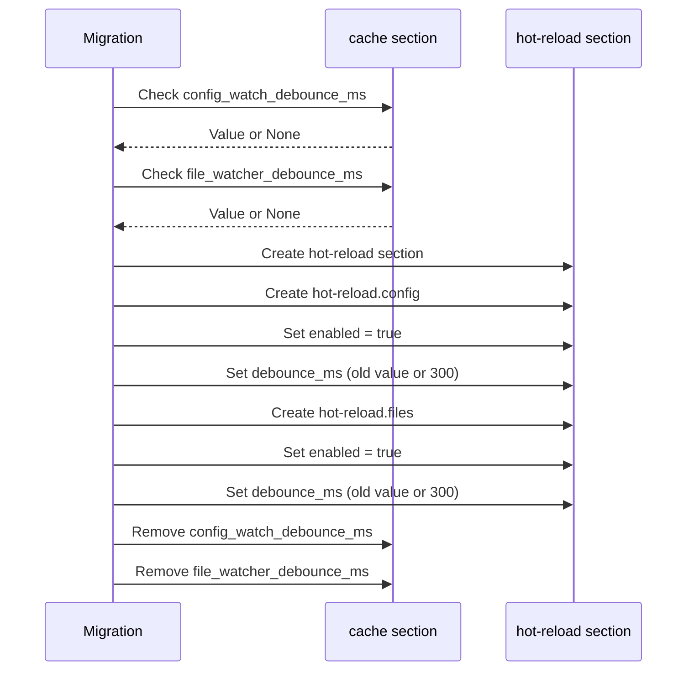
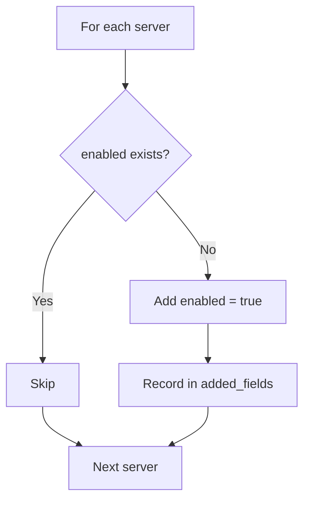
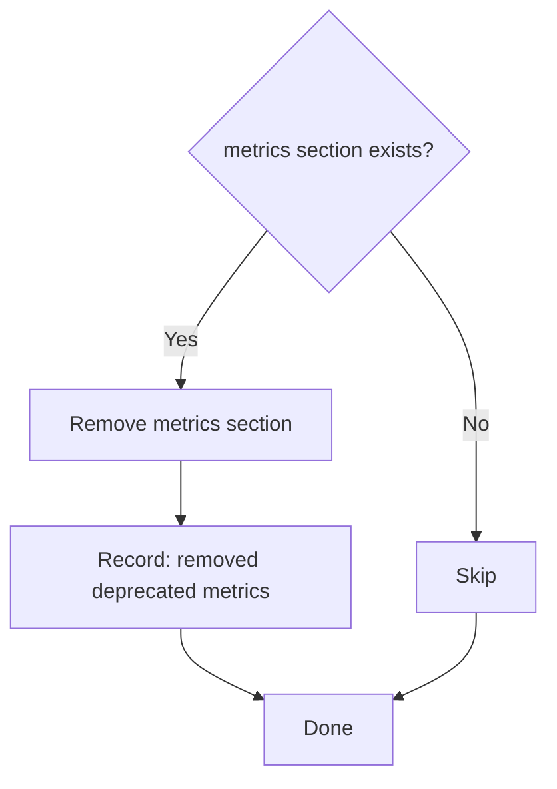

# Automatic Migration System

## Overview

The migration system allows configuration evolution without manual intervention. It automatically detects missing fields and updates the configuration file.

## Migration Process



## Migrations by Section

### Migration [server]

**Added Fields**:
```toml
[server]
tcp_nodelay = true
timeout_secs = 60
max_body_size_mb = 100
streaming_threshold_mb = 100
enable_compression = true
allowed_origins = ["*"]
max_concurrent_requests = 1000
```

**Special Migration: allowed_origins**

Detects if an old `[security]` section exists:



### Migration [cache]

**Restructuring batch_size**:

```toml
# Before
[cache]
scan_batch_size = 50

# After
[cache]
[cache.batch]
client = 50
libraries = 50
mods = 50
natives = 50
assets = 50
```

**Process**:


**New Fields**:
```toml
[cache]
checksum_buffer_size = 8192
hash_concurrency = 100
config_reload_channel_size = 100
```

**Removed Fields** (migrated to [hot-reload]):
- `config_watch_debounce_ms` → `[hot-reload.config] debounce_ms`
- `file_watcher_debounce_ms` → `[hot-reload.files] debounce_ms`

### Migration [hot-reload]

**New Structure**:
```toml
[hot-reload.config]
enabled = true
debounce_ms = 300

[hot-reload.files]
enabled = true
debounce_ms = 300
```

**Migration Process**:



**Migration Details**:
- Extracts old debounce values from `[cache]` if they exist
- Creates `[hot-reload]` section with subsections
- Preserves custom debounce values or uses 300ms default
- Removes deprecated fields from `[cache]`
- Both `enabled` flags set to `true` by default

**Example Migration**:
```toml
# Before
[cache]
config_watch_debounce_ms = 500
file_watcher_debounce_ms = 500

# After
[cache]
# Fields removed

[hot-reload.config]
enabled = true
debounce_ms = 500  # Preserved custom value

[hot-reload.files]
enabled = true
debounce_ms = 500  # Preserved custom value
```

### Migration [storage]

**Complete Structure**:

```toml
[storage]
backend = "local"  # ou "s3"
keep_local_backup = true
auto_upload = true

[storage.s3]
enabled = false
endpoint_url = ""
region = "auto"
access_key_id = ""
secret_access_key = ""
bucket_name = "lighty-updater"
public_url = ""
bucket_prefix = ""
```

**Automatic Creation**:
- [storage] section created if missing
- [storage.s3] section created with defaults

### Migration [cloudflare]

```toml
[cloudflare]
enabled = false
zone_id = ""
api_token = ""
purge_on_update = true
```

All fields have defaults.

### Migration [[servers]]

**Per-Server Migration**:



**Added Field**:
```toml
[[servers]]
name = "survival"
enabled = true  # Added if missing
# ... other fields ...
```

## Deprecated Sections

### Removing [metrics]



**Reason**: Metrics now handled by the event system.

### Removing [security]

Migrates to `[server]` then removes:

```toml
# Before
[security]
allowed_origins = ["https://example.com"]

# After migration
[server]
allowed_origins = ["https://example.com"]

# [security] section removed
```

## ensure_field Function

Central utility for adding fields:

```rust
fn ensure_field(
    table: &mut Table,
    key: &str,
    default_value: Value,
    added_fields: &mut Vec<String>,
) {
    if !table.contains_key(key) {
        table[key] = Item::Value(default_value);
        added_fields.push(key.to_string());
    }
}
```

**Usage**:
```rust
ensure_field(server, "tcp_nodelay", Value::from(true), added_fields);
ensure_field(cache, "rescan_interval", Value::from(30), added_fields);
```

## Configuration Preservation

### toml_edit vs toml

**toml**:
- Parses to Rust structures
- Loses comments and formatting
- For read-only usage

**toml_edit**:
- Preserves comments
- Preserves formatting
- Allows surgical modifications
- Used for migration

**Example**:

```toml
# Before migration (with comment)
[cache]
# Rescan interval in seconds
rescan_interval = 30

# After migration (comment preserved)
[cache]
# Rescan interval in seconds
rescan_interval = 30
file_watcher_debounce_ms = 500  # New field
```

## Migration Events

### Event Emission

```rust
if !added_fields.is_empty() {
    event_bus.emit(AppEvent::ConfigMigrated {
        added_fields: added_fields.clone(),
    });
}
```

**Content of added_fields**:
```rust
vec![
    "server.tcp_nodelay",
    "cache.file_watcher_debounce_ms",
    "storage.s3.bucket_prefix",
    "removed deprecated [metrics] section",
]
```

### Usage by Consumers

```rust
match event {
    AppEvent::ConfigMigrated { added_fields } => {
        tracing::info!("Configuration migrated, added fields: {}", added_fields.join(", "));
    }
    _ => {}
}
```

## Scenario Examples

### Scenario 1: First Use

```toml
# File does not exist
```

**Result**: File created with complete template.

### Scenario 2: Minimal Config

```toml
# Minimal config.toml
[server]
host = "0.0.0.0"
port = 8080

[cache]
enabled = true
```

**Migration**:
```toml
[server]
host = "0.0.0.0"
port = 8080
base_url = "http://localhost:8080"  # Added
base_path = "updater"  # Added
tcp_nodelay = true  # Added
# ... etc

[cache]
enabled = true
auto_scan = true  # Added
rescan_interval = 30  # Added
# ... etc

[hot-reload.config]  # Complete section added
enabled = true
debounce_ms = 300

[hot-reload.files]  # Complete section added
enabled = true
debounce_ms = 300

[storage]  # Complete section added
# ...

[cloudflare]  # Complete section added
# ...
```

### Scenario 3: Structure Migration

```toml
# Before
[cache]
scan_batch_size = 150
rescan_interval = 60

# After
[cache]
rescan_interval = 60

[cache.batch]
client = 150
libraries = 150
mods = 150
natives = 150
assets = 150
```

**added_fields**:
```
- removed deprecated cache.scan_batch_size
- cache.batch
- cache.batch.client
- cache.batch.libraries
- cache.batch.mods
- cache.batch.natives
- cache.batch.assets
```

### Scenario 4: Hot-Reload Migration

```toml
# Before
[cache]
config_watch_debounce_ms = 500
file_watcher_debounce_ms = 500
enabled = true

# After
[cache]
enabled = true

[hot-reload.config]
enabled = true
debounce_ms = 500  # Custom value preserved

[hot-reload.files]
enabled = true
debounce_ms = 500  # Custom value preserved
```

**added_fields**:
```
- hot-reload
- hot-reload.config
- hot-reload.config.enabled
- hot-reload.config.debounce_ms
- hot-reload.files
- hot-reload.files.enabled
- hot-reload.files.debounce_ms
- removed cache.config_watch_debounce_ms (migrated to hot-reload.config.debounce_ms)
- removed cache.file_watcher_debounce_ms (migrated to hot-reload.files.debounce_ms)
```

### Scenario 5: Deprecated Section Migration

```toml
# Before
[security]
allowed_origins = ["https://example.com"]

[metrics]
enabled = true
prometheus_port = 9090

# After
[server]
allowed_origins = ["https://example.com"]

# [security] and [metrics] removed
```

**added_fields**:
```
- server.allowed_origins (migrated from security)
- removed deprecated [security] section
- removed deprecated [metrics] section
```

## Error Handling

### Possible Errors

**TomlEditError**: File parsing fails
```rust
Err(ConfigError::TomlEditError(e))
```

**InvalidConfig**: Malformed section
```rust
Err(ConfigError::InvalidConfig("Invalid [cache] section"))
```

**IoError**: File write fails
```rust
Err(ConfigError::IoError(e))
```

### Recovery

Migration errors are critical:
- No fallback
- File unmodified on error
- Error propagated at startup
- User must manually correct

## Configuration Versioning

### Current Strategy

No explicit version field. Detection based on:
- Presence/absence of fields
- Section structure
- Deprecated fields

### Future Evolution

Possible addition of a version field:
```toml
[meta]
config_version = 2

[server]
# ...
```

Would allow more complex and conditional migrations.
