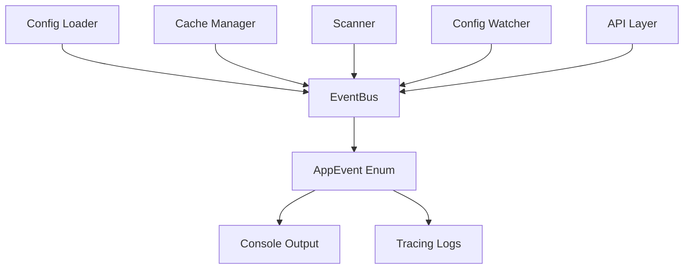
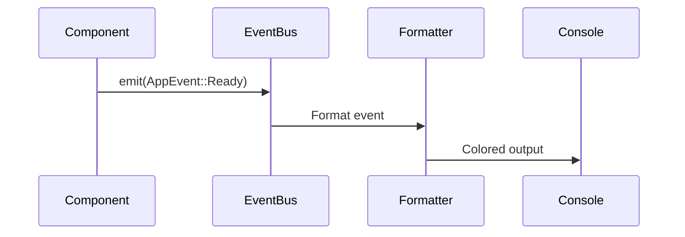

# Event System Architecture

## Components

## Simplified Publisher-Subscriber Pattern

The system uses a simplified pattern without multiple subscribers:
- EventBus centralizes emission
- Synchronous emission to console
- No asynchronous queue
- No event persistence

## Emission Flow

