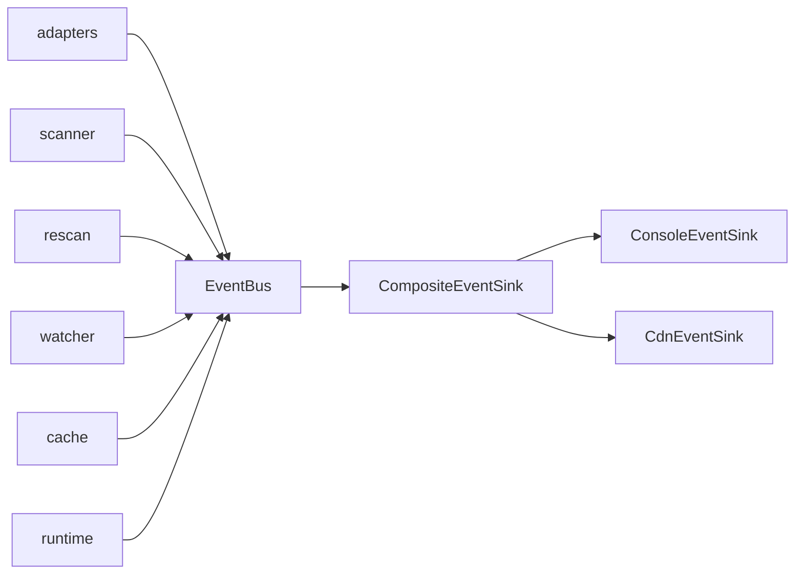

# Overview

The spine that lets every service crate report what it's doing without
taking a dep on tracing macros, the console, or the CDN. Three pieces:
`EventBus`, the `EventSink` trait, and the `AppEvent` enum.

## What's inside

| Item | Purpose |
|---|---|
| `AppEvent` | Closed enum of every event variant (lifecycle, config, scanning, cache, CDN, errors). |
| `EventBus` | One per process. `emit` is sync, fire-and-forget. |
| `EventSink` trait | `fn handle(&self, event: &AppEvent)`. |
| `CompositeEventSink` | Fan-out — wraps a vec of sinks. |

## How the bus is used

`EventBus::emit` is synchronous. Sinks that need async work
(`CdnEventSink`) save a `Handle` and spawn inside `handle`.

## Design notes

- No event loop, no broadcast channel. Inline dispatch.
- `verbose: bool` is the master switch — `false` makes `emit` a no-op.
- Closed enum, not trait objects. Adding a variant is one line.

## See also

- [how-to-use.md](./how-to-use.md)
- [exports.md](./exports.md)
- [../../adapters/docs/overview.md](../../adapters/docs/overview.md)
- [../../cdn/docs/overview.md](../../cdn/docs/overview.md)
