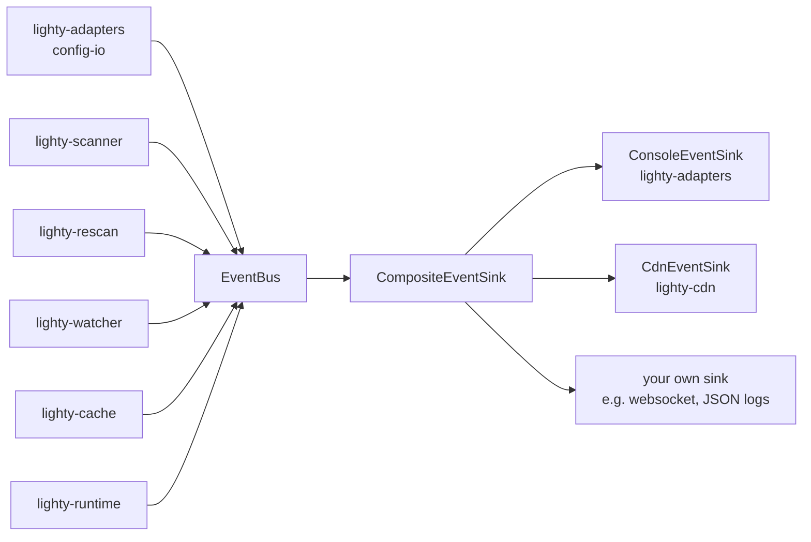

# Overview

`lighty-events` is the spine that lets every service crate report what
it's doing without taking a dep on tracing macros, the console, the
CDN clients, or the rescan loop. The crate carries three things:

1. `EventBus` — synchronous fan-in.
2. `EventSink` trait — anyone can subscribe.
3. `AppEvent` — the closed enum of every event variant in the system.

There's also one prefab sink (`CompositeEventSink`) so callers can
mount multiple consumers on the same bus.

## What's inside

| Item | Purpose |
|---|---|
| `AppEvent` | The complete catalogue: 28 variants covering lifecycle, config, scanning, cache, server discovery, auto-scan modes, CDN, errors. |
| `EventBus` | One owner per process. `emit` is sync and fire-and-forget; `verbose: false` makes it a no-op. |
| `EventSink` trait | `fn handle(&self, event: &AppEvent)`. Implementations decide whether to log, route to UI, post to a webhook, etc. |
| `CompositeEventSink` | Fan-out adapter — wraps a `Vec<Arc<dyn EventSink>>` and forwards each event to every child. |

## How the bus is used

`EventBus::emit` is **synchronous** — it calls `sink.handle(&event)`
inline. Sinks that need to do async work (`CdnEventSink` makes HTTP
requests) save a `tokio::runtime::Handle` and `spawn` from inside
`handle`.

## Design notes

- **No event loop, no broadcast channel.** The bus has zero
  buffering: an event is delivered to the sink the moment `emit`
  returns. If the sink is slow, the emitter waits. This is fine
  because the only blocking sink in the workspace is
  `ConsoleEventSink::println!`, which is effectively instant.
- **`verbose` is the master switch.** The single boolean controls
  whether `emit` does anything. `EventBus::new(true)` /
  `with_sink(true, ...)` turns it on; `false` turns it into a no-op
  (useful in tests).
- **Fan-out via composition.** `CompositeEventSink` is the only
  fan-out primitive. The bus itself stays one-sink.
- **Closed enum, not trait objects.** Every event lives in `AppEvent`.
  No `Box<dyn Event>`, no downcasting. Adding a new event variant is
  a single line in `models.rs` plus an arm wherever it's matched.

## Cargo features

None.

## See also

- [`how-to-use.md`](./how-to-use.md) — subscribe + emit snippets
- [`exports.md`](./exports.md) — every variant, with payload
- [`../../adapters/docs/overview.md`](../../adapters/docs/overview.md) —
  `ConsoleEventSink` implementation
- [`../../cdn/docs/overview.md`](../../cdn/docs/overview.md) —
  `CdnEventSink` implementation
