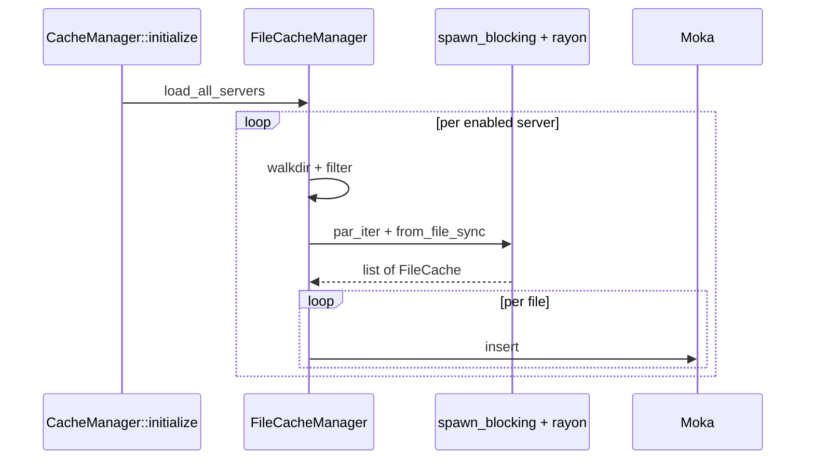
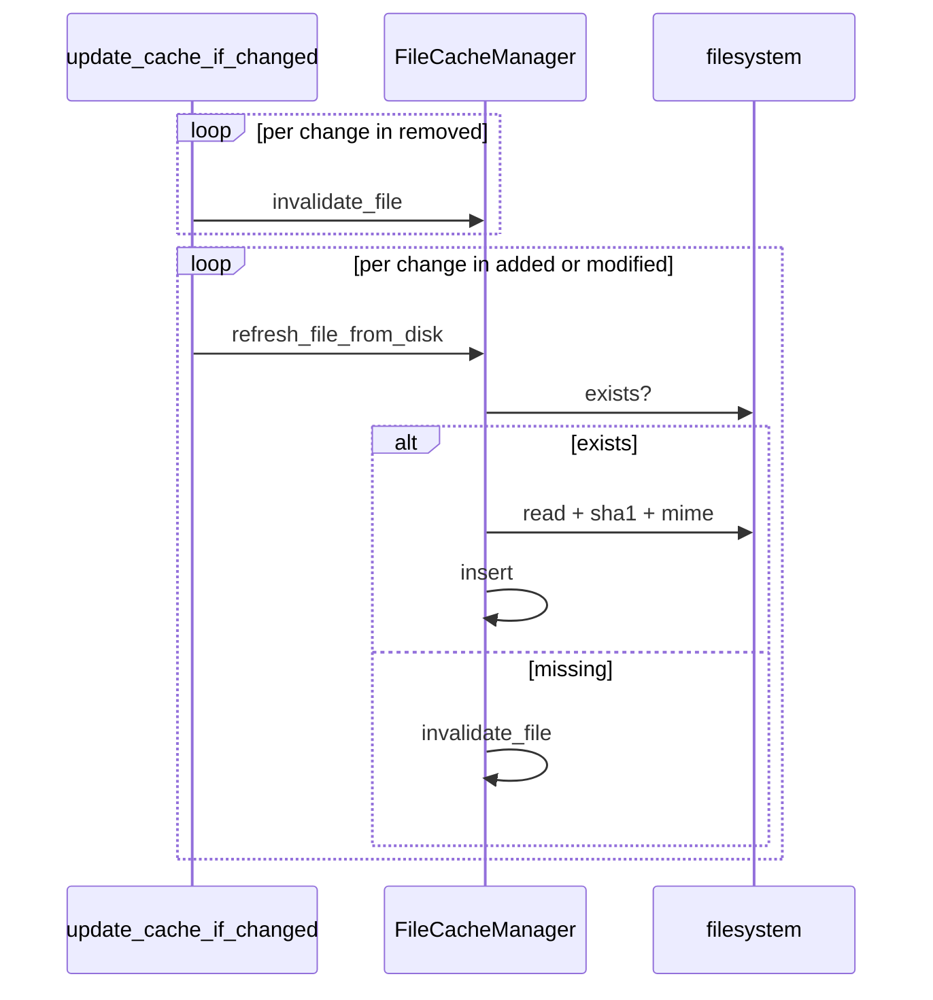
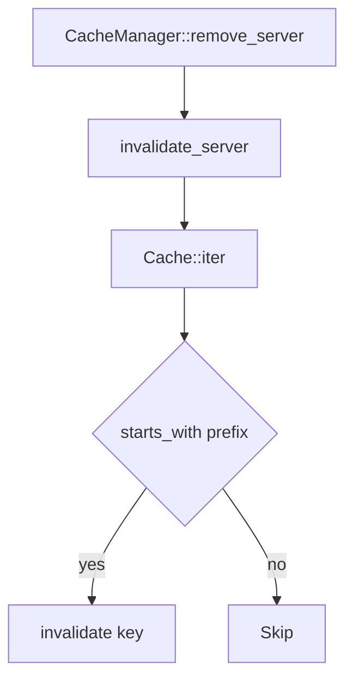

# Flows

## Bulk load at boot

`cache.hash_concurrency` servers are walked at a time via
`buffer_unordered`; inside each, rayon parallelises the hashing.

## Refresh on diff

Order: invalidate then refresh, so requests in flight never serve
stale bytes.

## Server-prefix invalidation

Moka has no prefix-delete; the function collects matching keys then
invalidates one by one.

## See also

- [overview.md](./overview.md)
- [../../rescan/docs/flows.md](../../rescan/docs/flows.md)
