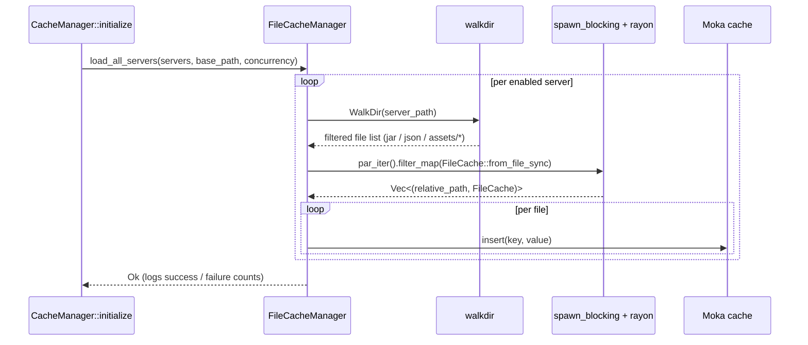
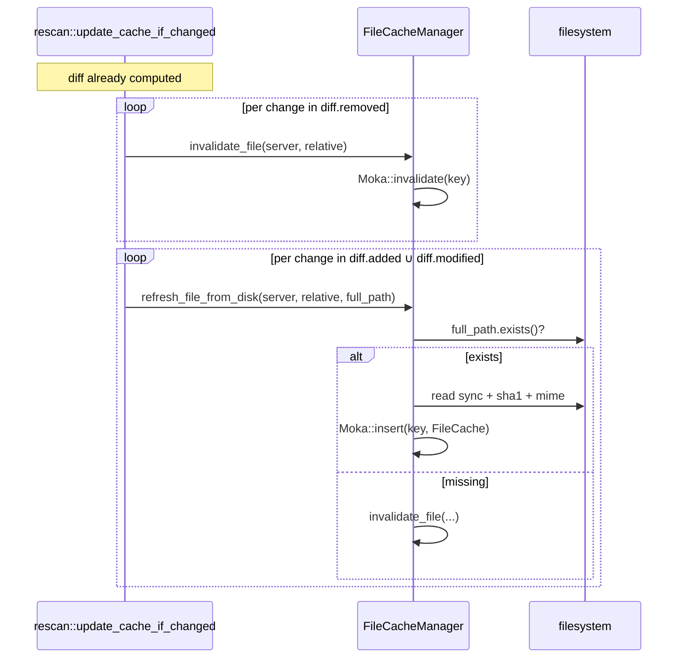
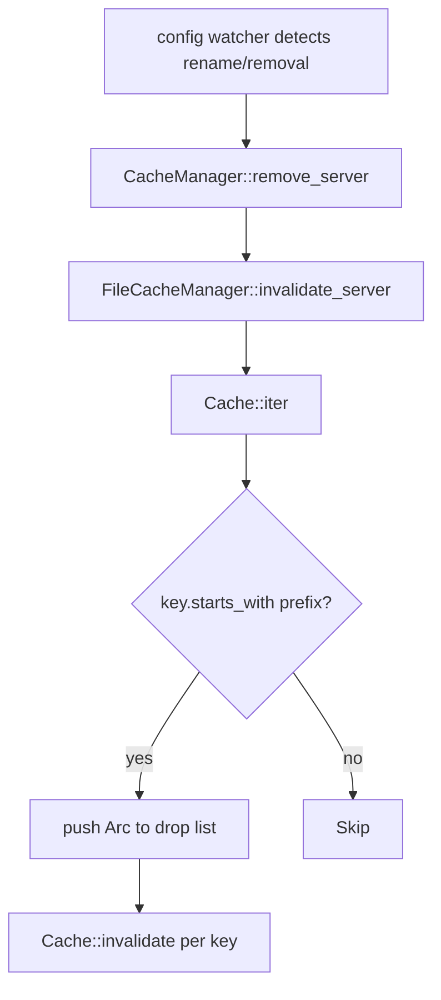

# Flows

## Bulk load at boot

`CacheManager::initialize` calls `load_all_servers` once, after the
initial scan has produced `VersionBuilder`s. The bulk load is what
makes the first user request fast.

Server-level parallelism is governed by `cache.hash_concurrency`:
`load_all_servers` uses `stream::buffer_unordered(N)` to walk that
many servers at a time. Inside each server, file hashing is parallel
via rayon.

## Refresh-on-diff

Whenever `lighty-rescan` produces a non-empty `FileDiff`, the
orchestrator calls into the file cache to keep RAM consistent with
disk before any HTTP response can stale.

The intent: a HTTP client that requests `survival/mods/iris.jar`
seconds after a mod swap gets the new bytes, not the stale ones.

## Server-prefix invalidation

When the operator removes a server from `config.toml` and saves, the
watcher triggers `CacheManager::remove_server`, which calls
`invalidate_server` here.

Moka's iterator yields `Arc<str>` keys; the function clones the ones
that start with `"{server}/"` into a `Vec` and then invalidates them
one by one (Moka has no batch invalidate by prefix).

## See also

- [`overview.md`](./overview.md)
- [`how-to-use.md`](./how-to-use.md)
- [`exports.md`](./exports.md)
- [`../../rescan/docs/flows.md`](../../rescan/docs/flows.md)
