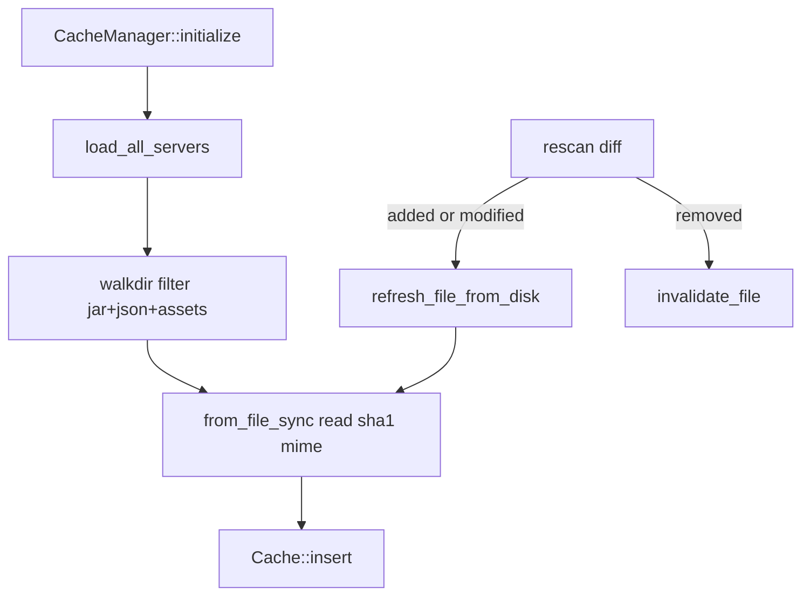

# Overview

In-memory file cache for the bytes served by the HTTP layer. Wraps a
weighted Moka cache plus a bulk-load helper for boot.

## What's inside

| Item | Purpose |
|---|---|
| `FileCache` | `data: Bytes` + `sha1` + `size` + `mime_type`. |
| `FileCache::from_file_sync(path)` | Sync read + SHA1 + MIME — call from `spawn_blocking`. |
| `FileCacheManager` | Insert, get, invalidate single, invalidate by server, bulk-load per server. |
| `FileCacheError` | `Io`, `Join`, `InvalidConfig`. |

Key format: `"{server}/{relative_path}"`. Moka weighs entries by
`data.len()`; configured GB cap is converted to bytes.

## Big picture

## See also

- [how-to-use.md](./how-to-use.md)
- [exports.md](./exports.md)
- [flows.md](./flows.md)
- [../../rescan/docs/overview.md](../../rescan/docs/overview.md)
