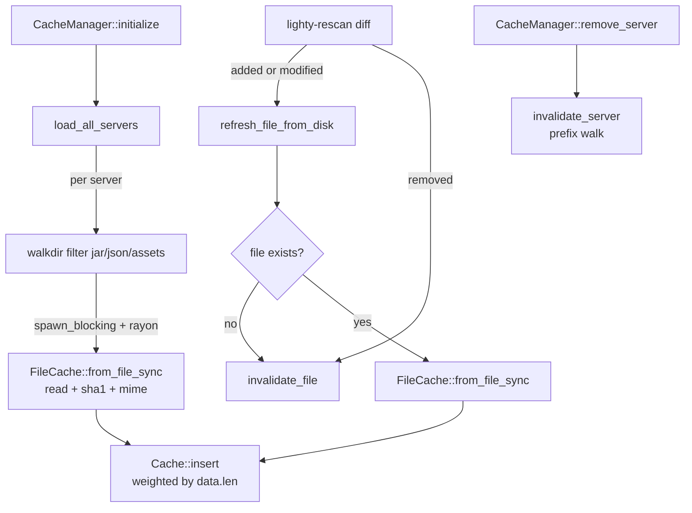

# Overview

`lighty-file-cache` is the in-memory file cache that lets the API
layer serve `client.jar`, libraries, mods, natives and assets without
ever touching the disk on a hot path. It wraps a weighted Moka cache
and adds the bulk-load / refresh-from-disk helpers the rescan loop
needs.

## What's inside

| Item | Purpose |
|---|---|
| `FileCache { data, sha1, size, mime_type }` | Owns the bytes plus everything the HTTP handler needs to emit a response. `data: Bytes` is `Arc`-shared, so handing it to Axum is zero-copy. |
| `FileCache::from_file_sync(path)` | Reads a file synchronously, computes SHA1, guesses MIME — meant to be called inside `spawn_blocking`. |
| `FileCacheManager` | The Moka-backed store: insert, get, invalidate single, invalidate by server prefix, bulk-load per server. |
| `FileCacheManager::load_all_servers(...)` | Walks every server folder, filters jar/json/assets, hashes in parallel with rayon, inserts into the cache. |
| `FileCacheError` | One error type for the crate; `#[from] io::Error`, `#[from] JoinError`, plus `InvalidConfig`. |

The crate has no Cargo features.

## How entries land in the cache



The Moka cache is **weighted** by file size in bytes. Configured
capacity (`cache.max_memory_cache_gb`) is multiplied to bytes and
passed as the `max_capacity`. `0` means unlimited; Moka still tracks
weighted size for `get_stats`.

## Cache key shape

Keys are `Arc<str>` of the form `"{server}/{relative_path}"`:

```
survival/client/client.jar
survival/libraries/net/example/lwjgl-3.3.6.jar
survival/mods/iris-1.8.0.jar
creative/assets/icons/16x16.png
```

`invalidate_server("survival")` walks `cache.iter()`, collects every
key with the `"survival/"` prefix and invalidates them one by one
(Moka has no first-class prefix delete).

## Design notes

- **Sync read, async insert.** `from_file_sync` lives inside
  `spawn_blocking`; the actual `Cache::insert` is async. This keeps
  the tokio worker pool free during large bulk loads.
- **Hard limit on entry weight.** `weighter` clamps each entry's
  weight to `u32::MAX` (Moka's bound). Anything bigger still gets
  cached but counts as 4 GiB for the limit math.
- **No partial state.** `load_all_servers` returns `Ok(())` even if
  some servers fail to walk — failures are logged at `warn!` and the
  count is reported. This matches the rest of the workspace's
  "boot through partial failures" rule.

## Cargo features

None. `moka`, `dashmap`, `walkdir`, `rayon`, `sha1`, `mime_guess` are
all unconditional.

## See also

- [`how-to-use.md`](./how-to-use.md) — code snippets per method
- [`exports.md`](./exports.md) — full public surface
- [`flows.md`](./flows.md) — bulk-load and rescan-refresh sequences
- [`../../api/docs/overview.md`](../../api/docs/overview.md) — the
  primary reader (file-serving handlers)
- [`../../rescan/docs/overview.md`](../../rescan/docs/overview.md) —
  the primary writer (rescan refreshes entries on diff)
