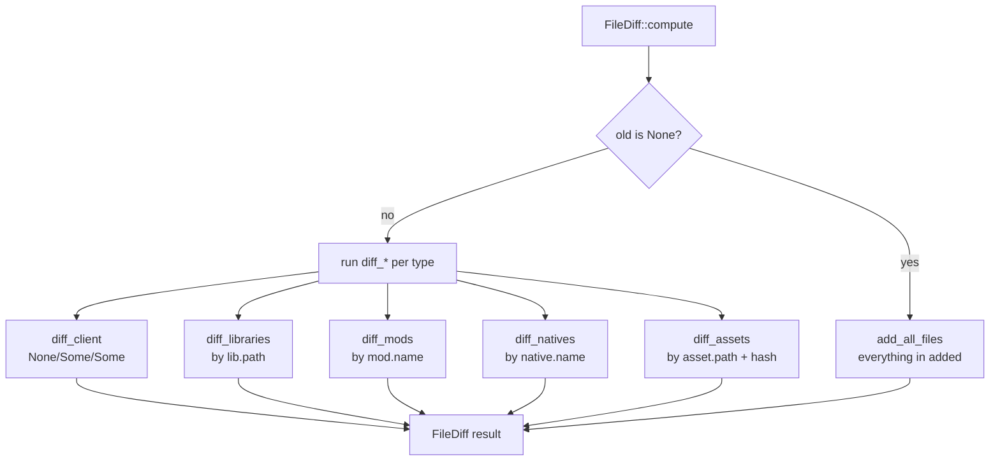

# Overview

`lighty-file-diff` compares two `VersionBuilder` snapshots and returns
a structured list of what changed. It is pure logic — no I/O, no
async, no global state — and lives at the bottom of the dependency
graph so any rescan, cloud-sync or CDN-purge logic can read from it
without pulling extra deps.

## What's inside

| Item | Purpose |
|---|---|
| `FileDiff { added, modified, removed }` | Three buckets of `FileChange`, one per transition kind. |
| `FileChange { file_type, remote_key, local_path, url }` | Single change descriptor, addressable both on disk and via CDN URL. |
| `FileType { Client, Library, Mod, Native, Asset }` | Which family the change belongs to. |
| `FileDiff::compute(server_name, old, new)` | Walks both snapshots; first scan (`old = None`) returns everything in `added`. |
| `FileDiff::apply_to_url_map(builder)` | Mutates a `VersionBuilder`'s `url_to_path_map` incrementally — no `build_url_map` rebuild. |

The crate has no Cargo features.

## How a diff is built

Each `diff_*` builds an `old_map: HashMap<key, &entry>` and a
`new_map`, then walks both: present in new only → `added`; present in
both with different SHA1 (or `hash` for assets) → `modified`; present
in old only → `removed`.

## Design notes

- **No allocation on identical snapshots.** If `old == new` the three
  vectors stay empty and the caller can short-circuit.
- **First-scan optimisation.** `compute("srv", None, &new)` skips the
  pairwise comparison entirely; it just enumerates `new` and pushes
  everything as `added`.
- **URL is optional on the wire.** `FileChange.url` may be an empty
  string (libraries/mods/assets without `url`). Callers that emit
  CDN purges or call `apply_to_url_map` filter empties.

## See also

- [`how-to-use.md`](./how-to-use.md) — runnable examples
- [`exports.md`](./exports.md) — full public surface
- [`../../rescan/docs/overview.md`](../../rescan/docs/overview.md) — the primary consumer
