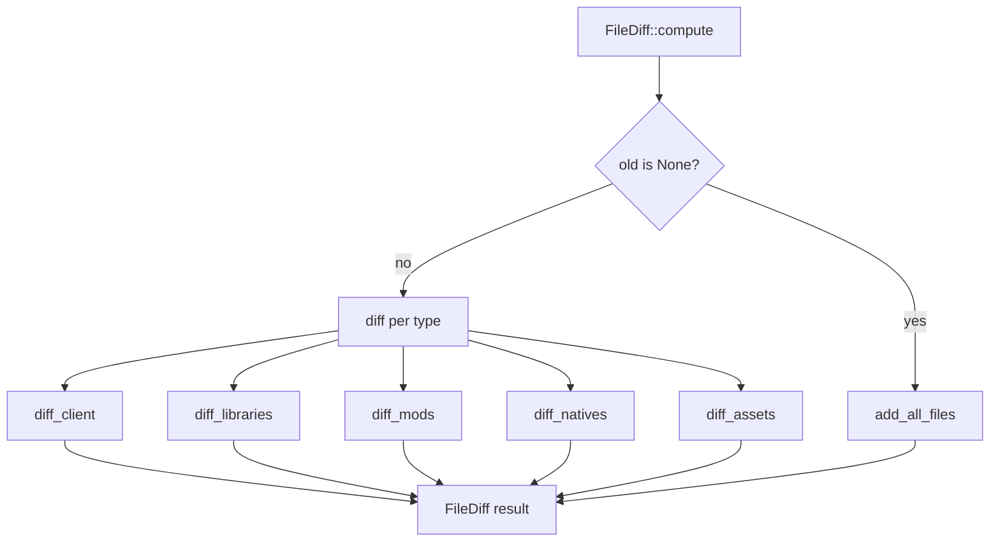

# Overview

Compares two `VersionBuilder` snapshots and returns the categorised
list of changes. Pure logic, no I/O.

## What's inside

| Item | Purpose |
|---|---|
| `FileDiff` | Three buckets: `added`, `modified`, `removed`. |
| `FileChange` | One change: `file_type`, `remote_key`, `local_path`, `url`. |
| `FileType` | `Client`, `Library`, `Mod`, `Native`, `Asset`. |
| `compute(server, old, new)` | Walks both snapshots; first scan (`old = None`) returns everything in `added`. |
| `apply_to_url_map(builder)` | Incremental update of `url_to_path_map` from a diff. |

## Big picture

## See also

- [how-to-use.md](./how-to-use.md)
- [exports.md](./exports.md)
- [../../rescan/docs/overview.md](../../rescan/docs/overview.md) — the primary consumer
