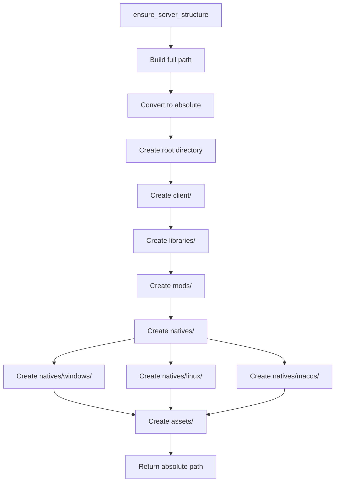
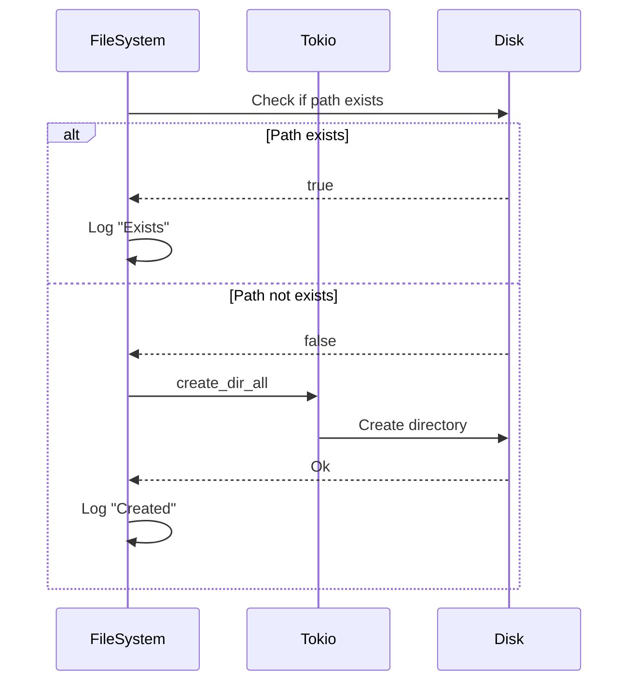
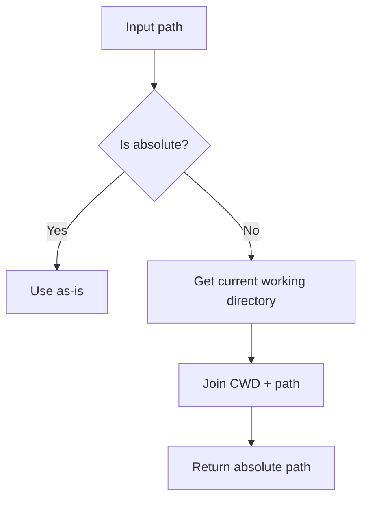

# File System Architecture

## FileSystem Structure

**FileSystem** is an empty struct serving as a namespace for utility functions.

**Public Methods**:
- `ensure_server_structure(base_path, server_folder)`: Create complete server directory structure
- `build_server_path(base_path, server_folder)`: Build server path
- `get_absolute_path_string(path)`: Get absolute path as String

**Private Methods**:
- `create_directory(path, description)`: Create single directory
- `get_absolute_path(path)`: Convert to absolute PathBuf

## Structure Creation Flow

## Atomic Operations

Each create_directory operation is atomic and idempotent:

## Path Resolution

