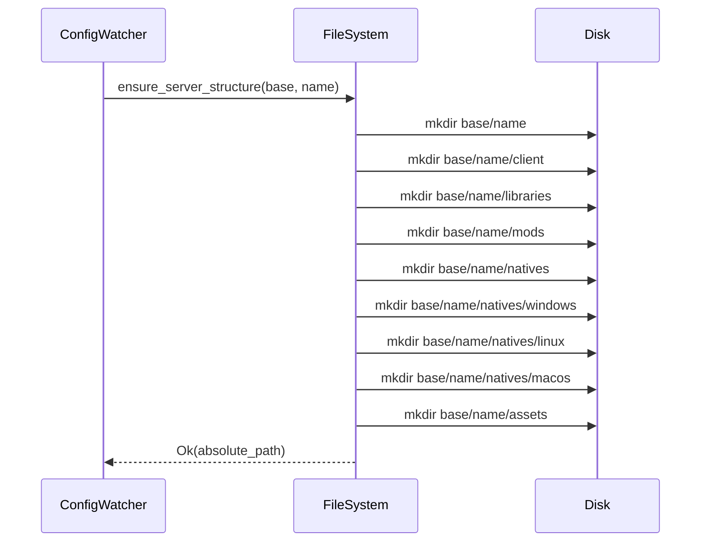

# Server Structure

## Complete Directory Tree

```
base_path/
└── server_name/
    ├── client/
    │   └── client.jar                    # Minecraft client JAR
    ├── libraries/
    │   └── com/google/guava/31.0/
    │       └── guava-31.0.jar            # Maven libraries
    ├── mods/
    │   ├── JEI-1.20.1.jar               # Mods
    │   └── OptiFine-1.20.1.jar
    ├── natives/
    │   ├── windows/
    │   │   └── lwjgl-natives-windows.jar
    │   ├── linux/
    │   │   └── lwjgl-natives-linux.jar
    │   └── macos/
    │       └── lwjgl-natives-macos.jar
    └── assets/
        └── ab/cd/
            └── abcdef123456               # Assets by hash
```

## Folder Roles

### client/
Contains Minecraft client JAR. Generally a single file.

### libraries/
Standard Maven structure for Java dependencies.
Format: `group/artifact/version/artifact-version.jar`

### mods/
Game modifications. JAR files with arbitrary names.

### natives/
Native libraries by platform:
- **windows/**: DLL wrapped in JAR
- **linux/**: SO wrapped in JAR
- **macos/**: DYLIB wrapped in JAR

### assets/
Game resources (textures, sounds, etc.).
Organization by hash for deduplication.

## Creation When Adding a Server



## Handling Existing Folders

If folders already exist:
- No error (idempotent)
- Existing files preserved
- Logs "Exists" instead of "Created"
