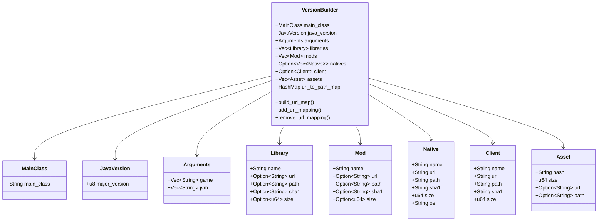

# Data Model Architecture

## Structure Hierarchy



## Format JSON

```json
{
  "main_class": {
    "main_class": "net.minecraft.client.main.Main"
  },
  "java_version": {
    "major_version": 17
  },
  "arguments": {
    "game": ["--username", "${auth_player_name}"],
    "jvm": ["-Xmx2G", "-XX:+UnlockExperimentalVMOptions"]
  },
  "libraries": [
    {
      "name": "com.google.guava:guava:31.0",
      "url": "http://localhost/server1/libraries/com/google/guava/31.0/guava-31.0.jar",
      "path": "com/google/guava/31.0/guava-31.0.jar",
      "sha1": "abc123...",
      "size": 2784000
    }
  ],
  "mods": [
    {
      "name": "JEI",
      "url": "http://localhost/server1/mods/JEI-1.20.1.jar",
      "path": "JEI-1.20.1.jar",
      "sha1": "def456...",
      "size": 1024000
    }
  ]
}
```

## Optional Fields

Some fields are Option to support different use cases:

**Optional url/path**: Maven libraries may have path but no URL if not hosted.

**Optional natives**: Servers without native components omit the field.

**Optional client**: Servers without client JAR (dedicated servers).

**Optional sha1/size**: Files without integrity verification.
