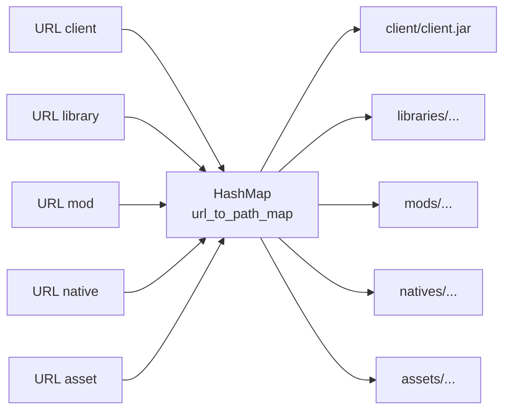

# URL Mapping System

## Architecture

The url_to_path_map mapping enables O(1) resolution from URLs to physical paths.



## Entry Format

**Key**: Complete URL including base_url, server name, and path
**Value**: Relative path to server folder including prefix (client/, mods/, etc.)

Example:
```rust
{
  "http://localhost:8080/server1/mods/JEI-1.20.1.jar": "mods/JEI-1.20.1.jar",
  "http://localhost:8080/server1/client/client.jar": "client/client.jar"
}
```

## Performance

- Insertion: O(1)
- Lookup: O(1)
- Suppression: O(1)
- Memory: ~150 bytes per entry (URL + path)
- Server with 500 files: ~75KB

## Serialization

The url_to_path_map field has the `#[serde(skip)]` attribute:
- Not serialized to JSON
- Rebuilt after deserialization via build_url_map()
- Avoids data duplication
