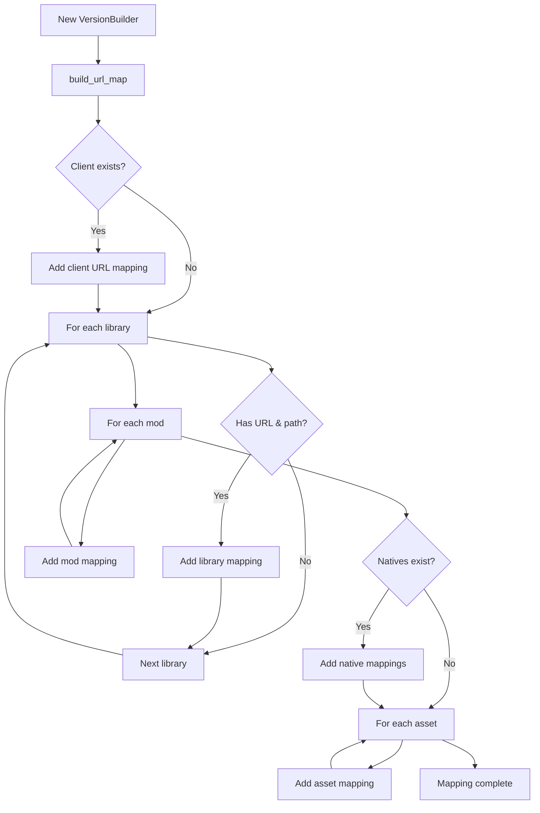

# VersionBuilder - Version Construction

## URL Mapping Construction



## Incremental Updates

```rust
// Add a file
version.add_url_mapping(
    "http://localhost/server/mods/new-mod.jar".to_string(),
    "mods/new-mod.jar".to_string()
);

// Remove a file
version.remove_url_mapping("http://localhost/server/mods/old-mod.jar");

// Modification (remove then add)
version.remove_url_mapping(old_url);
version.add_url_mapping(new_url, new_path);
```

## Validation

VersionBuilder does not validate data. Scanner's responsibility:
- Verify file existence
- Calculate correct hashes
- Validate sizes
- Ensure unique URLs
