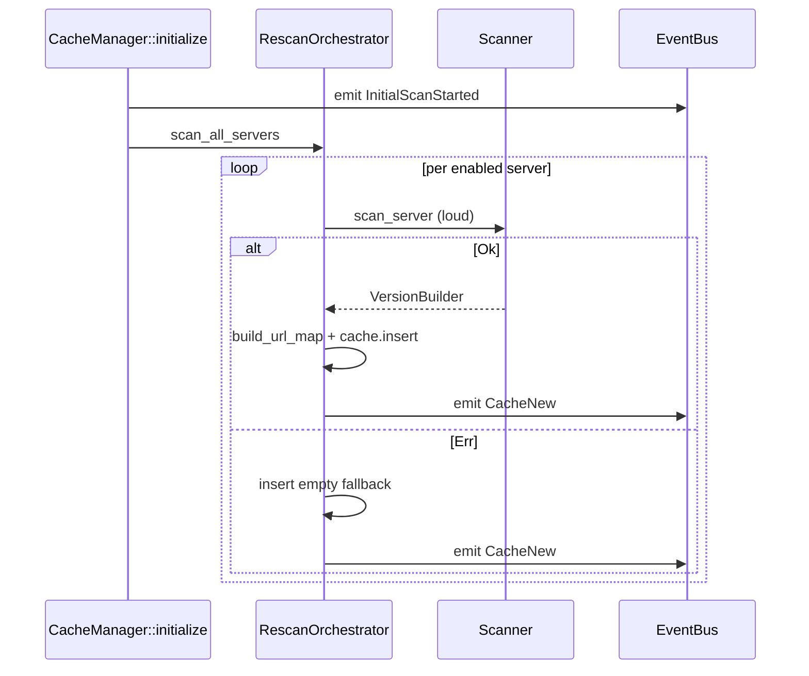
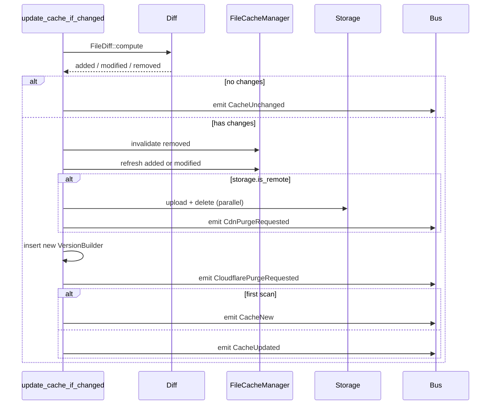
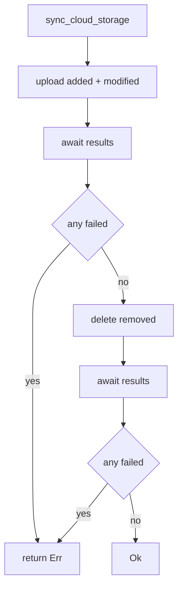

# Flows

## Initial scan



## Polling loop

```mermaid
sequenceDiagram
    participant Loop as run_rescan_loop
    participant Cfg as Config
    participant Orch
    participant Scanner

    Loop->>Cfg: read rescan_interval
    loop tick
        Loop->>Orch: paused?
        Loop->>Cfg: snapshot servers
        loop per enabled server
            Loop->>Scanner: scan_server_silent
            alt Ok
                Loop->>Orch: update_cache_if_changed
            else Err
                Note over Loop: swallowed
            end
        end
    end
```

## File watcher loop

```mermaid
sequenceDiagram
    participant Loop as run_file_watcher_loop
    participant Notify
    participant SPC as ServerPathCache
    participant Orch

    Loop->>Notify: watch every server path
    loop forever
        Notify-->>Loop: event
        Loop->>SPC: find_server
        Loop->>Loop: sleep debounce
        Loop->>Loop: drain queued events
        loop per impacted server
            Loop->>Orch: rescan_server
        end
    end
```

`ServerPathCache` is sorted longest-first so the most specific path
matches first. The drain after the debounce coalesces bursts.

## Diff-driven side effects



Order matters: invalidate RAM cache first, then refresh, then upload,
then emit purge events. Otherwise an in-flight request could be
redirected to a CDN URL that's purged but not yet uploaded.

## Cloud sync



Uploads happen before deletes so the new file lands before the old
one disappears.

## See also

- [overview.md](./overview.md)
- [events.md](./events.md)
