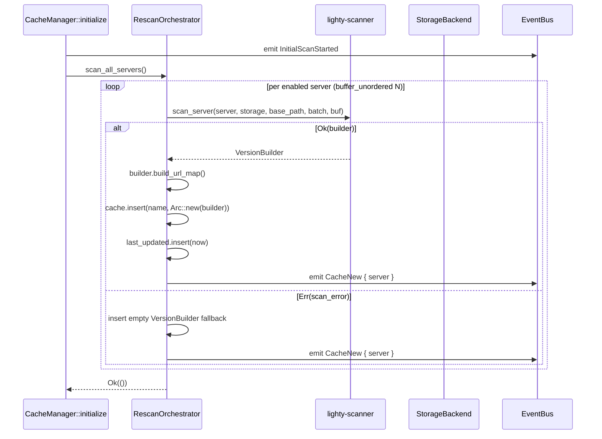
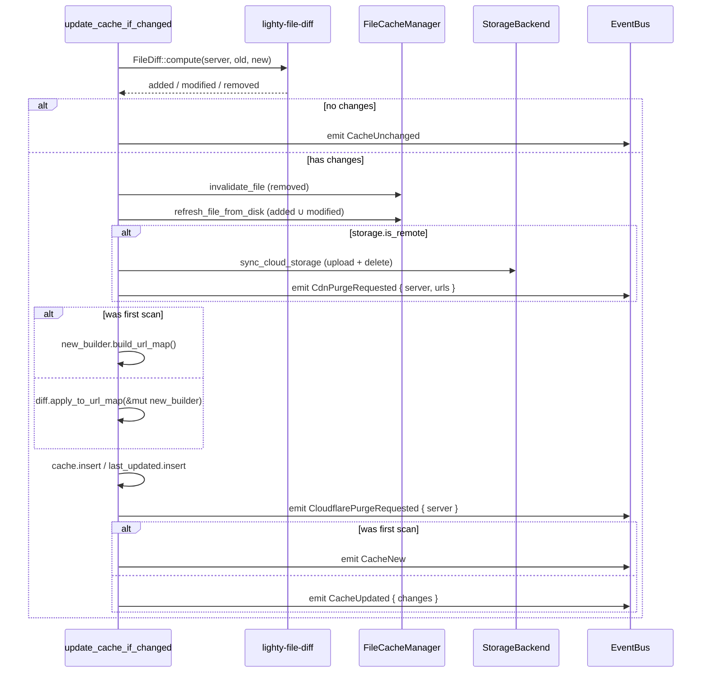
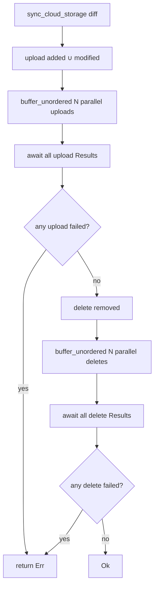

# Flows

Sequence diagrams for every loop and the diff-driven side-effect
pipeline.

## Initial scan (boot)

Triggered once by `CacheManager::initialize` after the config has
loaded.



Concurrency is `cache.hash_concurrency` servers at a time. Per-server
work happens inside `lighty-scanner`.

## Polling loop (`rescan_interval > 0`)

```mermaid
sequenceDiagram
    participant Loop as run_rescan_loop
    participant Cfg as Config
    participant Orch as RescanOrchestrator
    participant Scanner as ServerScanner::scan_server_silent

    Loop->>Cfg: read rescan_interval
    Loop->>Loop: tokio::time::interval(interval)
    loop forever
        Loop->>Loop: interval.tick()
        Loop->>Orch: if paused → continue
        Loop->>Cfg: snapshot servers + base_path
        loop per enabled server
            Loop->>Scanner: scan_server_silent(server, ...)
            alt Ok(builder)
                Scanner-->>Loop: VersionBuilder
                Loop->>Orch: update_cache_if_changed
            else Err
                Note over Loop: silently ignored<br/>(loud variant runs in force_rescan_server)
            end
        end
    end
```

The polling variant is "loud failure on init, quiet failure on
continuous". A missing file mid-update or a transient disk error
should not flood the logs.

## File-watcher loop (`rescan_interval == 0`)

```mermaid
sequenceDiagram
    participant Loop as run_file_watcher_loop
    participant Notify as notify::Watcher
    participant SPC as ServerPathCache
    participant Orch as RescanOrchestrator
    participant Bus as EventBus

    Loop->>Bus: emit ContinuousScanEnabled
    Loop->>Notify: recommended_watcher(tx)
    loop per enabled server
        Loop->>Notify: watch(server_path, RecursiveMode::Recursive)
    end
    loop forever
        Notify-->>Loop: Event (via mpsc)
        Loop->>Loop: if paused → continue
        Loop->>SPC: find_server(path) for each event.paths
        Loop->>Loop: sleep(debounce_ms)
        Loop->>Loop: try_recv drain (coalesce burst)
        loop per impacted server (HashSet)
            Loop->>Orch: rescan_server(server_config, base_path)
        end
    end
```

Notes:
- `ServerPathCache` is sorted longest-first, so the most specific path
  matches before any parent.
- The `try_recv` drain after the debounce sleep coalesces bursts (a
  modpack copy can emit thousands of events in a second; we want one
  rescan, not thousands).
- The `mpsc` channel is bounded; `Full` events get dropped with
  `tracing::trace!` — safe because we rescan the *whole* server, not
  per-file deltas.

## Diff-driven side effects

The heart of the crate. Called by both loops via `rescan_server`.



The order is intentional:
1. Invalidate RAM cache **first** so requests in flight don't read
   stale bytes during the upload.
2. Refresh RAM cache from disk **before** any upload — keeps "served
   from RAM" consistent with what's on the wire.
3. Upload to cloud storage **before** emitting `CdnPurgeRequested` —
   otherwise the launcher could be redirected to a CDN URL that's
   already purged but not yet uploaded.
4. Emit `CloudflarePurgeRequested` **after** inserting the new
   manifest into the in-memory cache, so the next GET on
   `/{server}.json` reads the new payload.

## Cloud sync detail (`sync_cloud_storage`)



`N` is `cache.hash_concurrency`. Uploads happen before deletes so a
launcher that fetches the manifest mid-sync sees the new file before
the old one disappears.

## See also

- [`overview.md`](./overview.md)
- [`how-to-use.md`](./how-to-use.md)
- [`exports.md`](./exports.md)
- [`events.md`](./events.md) — exhaustive list of emitted events
