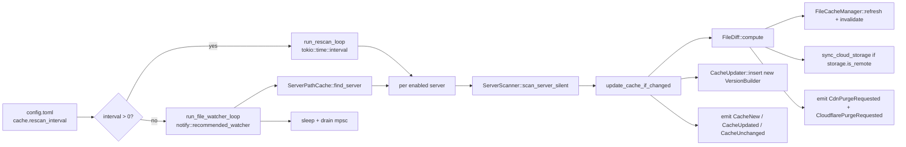

# Overview

`lighty-rescan` owns the loops that keep every server's
`VersionBuilder` in sync with the disk and the cloud. It picks the
right mode from config (timed polling or `notify`-based file watcher),
runs `lighty-scanner` to rebuild snapshots, asks `lighty-file-diff`
what changed, and emits the appropriate `AppEvent`s so file-cache
refresh, storage upload and CDN purge all happen without direct calls
between crates.

## What's inside

| Item | Purpose |
|---|---|
| `RescanOrchestrator` | The state machine. Owns the cache updater, file cache, storage backend, event bus, base path and `ServerPathCache`. |
| `RescanOrchestratorDeps` | Constructor input struct — keeps `new()` from drowning in arguments. |
| `ChangeDetector` | Pure functions that turn a `(old, new)` pair into a human-readable list of changes (`"libraries added (8 → 10)"`). Used for `CacheUpdated.changes`. |
| `ServerPathCache` | Sorted vec of `(server_path, server_name)` for O(k) reverse-lookup. Used by the file watcher to route a single inotify event to a single server. |
| `CacheUpdater` trait + `CacheStore` | Adapter the orchestrator writes through. `CacheStore` is a thin `DashMap` wrapper for callers that don't need a full `CacheManager`. |
| `RescanError` | One error type for the crate; covers `Io`, `Scan`, `Storage`, `Join`, `FileCache`, `ServerNotFound`, `InvalidConfig`. |

The crate has no Cargo features.

## Big picture

The two loops never run simultaneously: the orchestrator picks one at
startup based on `cache.rescan_interval`. `0` opts into the file
watcher (real-time, debounced); any positive value is the polling
interval in seconds.

## Initial scan vs continuous rescan

- **Initial scan** — `scan_all_servers()` runs once during
  `CacheManager::initialize`. It calls `ServerScanner::scan_server`
  (not the silent variant) so first-time errors surface as
  `AppEvent::Error`. On a missing or empty server it inserts an empty
  `VersionBuilder` so HTTP requests don't 500.
- **Continuous rescan** — `run_rescan_loop()` is spawned by
  `CacheManager::start_auto_rescan`. It silently swallows scan errors
  (server may be mid-update, missing files are fine) and only acts
  when the diff is non-empty.

## What the orchestrator does **not** do

- It does **not** open HTTP connections. CDN purges are emitted as
  events; `lighty-cdn::CdnEventSink` does the network.
- It does **not** mutate the storage backend trait. Upload / delete
  flow through `StorageBackend::upload_file` / `delete_file`.
- It does **not** know about HTTP handlers. The API layer reads from
  `CacheManager`; this crate only writes.

## Cargo features

None.

## See also

- [`how-to-use.md`](./how-to-use.md) — wiring snippets
- [`exports.md`](./exports.md) — full public surface
- [`flows.md`](./flows.md) — sequence diagrams for every loop and the
  diff-driven side-effect pipeline
- [`events.md`](./events.md) — the eight `AppEvent` variants emitted
  by this crate
- [`../../file-diff/docs/overview.md`](../../file-diff/docs/overview.md)
- [`../../file-cache/docs/overview.md`](../../file-cache/docs/overview.md)
- [`../../cdn/docs/overview.md`](../../cdn/docs/overview.md)
