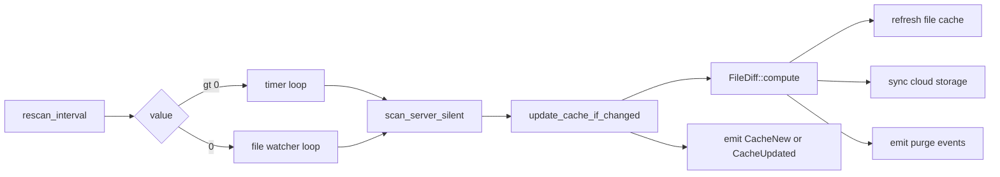

# Overview

Owns the loops that keep every server's `VersionBuilder` in sync with
the disk and the cloud. Picks polling or file-watcher mode from
config, runs `lighty-scanner`, diffs with `lighty-file-diff`, emits
events for everything else (cache refresh, cloud upload, CDN purge).

## What's inside

| Item | Purpose |
|---|---|
| `RescanOrchestrator` | The state machine. |
| `RescanOrchestratorDeps` | Constructor input — avoids 8-arg `new`. |
| `ChangeDetector` | Pure (old, new) → human-readable change list. |
| `ServerPathCache` | Sorted vec `(path, server_name)` for O(k) reverse-lookup. |
| `CacheUpdater` trait + `CacheStore` | Adapter the orchestrator writes through. |
| `RescanError` | `Io`, `Scan`, `Storage`, `Join`, `FileCache`, `ServerNotFound`, `InvalidConfig`. |

## Big picture

`scan_all_servers()` runs once at boot (loud variant);
`run_rescan_loop()` runs the background loop after that (silent
variant).

## See also

- [how-to-use.md](./how-to-use.md)
- [exports.md](./exports.md)
- [flows.md](./flows.md)
- [events.md](./events.md)
- [../../file-diff/docs/overview.md](../../file-diff/docs/overview.md)
- [../../file-cache/docs/overview.md](../../file-cache/docs/overview.md)
- [../../cdn/docs/overview.md](../../cdn/docs/overview.md)
