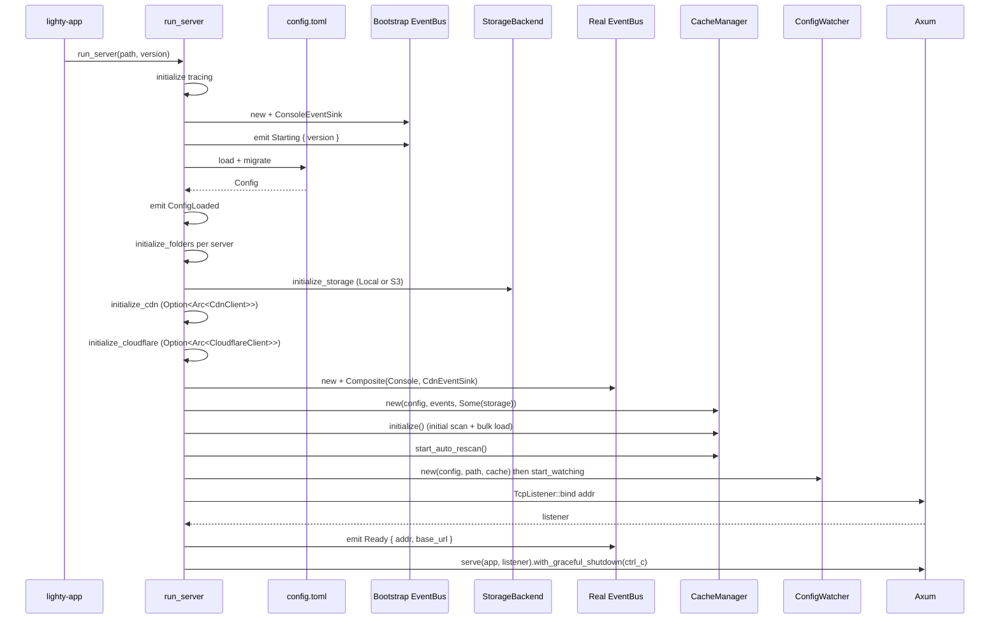
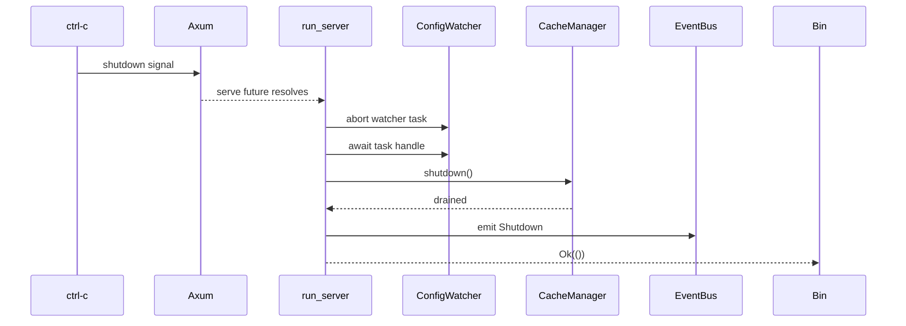
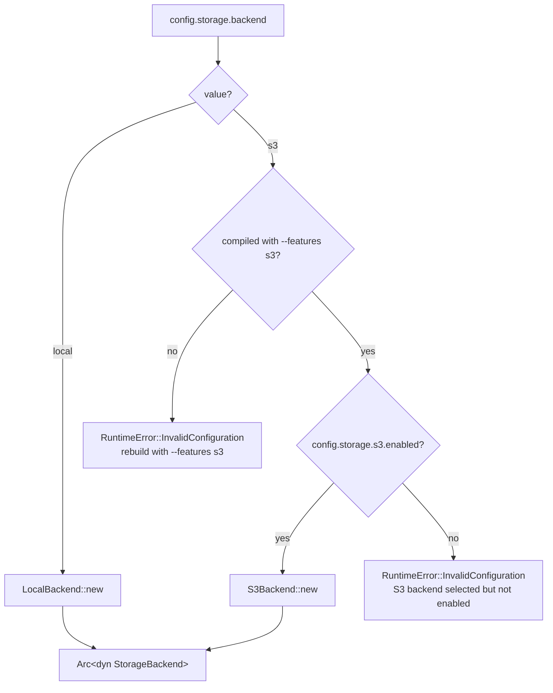

# Flows

## Bootstrap → Ready

The order of operations matters: each step depends on the previous
one. The diagram below is the canonical sequence.

## Shutdown

## Storage feature decision tree

This is why the `s3` feature must be threaded all the way up to the
binary: the backend selection happens at the runtime layer, but the
type only exists in `lighty-storage` when its `s3` feature is on.

## See also

- [`overview.md`](./overview.md)
- [`how-to-use.md`](./how-to-use.md)
- [`exports.md`](./exports.md)
- [`../../cache/docs/flows.md`](../../cache/docs/flows.md) — what
  `CacheManager::initialize` and `start_auto_rescan` actually do
- [`../../watcher/docs/`](../../watcher/) — config hot-reload flow
