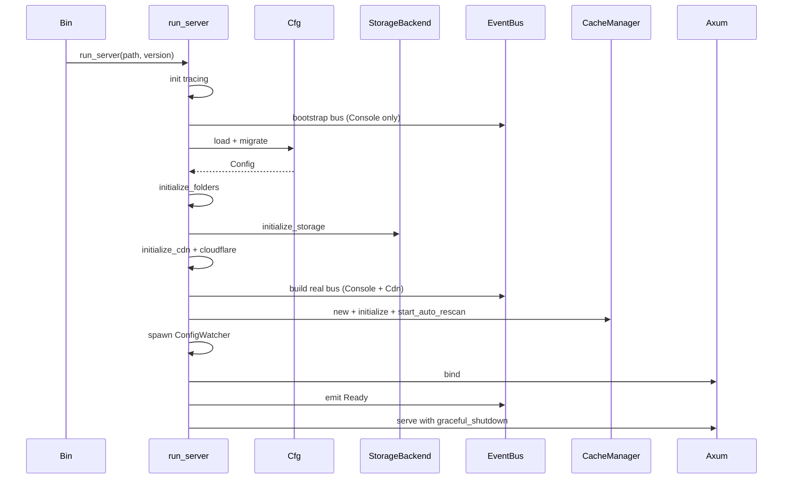
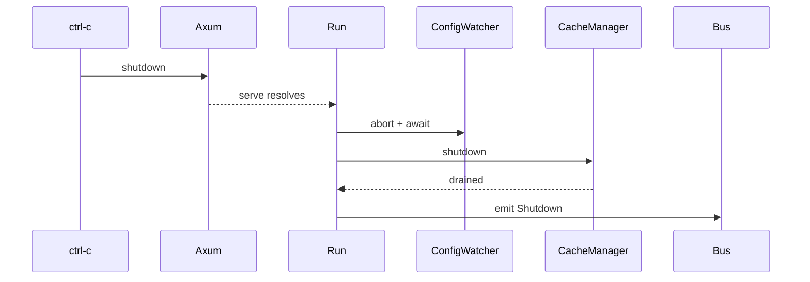
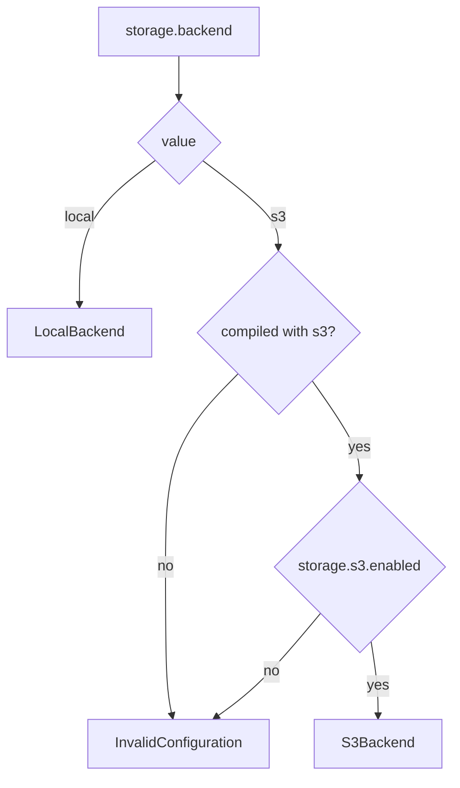

# Flows

## Bootstrap → Ready

## Shutdown

## Storage backend decision

`s3` must be threaded all the way from the binary down to
`lighty-storage`.

## See also

- [overview.md](./overview.md)
- [../../cache/docs/flows.md](../../cache/docs/flows.md)
