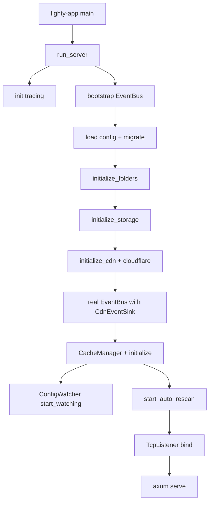

# Overview

Composition root of LightyUpdater. The only crate allowed to know
about every layer; everyone else either declares its own deps or
talks through events.

## What it does

1. Load config from `LIGHTY_CONFIG` (or `./config.toml`).
2. Build the storage backend (`Local` or `S3` if compiled with the
   feature).
3. Build the `EventBus` with a `CompositeEventSink` (Console + Cdn).
4. Construct `CacheManager`, initialize, start the rescan loop.
5. Spawn the config watcher.
6. Bind Axum, serve until `ctrl-c`, then drain.

## What's inside

| Module | Purpose |
|---|---|
| `runner` | `run_server` / `run_server_with_default_config`. |
| `bootstrap` | Tracing init, config load, folder setup, Axum router build. |
| `error` | `RuntimeError` with `#[from]` from every sub-crate. |

## Big picture

Two-bus dance: bootstrap events flow before the CDN clients exist;
once the real bus is built, it takes over.

## Wiring rules

- Only `lighty-runtime` touches `lighty-cdn`.
- Only `lighty-runtime` constructs `EventBus`.
- No HTTP handlers, no business logic — only wiring.

## Cargo features

| Feature | Effect |
|---|---|
| `s3` | Enables `lighty-storage/s3`. |

## See also

- [how-to-use.md](./how-to-use.md)
- [exports.md](./exports.md)
- [flows.md](./flows.md)
- [../../cache/docs/overview.md](../../cache/docs/overview.md)
- [../../cdn/docs/overview.md](../../cdn/docs/overview.md)
