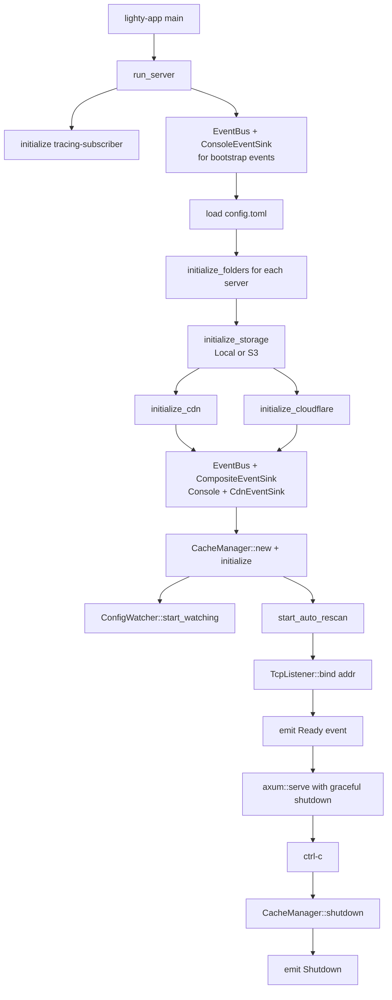

# Overview

`lighty-runtime` is the **composition root** of LightyUpdater. It is
the only crate allowed to know about every layer; everyone else
either declares its own deps or talks to others through events.

The crate's job:

1. Load the config from `LIGHTY_CONFIG` (or `config.toml`).
2. Create the per-process storage backend (`LocalBackend` or, with
   `--features s3`, `S3Backend`).
3. Build the `EventBus` with a `CompositeEventSink` that fans events
   out to `ConsoleEventSink` (operator-visible logs) and
   `CdnEventSink` (network purges).
4. Construct `CacheManager`, initialize it, start the rescan loop.
5. Bind Axum to the configured `host:port` and serve until
   `ctrl-c`.

After signal: drain the watcher, shut down the cache, emit
`Shutdown`, exit.

## What's inside

| Module | Purpose |
|---|---|
| `runner` | The `run_server` / `run_server_with_default_config` entry points. |
| `bootstrap` | `initialize` (tracing-subscriber), `load` (config), `initialize_folders`, `build` (Axum router). |
| `error` | `RuntimeError` with `IoError`, `BindAddress`, `InvalidConfiguration`, plus passthroughs from every other crate. |

## Boot sequence

The two-bus dance (bootstrap + real) is deliberate: bootstrap events
must reach the operator before the CDN clients exist (you can't
construct `CdnEventSink` without `Arc<Option<CdnClient>>`, and that
requires the config to be loaded). Once everything is up, the real
bus takes over.

## Wiring rules

- **Only `lighty-runtime` touches `lighty-cdn`.** Rescan emits
  events; the runtime mounts the sink. Direct calls from any other
  crate are forbidden.
- **Only `lighty-runtime` constructs `EventBus`.** Service crates take
  `Arc<EventBus>` as a parameter; they never construct one
  themselves.
- **No HTTP handlers, no business logic.** Everything `runtime`
  contains is wiring. If you find yourself adding a `pub fn
  do_business_thing` here, it belongs in a service crate.

## Cargo features

| Feature | Effect |
|---|---|
| `s3` | Enables `lighty-storage/s3`. Without it, `StorageBackend::S3` selected in config returns `InvalidConfiguration`. |

## See also

- [`how-to-use.md`](./how-to-use.md) — embedding `run_server` in a
  custom binary
- [`exports.md`](./exports.md) — public surface
- [`flows.md`](./flows.md) — boot and shutdown sequences in detail
- [`../../cache/docs/overview.md`](../../cache/docs/overview.md)
- [`../../cdn/docs/overview.md`](../../cdn/docs/overview.md)
