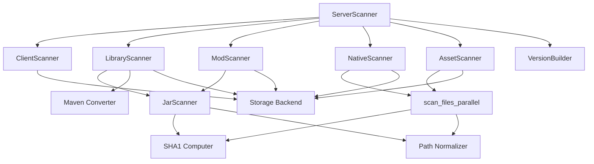
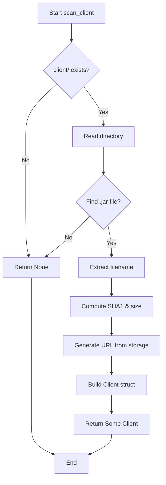
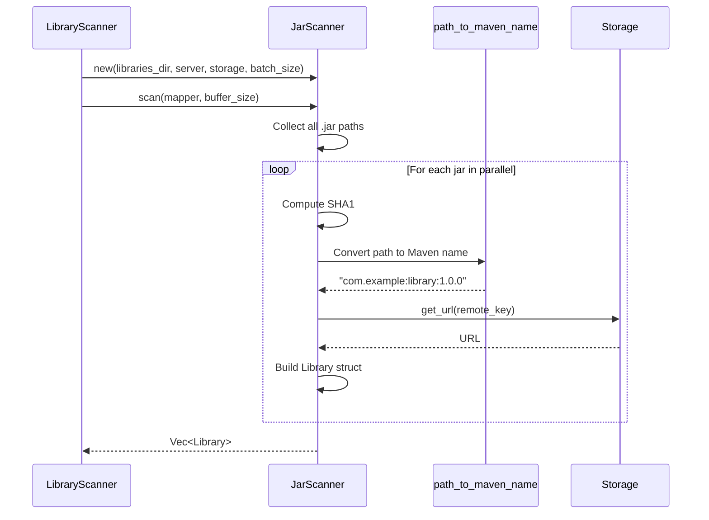
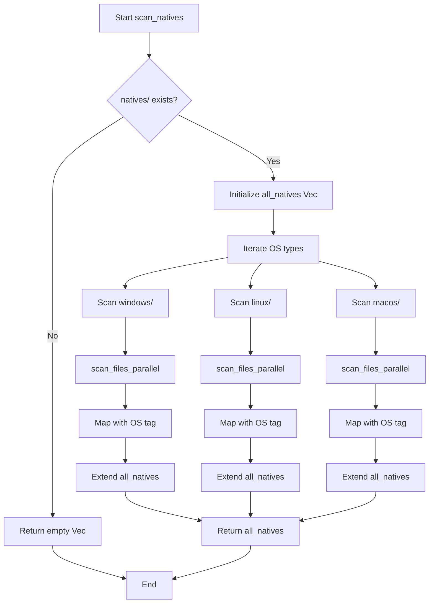
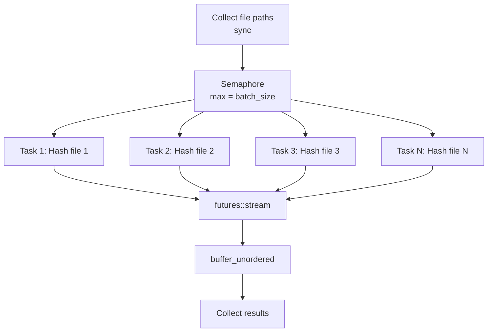
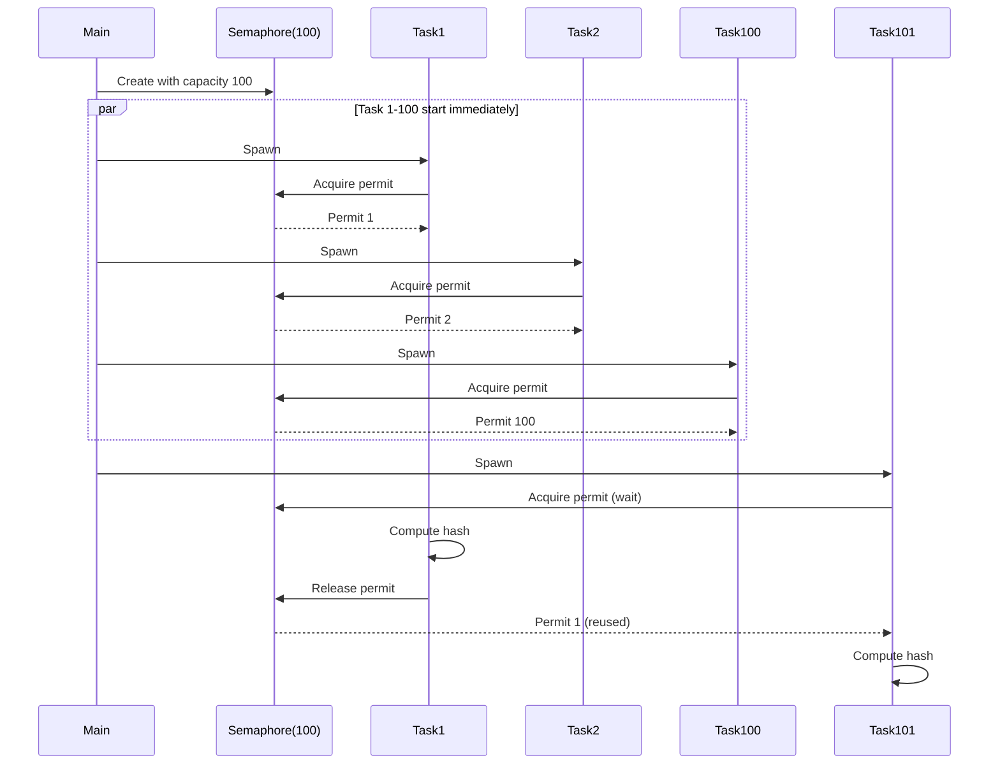
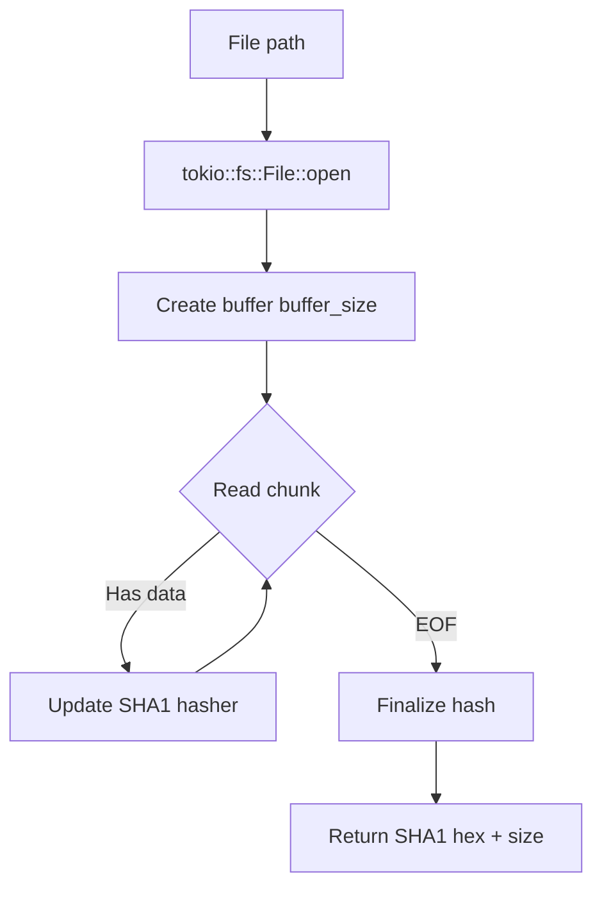
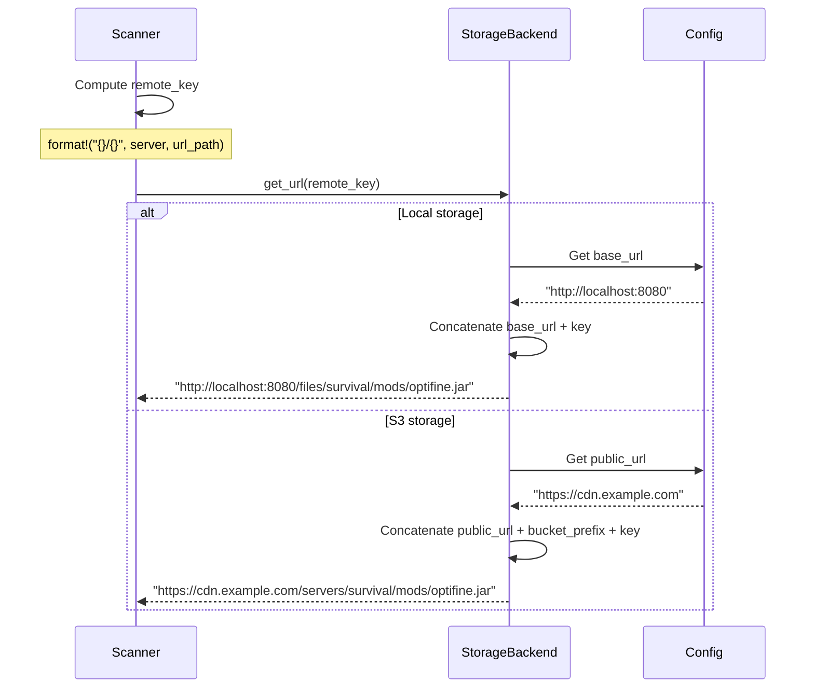

# Scan System Architecture

## Overview

The scan system is designed as a modular architecture with specialized components for each file type. The focus is on parallelization and performance.

## Architecture Diagram



## Main Components

### ServerScanner

Main entry point that orchestrates the complete scan of a server.

**Responsibilities**:
- Server structure validation
- Specialized scanner coordination
- VersionBuilder construction
- URL map generation

**Methods**:
- `scan_server`: Scan with detailed logging
- `scan_server_silent`: Scan without logging (for frequent rescans)
- `validate_server_path`: Verify server existence
- `build_version_metadata`: Build metadata with parallel component scanning

**Parallelization**:
The `build_version_metadata` method uses `tokio::join!` to scan all components (client, libraries, mods, natives, assets) concurrently. This allows multiple I/O operations to execute simultaneously, significantly reducing total scan time.

### JarScanner

Reusable generic scanner for JAR files with parallelization.

**Features**:
- Generic over return type `T`
- Customizable mapping function
- Concurrency control via Semaphore
- Uses futures::stream for parallelization

**Structure**:
```rust
pub struct JarScanner {
    pub base_dir: PathBuf,
    pub server: String,
    pub storage: Arc<dyn StorageBackend>,
    pub batch_size: usize,
}
```

**Algorithm**:
1. Synchronous collection of JAR file paths
2. Semaphore creation for concurrency control
3. File streaming with `buffer_unordered`
4. Parallel hash computation
5. Result mapping via provided function
6. Error filtering and collection

### scan_files_parallel

Utility function for parallel file scanning with customizable filter.

**Generic parameters**:
- `T`: Return type
- `Filter`: File filtering function
- `Mapper`: FileInfo → T transformation function

**Usage**: Natives and other non-JAR files requiring parallel processing.

## Specialized scanners

### ClientScanner

Scans the single client JAR file.

**Algorithm**:


**Characteristics**:
- No parallelization (single file)
- Takes the first .jar found
- Returns Option<Client>

### LibraryScanner

Scans libraries with Maven notation conversion.

**Process**:


**Maven conversion**:
- Input: `com/example/library/1.0.0/library-1.0.0.jar`
- Output: `com.example:library:1.0.0`

### ModScanner

Scans mods with simple structure.

**Features**:
- Uses JarScanner as base
- No name conversion (keeps filename)
- Flat structure (no subdirectories)

**Mapping**:
```rust
Mod {
    name: info.file_name,  // "optifine.jar"
    url: Some(info.url),
    path: Some(info.url_path),
    sha1: Some(info.sha1),
    size: Some(info.size),
}
```

### NativeScanner

Scans natives with multi-OS organization.

**Organization**:
```
natives/
├── windows/
│   └── lwjgl-natives-windows.jar
├── linux/
│   └── lwjgl-natives-linux.jar
└── macos/
    └── lwjgl-natives-macos.jar
```

**Algorithm**:


**Name format**:
```rust
name: format!("natives:{}:{}", os, file_name)
// Example: "natives:windows:lwjgl-natives-windows.jar"
```

### AssetScanner

Recursive scan of all assets.

**Characteristics**:
- Recursive scan of entire tree
- Can generate thousands of files
- Uses walkdir to traverse directories
- Massive parallelization with semaphore

**Typical structure**:
```
assets/
├── minecraft/
│   ├── textures/
│   │   ├── block/
│   │   │   ├── stone.png
│   │   │   └── dirt.png
│   │   └── item/
│   │       └── diamond.png
│   └── sounds/
│       └── ambient/
│           └── cave.ogg
└── custom/
    └── logo.png
```

## Parallelization

### Concurrency architecture



### Concurrency control

**Semaphore**:
- Limits the number of concurrent tasks
- Prevents CPU/memory overload
- Configured by batch_size

**buffer_unordered**:
- Executes up to N futures simultaneously
- Collects results in completion order
- Optimizes parallelization

### Flow example



## Asynchronous hash computation

### Problem

SHA1 computation is CPU-intensive and could block the async runtime.

### Solution

Using tokio for asynchronous computation with buffer:



**Advantages**:
- No runtime blocking
- Configurable buffer to optimize I/O
- Size computation at the same time

**Configuration**:
```toml
[cache]
checksum_buffer_size = 8192  # 8KB buffer
```

## Integration with Storage

### URL generation



### Remote key format

```
{server_name}/{category}/{relative_path}

Examples:
- survival/client.jar
- survival/libraries/com/example/lib/1.0.0/lib-1.0.0.jar
- survival/mods/optifine.jar
- survival/natives/windows/lwjgl-natives-windows.jar
- survival/assets/minecraft/textures/block/stone.png
```

## Error handling

### Filtering strategy

Individual errors do not block the complete scan:

```rust
let results: Vec<Result<T>> = stream::iter(paths)
    .map(|path| async { /* scan */ })
    .buffer_unordered(batch_size)
    .collect()
    .await;

// Filter errors
Ok(results.into_iter().filter_map(|r| r.ok()).collect())
```

**Impact**: A corrupted file does not prevent scanning other files.

### Critical error propagation

Some errors are critical:
- Server folder does not exist
- Insufficient permissions
- Storage backend inaccessible

These errors are propagated via `Result<VersionBuilder>`.

## Optimizations

### Eager path collection

```rust
// Good: Sync collection then async processing
let paths: Vec<PathBuf> = WalkDir::new(&dir)
    .into_iter()
    .filter_map(|e| e.ok())
    .filter(|e| is_jar_file(e.path()))
    .map(|e| e.path().to_path_buf())
    .collect();

let results = stream::iter(paths)
    .map(|path| async { /* process */ })
    .buffer_unordered(batch_size)
    .collect()
    .await;
```

**Advantage**: Separates sync I/O operations (walkdir) from async operations (hash).

### Arc reuse

```rust
let storage = Arc::clone(&self.storage);
let mapper = Arc::new(mapper);

// Lightweight clone for each task
let storage = Arc::clone(&storage);
let mapper = Arc::clone(&mapper);
```

**Advantage**: No copying of large structures.

### Path normalization

Converting Windows paths to Unix format:
```rust
// Windows: libraries\com\example\lib.jar
// Unix:    libraries/com/example/lib.jar
normalize_path(path)  // Always "/"
```

**Importance**: Consistent URLs regardless of OS.
