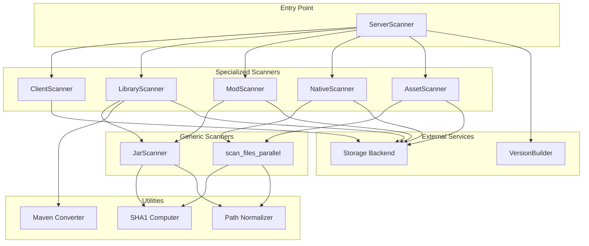
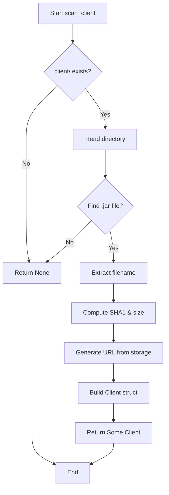
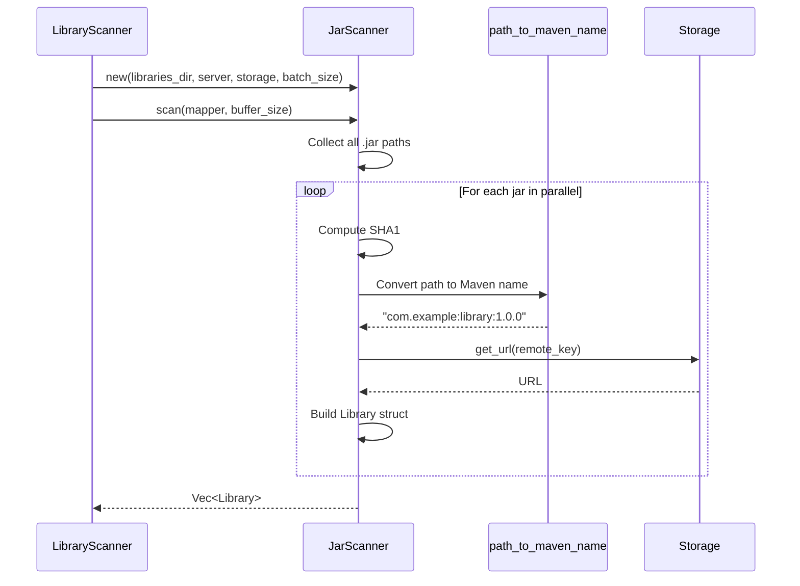
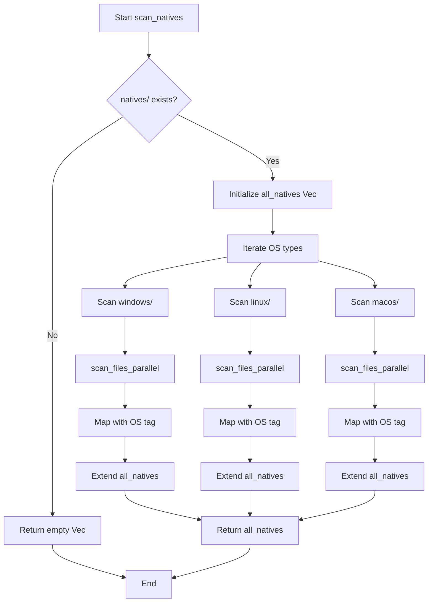
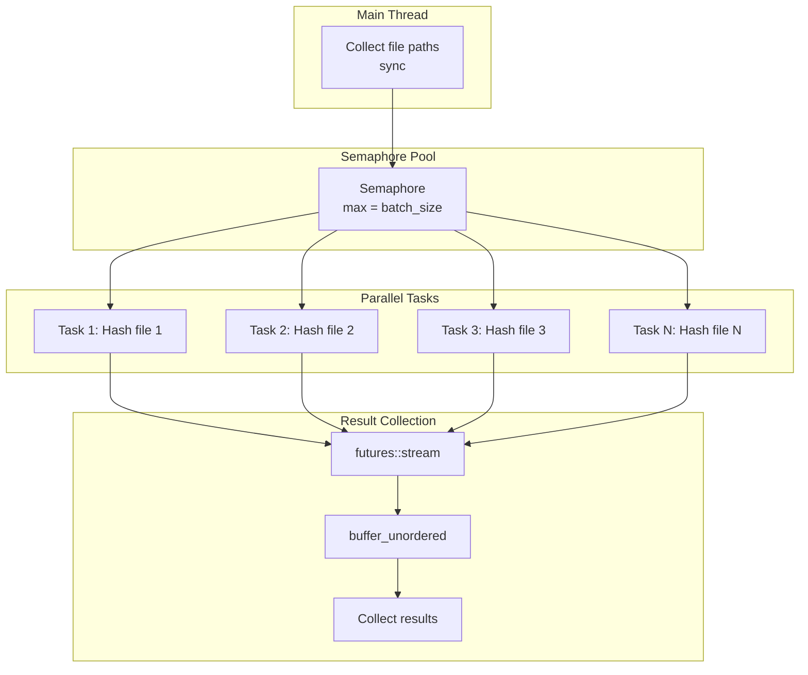
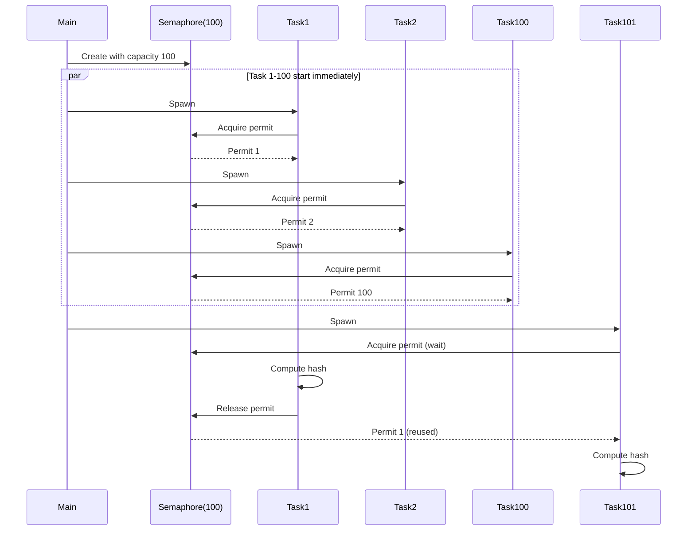
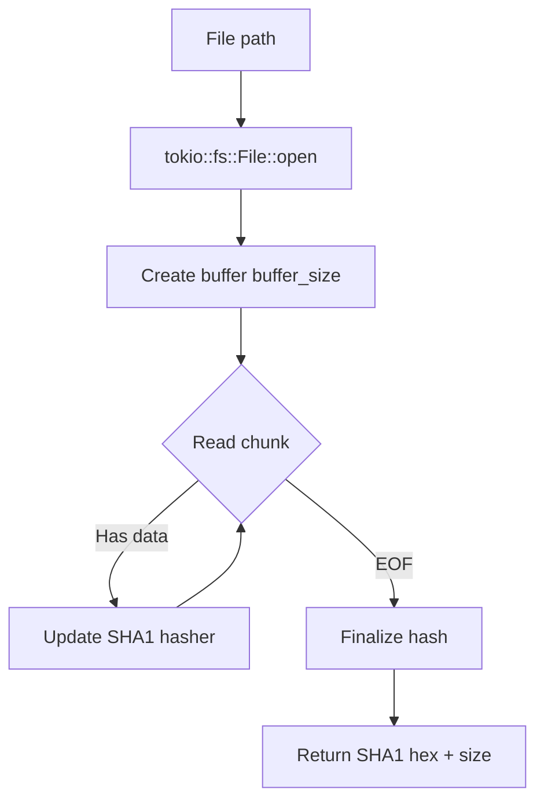
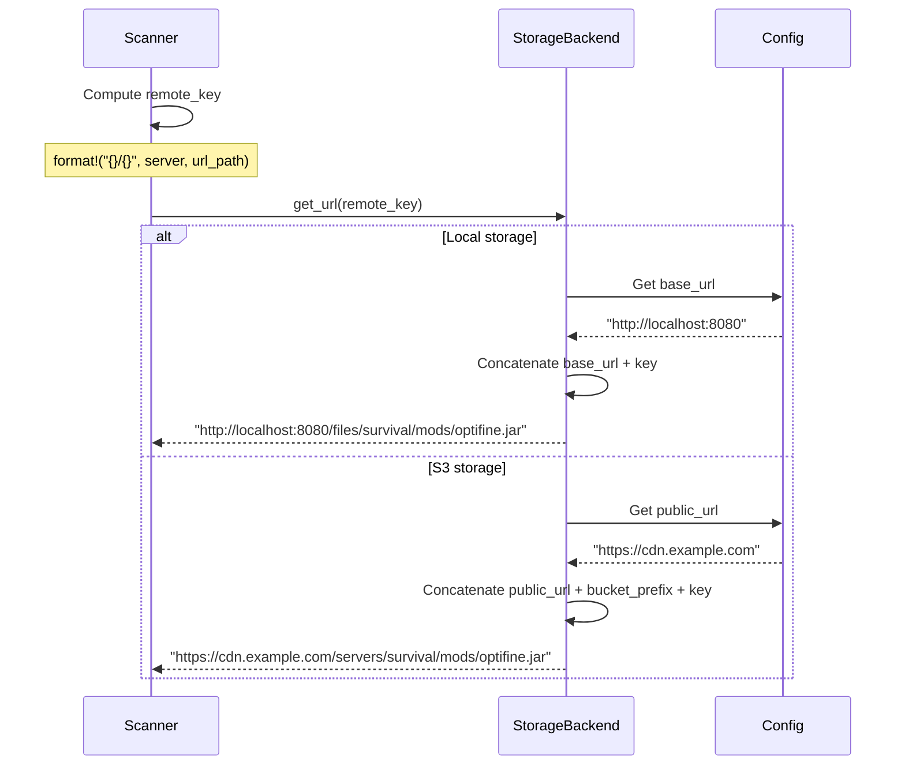

# Architecture du systeme de scan

## Vue d'ensemble

Le systeme de scan est concu comme une architecture modulaire avec des composants specialises pour chaque type de fichier. L'accent est mis sur la parallelisation et les performances.

## Diagramme d'architecture



## Composants principaux

### ServerScanner

Point d'entree principal qui orchestre le scan complet d'un serveur.

**Responsabilites**:
- Validation de la structure du serveur
- Coordination des scanners specialises
- Construction du VersionBuilder
- Generation de la URL map

**Methodes**:
- `scan_server`: Scan avec logging detaille
- `scan_server_silent`: Scan sans logging (pour rescans frequents)
- `validate_server_path`: Verification de l'existence du serveur
- `build_version_metadata`: Construction des metadonnees

### JarScanner

Scanner generique reutilisable pour fichiers JAR avec parallelisation.

**Caracteristiques**:
- Generic sur le type de retour `T`
- Fonction de mapping personnalisable
- Controle de concurrence via Semaphore
- Utilisation de futures::stream pour parallelisation

**Structure**:
```rust
pub struct JarScanner {
    pub base_dir: PathBuf,
    pub server: String,
    pub storage: Arc<dyn StorageBackend>,
    pub batch_size: usize,
}
```

**Algorithme**:
1. Collection synchrone des chemins de fichiers JAR
2. Creation du semaphore pour controle de concurrence
3. Stream des fichiers avec `buffer_unordered`
4. Calcul parallele des hashes
5. Mapping des resultats via fonction fournie
6. Filtrage des erreurs et collection

### scan_files_parallel

Fonction utilitaire pour scan parallele de fichiers avec filtre personnalisable.

**Parametres generiques**:
- `T`: Type de retour
- `Filter`: Fonction de filtrage des fichiers
- `Mapper`: Fonction de transformation FileInfo → T

**Utilisation**: Natives et autres fichiers non-JAR necessitant un traitement parallele.

## Scanners specialises

### ClientScanner

Scan du fichier client JAR unique.

**Algorithme**:


**Particularites**:
- Pas de parallelisation (1 seul fichier)
- Prend le premier .jar trouve
- Retourne Option<Client>

### LibraryScanner

Scan des libraries avec conversion en notation Maven.

**Processus**:


**Conversion Maven**:
- Input: `com/example/library/1.0.0/library-1.0.0.jar`
- Output: `com.example:library:1.0.0`

### ModScanner

Scan des mods avec structure simple.

**Caracteristiques**:
- Utilise JarScanner comme base
- Pas de conversion de nom (garde le filename)
- Structure plate (pas de sous-dossiers)

**Mapping**:
```rust
Mod {
    name: info.file_name,  // "optifine.jar"
    url: Some(info.url),
    path: Some(info.url_path),
    sha1: Some(info.sha1),
    size: Some(info.size),
}
```

### NativeScanner

Scan des natives avec organisation multi-OS.

**Organisation**:
```
natives/
├── windows/
│   └── lwjgl-natives-windows.jar
├── linux/
│   └── lwjgl-natives-linux.jar
└── macos/
    └── lwjgl-natives-macos.jar
```

**Algorithme**:


**Format du nom**:
```rust
name: format!("natives:{}:{}", os, file_name)
// Exemple: "natives:windows:lwjgl-natives-windows.jar"
```

### AssetScanner

Scan recursif de tous les assets.

**Particularites**:
- Scan recursif de toute l'arborescence
- Peut generer des milliers de fichiers
- Utilise walkdir pour traverser les dossiers
- Parallelisation massive avec semaphore

**Structure typique**:
```
assets/
├── minecraft/
│   ├── textures/
│   │   ├── block/
│   │   │   ├── stone.png
│   │   │   └── dirt.png
│   │   └── item/
│   │       └── diamond.png
│   └── sounds/
│       └── ambient/
│           └── cave.ogg
└── custom/
    └── logo.png
```

## Parallelisation

### Architecture de concurrence



### Controle de concurrence

**Semaphore**:
- Limite le nombre de taches concurrentes
- Evite la surcharge CPU/memoire
- Configuration par batch_size

**buffer_unordered**:
- Execute jusqu'a N futures simultanement
- Collecte les resultats dans l'ordre de completion
- Maximise le throughput

### Exemple de flux



## Calcul de hash asynchrone

### Probleme

Le calcul de SHA1 est CPU-intensif et pourrait bloquer le runtime async.

### Solution

Utilisation de tokio pour calcul asynchrone avec buffer:



**Avantages**:
- Pas de blocage du runtime
- Buffer configurable pour optimiser I/O
- Calcul de size en meme temps

**Configuration**:
```toml
[cache]
checksum_buffer_size = 8192  # 8KB buffer
```

## Integration avec Storage

### Generation d'URLs



### Remote key format

```
{server_name}/{category}/{relative_path}

Exemples:
- survival/client.jar
- survival/libraries/com/example/lib/1.0.0/lib-1.0.0.jar
- survival/mods/optifine.jar
- survival/natives/windows/lwjgl-natives-windows.jar
- survival/assets/minecraft/textures/block/stone.png
```

## Gestion des erreurs

### Strategie de filtrage

Les erreurs individuelles ne bloquent pas le scan complet:

```rust
let results: Vec<Result<T>> = stream::iter(paths)
    .map(|path| async { /* scan */ })
    .buffer_unordered(batch_size)
    .collect()
    .await;

// Filter errors
Ok(results.into_iter().filter_map(|r| r.ok()).collect())
```

**Impact**: Un fichier corrompu n'empeche pas le scan des autres fichiers.

### Propagation d'erreurs critiques

Certaines erreurs sont critiques:
- Serveur folder inexistant
- Permissions insuffisantes
- Storage backend inaccessible

Ces erreurs sont propagees via `Result<VersionBuilder>`.

## Optimisations

### Collection eagere des paths

```rust
// Bon: Collection sync puis traitement async
let paths: Vec<PathBuf> = WalkDir::new(&dir)
    .into_iter()
    .filter_map(|e| e.ok())
    .filter(|e| is_jar_file(e.path()))
    .map(|e| e.path().to_path_buf())
    .collect();

let results = stream::iter(paths)
    .map(|path| async { /* process */ })
    .buffer_unordered(batch_size)
    .collect()
    .await;
```

**Avantage**: Separe les operations I/O sync (walkdir) des operations async (hash).

### Reuse de Arc

```rust
let storage = Arc::clone(&self.storage);
let mapper = Arc::new(mapper);

// Clone leger pour chaque task
let storage = Arc::clone(&storage);
let mapper = Arc::clone(&mapper);
```

**Avantage**: Pas de copie des structures volumineuses.

### Normalisation de chemins

Conversion des chemins Windows en format Unix:
```rust
// Windows: libraries\com\example\lib.jar
// Unix:    libraries/com/example/lib.jar
normalize_path(path)  // Toujours "/"
```

**Importance**: URLs consistantes independamment de l'OS.
