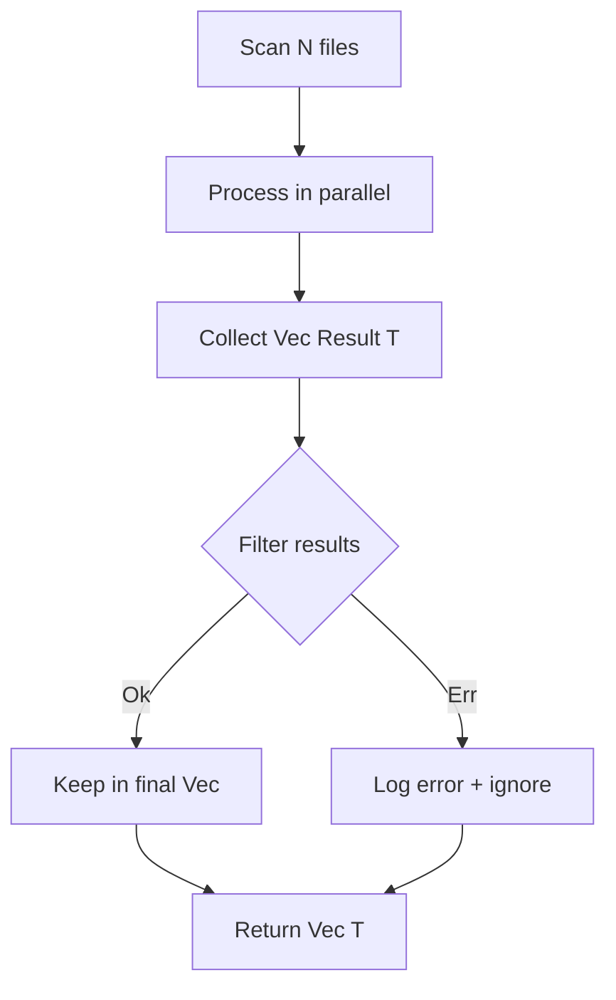

# Error Documentation

## Main Type: ScanError

Enumeration of scanner crate errors using `thiserror`.

## Error Types

### IoError
```rust
#[error("I/O error: {0}")]
IoError(#[from] std::io::Error)
```

**Causes**: File read/write errors, permissions, missing files.

**Context**: Reading JAR files, folder traversal, accessing metadata.

**Handling**: Automatic propagation via `#[from]`, ERROR logging.

---

### StorageError
```rust
#[error("Storage error: {0}")]
StorageError(#[from] lighty_storage::StorageError)
```

**Causes**: Storage backend failure, impossible URL generation.

**Context**: Calls to `storage.get_url()`.

**Handling**: Propagation, scan cancelled for this server.

---

### UtilsError
```rust
#[error("Utils error: {0}")]
UtilsError(#[from] lighty_utils::UtilsError)
```

**Causes**: Errors in utilities (hash calculation, path normalization).

**Context**: `compute_sha1_with_size`, `normalize_path`, `path_to_maven_name`.

**Handling**: Propagation, file ignored.

---

### JoinError
```rust
#[error("Join error: {0}")]
JoinError(#[from] tokio::task::JoinError)
```

**Causes**: Async task panic, runtime shutdown.

**Context**: Parallel file processing.

**Handling**: Critical error, immediate propagation.

---

### ServerFolderNotFound
```rust
#[error("Server folder does not exist: {0}")]
ServerFolderNotFound(String)
```

**Causes**: Non-existent server folder.

**Context**: Initial validation in `scan_server`.

**Handling**: Immediate error return, no scan.

---

### InvalidJar
```rust
#[error("Invalid JAR file: {0}")]
InvalidJar(String)
```

**Causes**: Corrupted or malformed JAR file.

**Context**: Reading JAR metadata.

**Handling**: File ignored, continue scan.

---

### ScanDirectoryError
```rust
#[error("Failed to scan directory: {0}")]
ScanDirectoryError(String)
```

**Causes**: Error during folder traversal.

**Context**: WalkDir errors, permissions.

**Handling**: Log WARNING, folder ignored.

---

### HashError
```rust
#[error("Failed to compute hash: {0}")]
HashError(String)
```

**Causes**: SHA1 calculation failure.

**Context**: `compute_sha1_with_size`.

**Handling**: File ignored, ERROR logging.

---

### InvalidMetadata
```rust
#[error("Invalid file metadata: {0}")]
InvalidMetadata(String)
```

**Causes**: Invalid file metadata, failed name/path extraction.

**Context**: `strip_prefix`, `file_name`, path extraction.

**Handling**: File ignored, WARNING logging.

## Resilience Strategy

### Individual Error Filtering



**Principle**: Error on one file doesn't stop the complete scan.

### Critical Errors

Some errors stop the scan:
- ServerFolderNotFound
- Uninitialized storage backend
- JoinError (task panic)

These errors are propagated via `Result<VersionBuilder>`.
