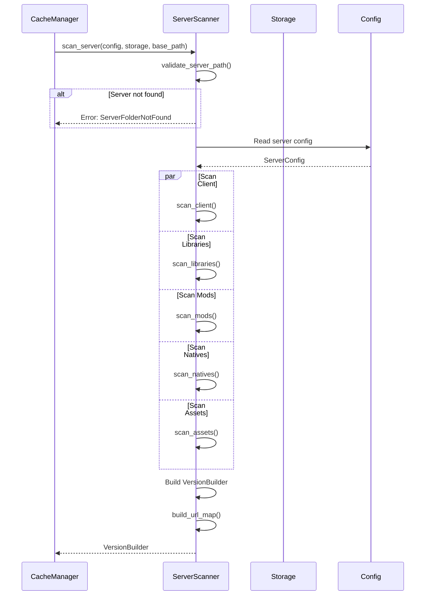
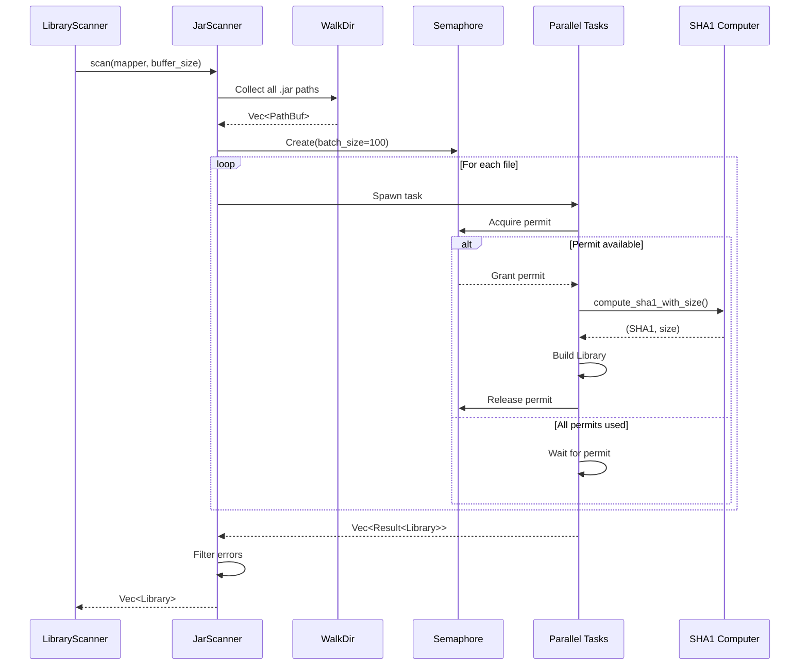
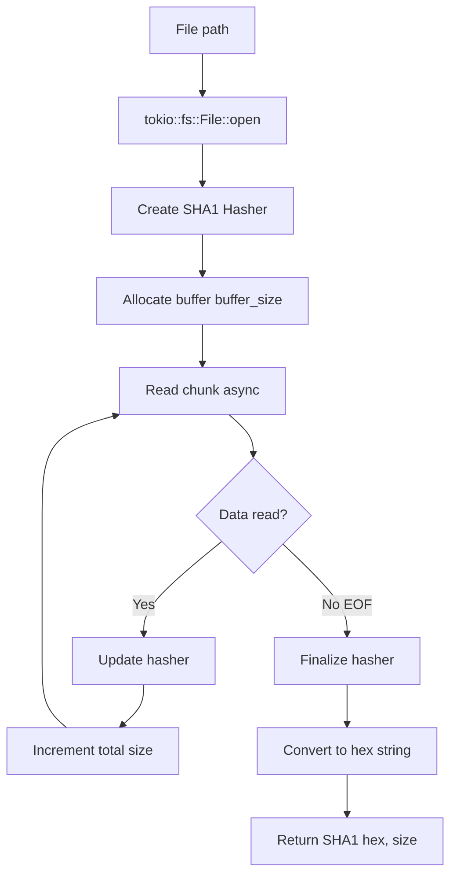
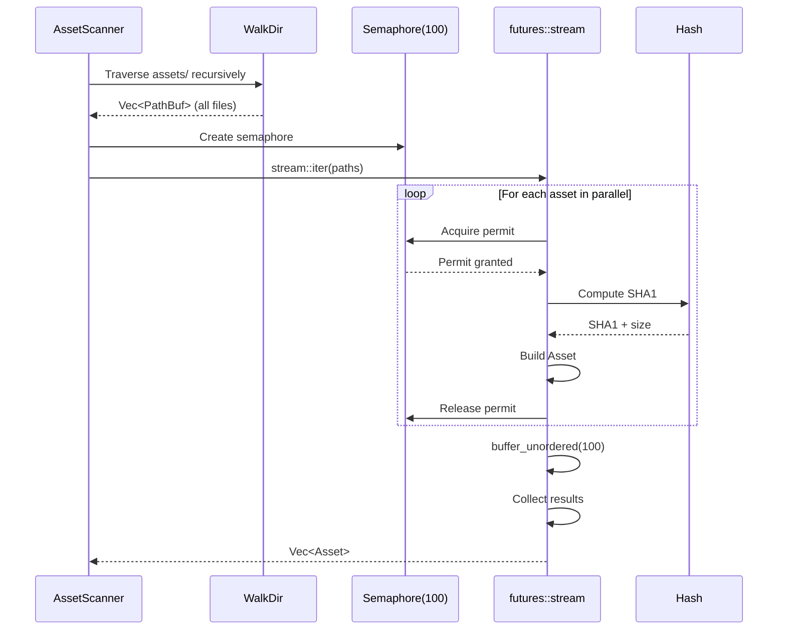
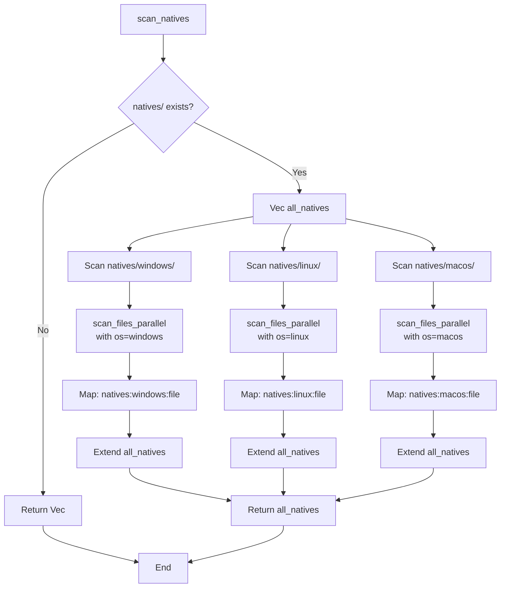
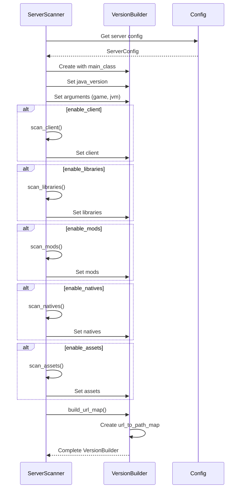

# Processing flows

## Flow 1: Complete server scan

## Flow 2: Parallelized JarScanner

## Flow 3: Asynchronous hash computation

## Flow 4: Recursive asset scan

## Flow 5: Multi-OS native scan

## Flow 6: VersionBuilder construction

## Performance metrics

### Time complexity

**Sequential**:
- Scan of N files: O(N * T) where T = hash time

**Parallel with batch_size B**:
- Scan of N files: O(N/B * T) theoretical
- In practice: Limited by disk I/O
